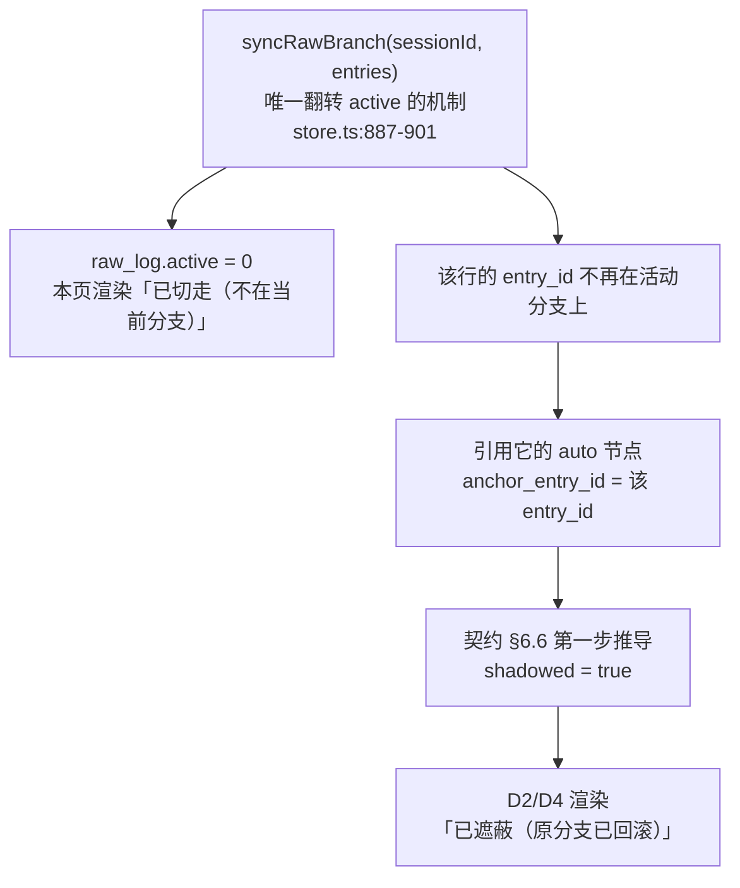

# 03 · 原文日志与动态区（D3）

> 范围：`assets/views/raw.js`、`assets/views/temp.js`，以及这两个页面**在前端侧消费** `/api/raw`、`/api/sessions`、`/api/temp` 的契约。
> 端点形状由 D1 定义（契约 §7.1）。本文只描述**怎么用**，发现缺字段写进 §9。
> 权威层级：`00-共同上下文.md` > 本文 > 现有实现代码 > nocturne 参考实现。
> 事实标注：一切「现状是 X」带 `file:line`；推断标 `[推断]`。**本文中标注「实跑」的输出均为本次会话真实执行的结果**（脚本见 §12.6）。

---

## 1. 一句话定位

**这是整个 Web 读端里唯一「nocturne 完全没有」的部分**：把 `raw_log`（消息级原文镜像）画成一条可回溯的时间轴，把 `TEMP://`（动态暂存区）画成一个可清空的清单。

两页的共同点：**它们都不显示「记忆」，而显示「记忆的原料与待办」**。

| 页 | 数据源 | 回答使用者什么问题 |
|---|---|---|
| `#/raw` 原文时间轴 | `raw_log` 表（消息级，非节点） | 「当时到底说了什么？」「我 reroll 掉的那一版去哪了？」 |
| `#/temp` 动态区 | `nodes WHERE domain='TEMP'` | 「还有什么草稿没整理？」「离触发整理还差几条？」 |

**与 D2 的边界**：D2 的树页回答「记忆现在是什么」；本模块回答「记忆从哪来、还欠什么」。两者通过 `#/raw?around=<entry_id>` 互相跳转（D2 已预留该链接，`02-浏览与检索界面.md:450`）。

**与 D4 的边界（契约 §14 硬约束）**：`MEM://timeline` 的服务端结构化实现归 D4（`views.ts`）。**本页 MUST NOT 重算 timeline 语义**。本页与 `MEM://timeline` 的关系是 §8 的主题。

---

## 2. 原文时间轴页（`#/raw`）

### 2.1 数据源：必须是 `raw_log`，不是 `nodes`

契约 §8.1：`MEM://timeline` 的数据源 = `raw_log`（消息级），**纪要节点不入轴**。依据 `docs/memory-system.md:244` 决策 4：「timeline 视图数据源 = raw_log（消息级，带 world_ts）；纪要节点不入轴，避免同场双条」。

本页沿用同一口径。**这不是风格选择，是语义正确性**：`raw_log` 是「原文日志」，`nodes` 里 `history` domain 的纪要是「对原文的摘要」。若把两者混在一条轴上，同一场对话会出现两条（原文 1 条 + 纪要 1 条），使用者无法判断哪个是底稿。

### 2.2 展示全列的意义

契约 §6.2 冻结了 `raw_log` 的 8 列。**本页 MUST 全部取回并为使用者可见**（可在详情展开区显示，不必全挤在行内）：

| 列 | 展示位置 | 意义（使用者语言） | 为什么必须显示 |
|---|---|---|---|
| `raw_id` | **行首 `#<n>` 徽章**（等宽字体） | 「原文行的永久编号」 | 它是**唯一稳定标识**：`raw_id` 永不回收（§6.2），reroll 后切回来还是这个号（`store.ts:842-851`）。使用者用它和 `retrace` 工具对话（`tools.ts:904`） |
| `role` | **行内角色徽章** | 「谁说的」 | 见 §2.4 —— 它**可能不是 `user`/`assistant`** |
| `text` | **行主体** | 原文 | 页面主内容。**必须字面呈现**（不解析 markdown/HTML） |
| `entry_id` | **详情展开区** + 复制按钮 | 「这一行在 pi 会话树里的位置」 | 它是 `nodes.anchor_entry_id` 的取值域 —— **回滚判定就是拿它去查的**（§6.6）。使用者点一个 `shadowed` 节点时，D2 会跳来 `#/raw?around=<entry_id>`（`02-浏览与检索界面.md:450`） |
| `session_id` | **行内小字** + 顶部筛选器 | 「哪次会话」 | 库支持多 session 共存（`(session_id, entry_id)` 唯一索引，`schema.ts:71`；`syncRawBranch` 的作用域单位是 session，`store.ts:887-901`）。注意 `docs/memory-system.md:206` 决策 2a 定的是**每进程各一库**，所以多 session 共库不是常态，但 `raw_log.active` 的语义**必须**按 session 隔离才正确（`docs/memory-system.md:82` v5.5 修复 #1） |
| `active` | **⭐ 行状态** | 「在不在当前分支上」 | **本模块的核心可视化，见 §3** |
| `wall_ts` | **次级时间行**「记录于 …」 | 真实世界时间 | 契约 §10.2：`wall_ts` → 「记录于 …」 |
| `world_ts` | **主时间行**「世界时间 …」 | 角色的世界钟 | 契约 §10.2：⭐ **故事语境优先展示**。`world_ts` 可空（`schema.ts:69`）；实跑确认 `world_ts = null` 的行正常存在 |

> ⭐ **`raw.active` 的 DTO 类型已与 D1 对齐（2026-09-15）**：定为 **`number`（0/1）**，与 `raw_log.active` 的 SQL 列类型（`INTEGER NOT NULL DEFAULT 1`，`schema.ts:67`）一致。理由：本页对 `active=0` 做的是**视觉区分**（斜纹 + 删线 + 降透明 + `title`），**不做 JS 真值判断**，但代码写 `active === 0` 显式比较 —— `number` 最直接。D1 原定 `boolean`，**已按本页改为 `number`**（D1 侧书面确认）。**MUST NOT** 在客户端对 `active` 用 `!row.active` 之类的真值判断（`0` 与 `false` 语义不同，且 `1/0` 的可读性更好）。

**时间轴的轴序用哪个字段？** 用 `raw_id`（入库顺序），**不是** `world_ts`。

理由（必须写进 UI 脚注，否则使用者会困惑）：

- `raw_id` 全局单调自增，**永不重排**；`world_ts` 会随「调世界钟」（`setWorldTime`，`store.ts:1116-1134`）改变语境，用它排序会让轴的顺序随世界钟漂移。
- `world_ts` 可为 `null`（该行写入时未取到世界钟），排到哪边都是错的。
- `listRaw` 本身按 `raw_id` 升序返回（`store.ts:935` 的 `ORDER BY raw_id`）。

**但「世界时间」列仍必须显示**，因为它是故事语境的主时间。轴序与显示时间分离，页脚一句说明即可。

### 2.3 默认排序

**默认 = 最新在上（`raw_id` 降序）**，与 `renderTimelineView` 一致（`memory-views.ts:26` 的 `ORDER BY raw_id DESC`）。原文日志无限增长不裁剪（`docs/memory-system.md:223` 决策 19），默认打开时使用者最关心「刚刚发生了什么」。

提供「正序/倒序」切换（纯客户端反转已取回页，不重新请求）。

### 2.4 `role` 容错（P5）

契约 §12-P5：每个 role 都可能是 customType。证据 `module.ts:351-354`：

```ts
function toRawEntry(m: MemoryTurnMessage, sessionId: string, worldTs: string | null): RawEntry {
	return {
		role: m.customType ?? m.role,
```

即 `role` 列的**取值域是 `user` | `assistant` | 任意 customType 字符串**。实跑确认：写入 `role: "rp-notify"` 的行正常存储并返回。

**UI 规则（冻结）**：

1. 已知 `user` / `assistant` / `system` / `tool` → 固定配色徽章。
2. `rp-notify` → 「系统通知」样式（它是 `RP_NOTIFY_TYPE`，`temp-notify.ts:12`；TEMP 触发通知走的就是这个 customType）。
3. **任何其它值 → 原样显示字符串，中性配色**。MUST NOT 抛错、MUST NOT 显示「未知角色」、MUST NOT 当作空。

与 D2 §5.2 对 `source` chip 的容错规则同构（`02-浏览与检索界面.md:883`），是**同一纪律的两个落点**。

### 2.5 分页策略（⭐ 本文最硬的一节）

#### 2.5.1 约束：`listRaw` 是范围查，且签名带陷阱

`store.ts:903-947`：

```ts
listRaw(
	fromRawId: number,
	toRawId?: number,
	opts: { sessionId?: string; activeOnly?: boolean } = {},
): Array<{ raw_id; role; text; entry_id; session_id; wall_ts; world_ts; active }>
```

**陷阱（`store.ts:924-930`，实跑确认）**：`toRawId === undefined` 时**不是**「从 fromRawId 到无限」，而是**精确单行查**：

```ts
if (toRawId === undefined) {
	filters.push("raw_id = ?");     // ⭐ 单行！
	params.push(fromRawId);
} else {
	filters.push("raw_id >= ? AND raw_id <= ?");
	params.push(fromRawId, toRawId);
}
```

实跑证据：

```
=== listRaw(1, undefined) — single row ===
[ { raw_id: 1, role: "user", text: "商队从北方来", ..., active: 1 } ]
=== listRaw(1,2) range ===
[1,2]
```

**后果**：`store.listRaw(1)` 返回 1 条，不是全部。任何「取全部原文」的写法 MUST 显式给 `toRawId`。
（现有代码 `tools.ts:904` 的 `store.listRaw(params.raw_id)` 正是**故意**用这个单行语义做精确回溯。）

#### 2.5.2 ⚠️ 已实证的反面教材：**草稿循环的锚点选错**导致近似挂死（⭐ 归因已按 §16.12 更正）

**先澄清一个易被误记的点（Main 复现 + 本文复核，双方一致）**：`listRaw` **本身没有缺陷**。

```
(A) listRaw(0, Number.MAX_SAFE_INTEGER, {activeOnly:true}) → 20 行，4ms 返回   ← 正常
(A2) listRaw(0, 2147483647, {activeOnly:true})             → 20 行            ← 正常
```

**真正出问题的是第一版草稿的翻页循环**：它把 `hi` 初始化为 `INT_MAX`，然后每轮只走一个宽度 64 的窗口、逐窗口向小侧推进。

```
(B) 该草稿循环（limit=5）：200,001 次迭代后仍未收敛，8.99s 未完成（本文用 20 万迭代护栏截断；
    真实需要 2³¹ / 64 ≈ 3350 万轮才能探到真实 MAX(raw_id)）
```

**⭐ 更正后的归因（Main §16.12 裁定，本文复核同意）**：这是**算法缺陷，不是 `listRaw` 缺陷**。
`raw_id` 是 `AUTOINCREMENT`（`schema.ts:62`），真实最大值通常远小于 `INT_MAX`；而 `listRaw` 对 `[lo, hi]` 是**闭区间**扫描，**空区间不报错、照常返回 0 行**，于是循环只能一格一格向真实 MAX 挪。

> ⚠️ **本文旧稿称「挂死」（300s 超时）且未言明是循环的错 —— 该表述不精确，已按 §16.12 更正。** `MUST NOT` 把该 bug 记在 `listRaw` 头上（契约 §16.12 原文）。

**教训（仍然成立且已升级为裁定）**：

1. **不要把 `MAX_SAFE_INTEGER` / `INT_MAX` 当「够大的常量」来起锚**。若确需区间上界，用 `0, Number.MAX_SAFE_INTEGER` 之外更简单的方式（见 2.5.3 的 §16.10 裁定）。
2. **若一定要做窗口循环，锚点 MUST 是真实 `MAX(raw_id)`**（取法见 §2.5.6），**且循环 MUST 保证游标单调推进并以真实下界终止**。

> ⭐ **§16.10 的裁定（Main 2026-09-15，与本文冲突时以它为准）**：`timeline` 的取数 MUST 用**一次 `ORDER BY raw_id DESC LIMIT n`**（等价于 `listRaw(0, REAL_MAX, {activeOnly:true}).slice(-n).reverse()`），**MUST NOT** 以 `MAX_SAFE_INTEGER` 为锚做逐窗口反向查询。D4 MUST 删除 `MAX_RAW_ID_HINT`。
>
> **实跑验证（本文复核该裁定）**：
> ```
> single-query N=5 → [25,24,23,22,21]  0ms
> keyset     N=5 → [25,24,23,22,21]
> equal: true
> ```
> 即**单次查询与（修正锚点后的）keyset 走法结果一致** —— 裁定既能避免缺陷、又不改变语义。契约 §16.10 同时指出：该裁定**顺带满足 §8.3 的双端点互验**。

#### 2.5.3 ⭐ 裁定后的首选取数法：单次 `ORDER BY raw_id DESC LIMIT n`（§16.10）

**`/api/view?name=timeline` 与 `/api/raw` 的第一页 MUST 都用单次查询**，不用窗口循环：

```
# 语义（等价式，D1/D4 任选实现）：
timelinePage(n) = listRaw(0, REAL_MAX, {activeOnly: true}).slice(-n).reverse()
                  ↑ 升序全取                ↑ 取末尾 n 条 = 最新 n 条   ↑ 转倒序
# D4 侧等价的 SQL 形态：SELECT … FROM raw_log WHERE active=1 ORDER BY raw_id DESC LIMIT n
#                     （与 renderTimelineView 的 memory-views.ts:26 逐字一致）
```

**实跑验证**：`single-query N=5 → [25,24,23,22,21]`（0ms），与修正锚点后的 keyset 走法**结果一致**（§2.5.2 的表）。

> ⚠️ **这里的 `listRaw(0, REAL_MAX, …)` 能一条不漏地取回全部活跃行** —— 因为 `raw_id >= 0` 覆盖全部（`store.ts:928` 的闭区间下界为 0 即可），而 `listRaw` 对闭区间是**正常扫描**（§2.5.2 A 组，4ms）。**代价是物化全部活跃行**；对 `n` 很小而库很大的场景，D1 若要走 SQL `LIMIT` 直接下推更好（D4 的 `views.ts` 就该这么做）。**本模块（`/api/raw` 分页）只在「第一页 + 需要总数」时用单次查询**，深页仍用下面的 keyset。

#### 2.5.4 深页继续翻页：向后 keyset 窗口走（算法 A）

> **适用范围**：用于 `/api/raw` 的**第 2 页及以后**（契约 §7.1 的 `before` 游标）。**第一页与 D4 的 timeline 视图 MUST 用 §2.5.3 的单次查询。**
> `around`（§16.9）既可能落在窗口中部也可能在窗口外 —— 它的定位逻辑属于端点内取数（§2.6），**不由本算法承担**；本算法只负责「给了 `before` 之后，如何跨 `active=0` 空洞凑满一页」。

```
# 前置：anchor = 过滤条件下真实的 MAX(raw_id)（取法见 2.5.5）
anchor = last( listRaw(0, REAL_MAX, {sessionId, activeOnly}) ).raw_id
# 结果为空 → 空页，结束

页面 N（N ≥ 2，由 before 游标驱动）：
    to     = before - 1                                  # before = cursor_{N-1}
    out    = []
    WINDOW = max(64, limit * 4)
    while len(out) < limit and to >= 1:                  # ⭐ 以真实下界 1 终止
        from = max(1, to - WINDOW + 1)
        rows = listRaw(from, to, {sessionId, activeOnly})   # 升序返回，已过滤
        for r in reverse(rows):                             # 反转为「最新在上」
            if len(out) < limit: out.push(r)
        to = from - 1                                       # ⭐ 单调递减，永不重锚
    cursor_N = min(out[].raw_id)
```

**为什么这个循环不会重演 §2.5.2 的缺陷**：起点 `to` 来自**真实游标**（`before − 1` 或真实 `MAX(raw_id)`），不是 `INT_MAX`；每轮 `to` 严格递减、且循环条件是 `to >= 1`，**迭代次数上界 = 数据量 / WINDOW**，与常量无关。

**为什么用窗口**：`activeOnly` / `sessionId` 是**在 SQL 里过滤的**（`store.ts:919-923`），所以 `listRaw(from, to, ...)` 返回的已是过滤后的行。窗口只需让**单次调用返回的行数有界**。

**为什么窗口要略大于 `limit`**：`active=0` 的行可能连续成片（一次 reroll 让整段变 `active=0`，实跑确认 `1,2,3,4,5,6*,7*,8*,9*,10*,11,...` 即 6–10 连续 5 行为 `0`）。窗口稍宽可减少循环次数；**稀疏由循环本身正确处理**，宽度只是性能参数。

实跑验证（fixture：25 行，s1 的 e6–e10 被 `syncRawBranch` 置 `active=0`）：

```
active: 1,2,3,4,5,11,12,13,14,15,16,17,18,19,20,21,22,23,24,25 (total 20 )
newest-first pages: [[25,24,23,22,21,20],[19,18,17,16,15,14],[13,12,11,5,4,3],[2,1]]
union==active: true          ← ⭐ 翻页并集 === 活跃集合，无遗漏无重复
```

注意第 3 页 `[13,12,11,5,4,3]`：**正确跨过 6–10 的 inactive 空洞**（这个「跨空洞」能力就是它**不能被单次 `LIMIT n` 替代**的原因 —— 单次查询只在第一页够用）。

#### 2.5.5 算法 B（`offset` 兼容路径，`before` 缺省时的回落）

契约 §7.1 给 `/api/raw` 的参数是 `?session=&from=&to=&activeOnly=&limit=&offset=`。若 D1 按 `offset` 实现（而非游标），用**正向窗口累计**：

```
offsetPage(offset, limit, sessionId, activeOnly):
    cursor = 1; skipped = 0; out = []
    WINDOW = max(64, limit * 4)
    to = <真实上界>
    while len(out) < limit and cursor <= to:
        hi   = min(cursor + WINDOW - 1, to)
        rows = listRaw(cursor, hi, {sessionId, activeOnly})   # 升序
        for r in rows:
            if skipped < offset: skipped++
            elif len(out) < limit: out.push(r)
        cursor = hi + 1                    # ⭐ 正向单调
    return out
```

第 N 页（`limit` 条/页，倒序展示）= `offsetPage(total - N*limit, limit)` 后**反转**；`total` 见 §2.5.7。

实跑验证（同 fixture，`limit=5`）：

```
active raw_ids: 1,2,3,4,5,11,...,25 total: 20
newest-first pages: [[25,24,23,22,21],[20,19,18,17,16],[15,14,13,12,11],[5,4,3,2,1]]
union == active: true
```

**两条算法的取舍（本模块的建议）**：

| 维度 | A（keyset） | B（offset） |
|---|---|---|
| 深页成本 | **O(1) 起点**，每页只走自己的窗口 | O(offset)，第 100 页要走 100×limit 行 |
| 与契约 §7.1 参数表的贴合 | `before` 已在表内（见下） | **完全贴合** `limit`/`offset` |
| 稳定性 | 翻页期间新行入库**不跳行不重复** | 翻页期间新行入库会**漂移** |
| 实现复杂度 | 略低（一个游标） | 低 |

**⭐ 裁决结果（Main 2026-09-15，已回写契约 §7.1 与 §12-P13）**：

> `/api/raw` MUST 同时返回 `total`（**过滤后**）与 `totalAll`（**全库**）；并 MUST 加可选 keyset 游标 `before`（`raw_id < before`），`offset` 作为兼容保留。

契约 §7.1 的路由表现在是（实测值）：

```
?session=&from=&to=&activeOnly=&before=&limit=&offset=   →  {items, total, totalAll}
```

**因此本页的分页冻结为：默认用 `before`（算法 A），`offset` 仅在 `before` 缺省时回落（算法 B）。** 理由（已被 Main 采纳）：原文日志**无限增长**（决策 19），且外部 agent 会持续 append —— `offset` 的漂移会让使用者翻页时看到重复行。

**`before` 的语义（冻结）**：`raw_id < before`，**不含** `before` 本身。第一页不传；后续页传 `min(items[].raw_id)`。与算法 A 的 `to = cursor − 1` 等价（`store.ts:928-929` 的 `raw_id >= ? AND raw_id <= ?` 是闭区间，故 D1 在端点内应实现成 `raw_id < before`）。

#### 2.5.6 锚点（真实上界）怎么取 —— 不拼 SQL

本模块**不新增任何 SQL**（§9-C1 说明纪律边界）。锚点由 D1 在端点内提供。

> ⭐ **裁决结果（Main 2026-09-15，已回写契约 §9.1 与 §12-P12）**：
> §9.1 纪律 2 **只约束写路径**。**读路径允许 `store.db.prepare` 做只读聚合** —— 引擎自身既有先例：`slots.ts:103`、`temp-notify.ts:32`、`memory-views.ts:25` 都在读路径直查库。
> 硬边界不变：**任何写操作 MUST 经 `MemoryStore` 方法**；**任何路径 MUST NOT 在读路径写库**。
>
> **本模块的选择（比裁决更保守，Main 明确采纳）**：仍**不新增任何 SQL**，全部经 `/api/*` 端点取数。锚点计算由 D1 在端点内完成。
>
> `slots.ts:103` 的现成写法（`SELECT MAX(raw_id) AS m FROM raw_log`）可直接沿用；同一文件 `slots.ts:107` 紧接着用 `store.listRaw(upto - rawCount + 1, upto, {activeOnly:true})`。
>
> `NEW` `getRawBounds(opts: {sessionId?: string}) → { min: number; max: number }`（建议 D1 在 `routes.ts`/`serialize.ts` 内实现）。

#### 2.5.7 `total` 是哪个数？—— 必须给两个

契约 §7.2：列表端点返回 `{ items, total }`。本页需要**两个**数，**MUST 区分**：

| 数字 | 含义 | 取法 | UI 位置 |
|---|---|---|---|
| `total`（过滤后） | 当前筛选条件下的行数 | `activeOnly`/`sessionId` 生效后的 COUNT | 「共 N 条」 |
| `totalAll`（全库） | `raw_log` 全表行数 | 无过滤 COUNT | 页脚「库内原文共 M 条（含 N 条历史分支）」 |

**为什么必须给 `totalAll`**：这是本模块**唯一能告诉使用者「你 reroll 过多少东西」的地方**。差额 `totalAll − total(activeOnly=true, 无 session)` = **全局 inactive 行数**，即「被回滚/切分支后留下的历史行总数」。它是「行永不物理删除」（§6.2）这条设计的**唯一可见证明**。

实跑确认该差额存在：全库 25 行，active 20 行 → 差 5 行。

**⭐ 裁决结果（Main 2026-09-15，已回写契约 §7.1 与 §12-P13）**：`/api/raw` **MUST 同时返回 `total`（过滤后）与 `totalAll`（全库）**。Main 采纳的理由与本段一致：「差额 = '被 reroll 掉多少行' = '行永不物理删除'的唯一可见证明」。**本页不再需要降级路径**（原 §10 U-D3-4 已关闭）。

### 2.6 筛选器（UI）

| 控件 | 对应参数 | 说明 |
|---|---|---|
| session 下拉 | `?session=` | 选项来自 `/api/sessions`（§4）。首项「全部会话」= 不传 |
| 「只显示当前分支（`active=1`）」复选框 | `?activeOnly=` | **默认勾选**（与 `MEM://timeline` 口径一致，§8）。取消后**必须显示「含 N 条历史分支行」回执**（§3.4） |
| 「角色」筛选 | 无服务端参数 | **纯客户端**（过滤已取回的页）。`role` 取值域开放（§2.4），服务端筛选需枚举 customType，不值得 |
| 定位 | `?around=<entry_id>` / `?from=&to=` | D2 节点详情页的跳转入口（`02-浏览与检索界面.md:450,452`）。服务端把 `around` 解析成 `raw_id` 后返回该行及其邻近页 |

**`?around=` 的语义（D1 需实现）**：给一个 `entry_id`，返回**包含该行的那一页**。若多 session 共库且该 `entry_id` 跨 session 重复，**MUST 同时用 `session_id` 定位**（D2 跳转时会带 `session=`，链接已含）。若 D2 没带 session 而 `entry_id` 跨 session 重复 → 返回 `bad_request` 并提示需指定 session，**不得**任选一条。

> ⭐ 依据：`schema.ts:71` 的唯一索引是 `(session_id, entry_id)`，**不是** `entry_id` 单列。`schema.ts:73` 另建 `idx_raw_log_entry_id`（说明有按 entry_id 单列查的需求），但**唯一性由两列共同承担**。任何按 `entry_id` 单列定位的接口都必须容忍多命中。

**⭐ §16.9 裁定（Main 2026-09-15，已写进契约）**：`around` 参数**已采纳**（D1 的 `/api/raw` 会加，并带 `centered` 字段）。完整语义：

- 以该 `entry_id` **在本次 `from`/`to` 窗口内的 `raw_id` 为中心**，返回前后各半页。
- 若该 entry **不在窗口内** → 返回以它为准的窗口（`raw_id >= around 的窗口起点`），并带 `centered: true`。
- **无 `around` 时 `centered` 恒为 `false`**，本页据此决定是否显示「已定位」提示。
- ⚠️ **仍 MUST 带 `session=`**：`entry_id` 非全局唯一（`(session_id, entry_id)` 才是唯一键，`schema.ts:71`），故本页的跨 session 重复处理（上一段）**不变**。

> 本页的验收用例（§12.1 #4/#5）**已被契约 §16.9 采纳**，并新增 `centered` 断言（见 §12.1）。

---

## 3. ⭐ 分支 `active` 的可视化

### 3.1 一句话：`active=1` 与 `active=0` 的区别必须「一眼看出」

契约 §6.2：`active` = **1 = 在当前分支上；0 = 被回滚/切分支后留下的历史行**。行**永不物理删除**。

**默认视图只显示 `active=1`**（与 `MEM://timeline` 同口径）。`active=0` 的行**必须由使用者显式打开开关**才出现。

这个「默认隐藏、显式可见」是**纪律性的**：`docs/memory-system.md:85` 原文：「默认视图/timeline/autoretain/FTS 只读活动行」。若默认把历史行混进来，使用者会把「已经被回滚的对话」当成「真实发生过的对话」—— **这正是 §6.6 警告的「展示已被回滚的幻觉记忆」在原文层的同款错误**。

### 3.2 视觉区分（关闭开关后，两类行同屏时的规则）

| 维度 | `active=1` | `active=0` |
|---|---|---|
| 行背景 | 默认 | **斜纹背景**（`repeating-linear-gradient`，纯 CSS，无图片） |
| 行左边框 | 无 | **4px 实心灰边**（`border-left`） |
| `raw_id` 徽章 | 正常 | **删除线**（`text-decoration: line-through`） |
| 行首图标 | 无 | **`↩` 回滚标记**（纯文本，不用图标字体） |
| 时间列 | 「世界时间 …」 | 同左，但**整行降不透明度**（`opacity: .65`） |
| 行状态 chip | 无 | **「已切走（不在当前分支）」** |
| 悬停 `title` | — | 「这行曾出现在活动分支上，reroll/切分支后被标记为 `active=0`。行未被删除，切回该分支会原样复活。」 |

**「降不透明度」而不是「隐藏」**：`active=0` 是**保留品**，不是垃圾。视觉上要像「存档」而不像「失效」。

### 3.3 ⭐ 与 §6.6 `shadowed` 的关系：`active=0` 是因，`shadowed` 是果

**Main 广播 #2 的文案纪律**：节点层标记冻结为 **「已遮蔽（原分支已回滚）」**，MUST NOT 写成「已隐藏」或「当前角色看不到」。

本模块是**原文行层**，与节点层是不同对象，因此**刻意使用不同措辞**：

- 节点层（D2/D4 渲染）：「已遮蔽（原分支已回滚）」—— 描述的是**节点**。
- 原文行层（本页）：「已切走（不在当前分支）」—— 描述的是**行**。

两者**同源但不矛盾**（Main 广播 #2 对 D3 的原话：「二者是同一机制的两种视角，不要互相矛盾」）。因果链：



**即：本页是上游。** D2 的节点详情页跳来 `#/raw?around=<entry_id>`（`02-浏览与检索界面.md:450`）时，使用者看到的正是「让那个节点被遮蔽的那一行原文」—— 两个视角在此闭环。

**MUST NOT**：在本页对 `active=0` 行说「这条记忆已被删除」或「角色看不到这条」。行不是记忆，也不适用「看不看得到」的资格 —— 它只是不在当前分支上。

### 3.4 为什么行永不物理删除（必须写进 UI 页脚）

`docs/memory-system.md:78`：「**v5.5 起不再物理删除**——行用 `active` 标记表示是否在活动路径上，`raw_id`/wall/world 时间戳永存。」

`store.ts:881-886` 的注释：

```
 * Reconcile ONE session's raw_log mirror against its active branch. Rows
 * of other sessions are never read into JS and never touched. Rows that
 * left THIS session's active path are marked inactive (kept forever);
 * switching back re-marks them active with identical raw_id / timestamps.
```

三条必须让使用者知道的事实（页脚三行，不是悬停才发现）：

1. **回滚不丢原文**。reroll / 切分支只翻 `active` 标记；`store.ts:896` 的那条 UPDATE 是**唯一的写动作**，无 DELETE。
2. **切回去会原样复活**。`_upsertRaw` 对已存在行只 UPDATE，**`raw_id` 与 `world_ts` 被保留**（`store.ts:846-851`：`existing.world_ts` 被原样写回）。实跑确认。
3. **别的 session 的行不受影响**。`syncRawBranch` 的作用域被 `WHERE session_id = ?` 锁死（`store.ts:896`）。多 session 共库时，A 的 reroll 不隐藏 B 的原文（`docs/memory-system.md:82` 的 v5.5 修复 #1）。

> ⭐ **实跑确认第 2 条的一个副作用（本模块必须显示它）**：`_upsertRaw` 刷新 `wall_ts` 但**保留 `world_ts`**。
> ```
> appendRaw(e1, wall_ts="2020-01-01T00:00:00Z", world_ts=null)
>     → world_ts: null
> appendRaw(e1, wall_ts="2021-09-09T00:00:00Z", world_ts="2099-01-01")   ← 同一 (session, entry) 再写
>     → wall_ts: "2021-09-09T00:00:00Z",  world_ts: null                 ⭐ world_ts 未被覆盖
> ```
> 即 **`wall_ts` 可能被后来的 sync 覆盖，`world_ts` 不会**（一次写入即冻结）。
> **UI 后果**：`wall_ts` **不是**「这条消息最初发生的真实时间」的绝对可靠证据（若上游传了新时间戳）。本页 MUST NOT 把 `wall_ts` 呈现为「原文产生时刻」的权威，措辞用中性的「记录于 …」（契约 §10.2 已如此规定）。`role`/`text` 同样会被刷新 —— 这是 `store.ts:837` 注释明说的设计意图（"role/text/wall_ts are REFRESHED from the incoming entry"）。

### 3.5 关闭开关时的回执（不得静默过滤）

与 D2 §4.5 第 4 条同款纪律：

- 勾选「只显示当前分支」时，若本次结果里**有**被过滤掉的 `active=0` 行，列表底部显示回执：
  `已按分支过滤掉 N 条历史行 · [显示它们]`（`[显示它们]` = 就地取消勾选）。
- **措辞 MUST 是「过滤掉」而不是「隐藏」**，理由同 D2 §4.5（「隐藏」暗示不可见/已删）。
- 若全库根本没有 `active=0` 行（`totalAll === total`），**不显示回执**（不制造噪音）。

### 3.6 与 §6.6「第二步」的关系

契约 §6.6 第二步（指定「角色视角 = 某 session」，`foreignSession` 字段）**本模块不做**，与 D2 结论一致（`02-浏览与检索界面.md:903` 的「新 1」）。

原因在本页更直白：**原文行没有「视角」概念**。`raw_log` 行属于它自己的 `session_id`，`active` 是该 session 分支状态的事实；换个 session 看它，`active` 不会变（`syncRawBranch` 作用域锁死）。所以本页**不需要**第三种状态。

---

## 4. session 分组：`/api/sessions` 的消费

### 4.1 为什么需要

`raw_log` 是**多 session 共存的单表**（`session_id` 列 + `(session_id, entry_id)` 唯一索引，`schema.ts:66,71`）。使用者需要入口回答「我有过哪几次会话？各有多少条原文？」

契约 §7.1：`/api/sessions` = 「raw_log 的 session 分组与计数 | 直查 `raw_log`」。

### 4.2 本页需要的字段（消费契约）

`NEW` —— 请 D1 保证 `/api/sessions` 返回：

```jsonc
{
  "items": [
    {
      "session_id": "s_abc123",
      "total": 42,          // 该 session 的 raw_log 行数（含 active=0）
      "active": 30,         // 其中 active=1 的行数（⭐ 与 D1 已对齐：原 D1 名 active_count，已改）
      "first_raw_id": 101,  // 该 session 最小 raw_id
      "last_raw_id": 355,   // 该 session 最大 raw_id
      "wall_first": "2026-09-01T08:00:00Z",   // 最早 wall_ts
      "wall_last":  "2026-09-10T22:14:03Z"    // 最晚 wall_ts
    }
  ],
  "total": 3   // ⭐ session 个数（与 D1 已对齐：顶层 total = 会话数，不是行数）
}
```

**逐字段必要性**：

| 字段 | 用途 | 缺了会怎样 |
|---|---|---|
| `session_id` | 下拉选项 value + 显示 | **必需** |
| `total` | 「该会话共 N 条原文」 | 必需 |
| `active` | **⭐ 区分「这次会话被回滚了多少」** | 缺了则本模块最独特的洞察消失 |
| `first_raw_id`/`last_raw_id` | 「`#101`–`#355`」区间显示；会话内定位 | 缺了可退化（无区间显示） |
| `wall_first`/`wall_last` | 下拉显示「s_abc123（09-01 ~ 09-10，42 条）」 | 缺了则下拉只能用裸 id，可读性差 |

**`active` vs `total` 的差额 = 该 session 被切走的历史行数**，与 §2.5.7 的全局差额是同一指标的两个粒度。

**实跑证据（`syncRawBranch` 的效果）**：s1 原本 15 行，`syncRawBranch("s1", entries 去掉 e6–e10)` 后：

```
all raw: 1,2,3,4,5,6*,7*,8*,9*,10*,11,12,...,25     （* = active=0）
→ s1: total=15, active=10      （6*–10* 是被切走的 5 行）
→ s2: total=10, active=10
```

### 4.3 下拉排序

按 `last_raw_id` 降序（最近活跃的会话在上），**不按 `session_id` 字典序**（session id 是随机串，字典序无意义）。

### 4.4 空库状态

`items: []` → 下拉禁用，页面显示空状态文案（§7 统一空状态规范）。

---


## 5. TEMP 动态区页（`#/temp`）

### 5.1 一句话：TEMP 是「草稿缓冲区」，动作叫「整理」，目标「清到零」

契约 §10.1 冻结术语：`TEMP`（不叫 `temp_zone`）、动作叫 **整理**（不叫 cleanup/prune）、目标 **清到零**（不叫「清理旧项」）。

`docs/memory-system.md:114` 原文：「**整理 = 要求清到零**（不是修剪）；一旦允许"先处理一部分"，缓冲区变垃圾场（MEMORY.md 历史教训）。」

**因此本页的文案基调是「清空」而不是「浏览」**：页面顶部是进度条 + 一句「离整理还差 N 条 / 已超阈值，该整理了」，而不是一个中性列表。

### 5.2 ⭐ 三个计数口径：`countTempNodes` / `countActiveTempNodes` / `domain === "TEMP"`

契约 §13-U6 与 Main 补充 #4 都点了这一条。**这是本页最容易做错的地方**。

| 方法 | 实现 | 过不过滤 `shadowed` | 出处 |
|---|---|---|---|
| `countTempNodes()` | `uri LIKE 'TEMP://%' AND is_stub = 0` | **否** | `store.ts:1187-1192` |
| `countActiveTempNodes(store, isVisible)` | 同上 + 谓词过滤 | **是**（谓词由调用方给） | `temp-notify.ts:28-36` |
| `domain === "TEMP" && !is_stub`（`/memories temp` 扩展） | `store.listNodes()` 后 JS 过滤 | **否** | `coding-agent/src/extensions/memories/index.ts:62` |

**引擎触发 notify 用的是 `countActiveTempNodes`（口径 ②）**（`module.ts:513`）：

```ts
const isVisibleLocal = (node) => node.source !== "auto" || !hiddenAutoNodeIds.has(node.node_id);
if (countActiveTempNodes(store, isVisibleLocal) < tempThreshold) { ... }
```

**实跑证明两者会分叉**（fixture：1 个 manual + 3 个 auto，其中 1 个 anchor 在活跃分支、1 个 anchor 被回滚、1 个无 anchor）：

```
nodes: TEMP://m1 src=manual shadowed=false
       TEMP://a1 src=auto   shadowed=false   ← anchor e1 仍 active
       TEMP://a2 src=auto   shadowed=true    ← anchor e2 已被回滚
       TEMP://a3 src=auto   shadowed=true    ← 无 anchor
countTempNodes (no shadow filter): 4
derived active (stub-excluded + shadow-filtered): 2
countActiveTempNodes w/ predicate: 2          ← ⭐ 差 2
```

**本页的冻结决定（裁决契约 §13-U6 的「待 D3 定」）**：

- **主数字 = `countActiveTempNodes`**（与引擎触发口径一致）→ 页面显示「**活跃草稿 2 条**」。
- **若 `countTempNodes > countActiveTempNodes`**，进度条下方补一行小字：
  「另有 N 条已遮蔽草稿（原分支已回滚，不计入触发）」。
- **若两者相等**，不显示这一行（不制造噪音）。
- **`countTempNodes` MUST NOT 作为主数字**，否则使用者看到「12 条」而引擎按「7 条」判断，进度条永远对不上阈值。
- **MUST NOT 用第三种口径 `domain === "TEMP"`**（`coding-agent/src/extensions/memories/index.ts:62`）—— 它既不过滤 `shadowed`、又与引擎的 `LIKE` 口径不同（§9-C5）。

**⭐ 裁决结果（Main 2026-09-15，已回写契约 §12-P11）**：**本页的冻结决定全部成立并获批准**。Main 独立复现并锁定了根因 —— SQLite 的 `LIKE` 对 **ASCII 大小写不敏感**（`'temp://x' LIKE 'TEMP://%'` → 1），而 `GLOB` 敏感（→ 0）。裁定原文：「Web 端 TEMP 页冻结采用**引擎口径**（`countTempNodes` 的 LIKE + `countActiveTempNodes` 的谓词），**MUST NOT** 用 `domain === "TEMP"` 口径。」三口径差异登记为 **P11**，本期不修引擎。

**`shadowed` 的推导**：独立服务器拿不到引擎内存集，MUST 用契约 §6.6 第一步的无条件算法（`visibility.ts`，D1/D2 共用那份），**不得**自己写第二份。实跑确认该推导可复现引擎结果：

```
derived active (stub-excluded + shadow-filtered): 2
countActiveTempNodes w/ predicate: 2     ← 一致 ✅
```

### 5.3 阈值从哪来（⚠️ 契约 §13-U5 的真实缺口）

**阈值不存在库里**。证据链：

- `config.ts:26`：`temp?: { threshold?: number };` —— 它是 **coding-agent settings** 的形状，不在 `memory.db`。
- `module.ts:271`：`const tempThreshold = settings.temp?.threshold ?? DEFAULT_TEMP_THRESHOLD;`
- `temp-notify.ts:13`：`export const DEFAULT_TEMP_THRESHOLD = 10;`
- settings 文件落点（Main 补充 #4）：`~/.pi/agent/settings.json` 与 `<cwd>/.pi/settings.json`（`settings-manager.ts:238-239`）。

**独立 HTTP 服务器看不到 `settings`**，因此**只能知道默认值 10**。

**本页的冻结处理（在 U5 被裁决前）**：

1. 阈值数字 **MUST 标注来源**。缺省文案：`阈值 10（默认值）`。
2. ⭐ **已与 D1 对齐（2026-09-15）**：D1 在 `/api/temp` 响应里加 `thresholdSource: "cli" | "settings" | "default"`（字段名**统一为 `thresholdSource`** —— D1 原 `/api/meta` 的 `temp_threshold_source` 与 `/api/temp` 的 `threshold_source` 两种写法已合并为此名；取值统一用 `"cli"`，非 D1 原稿的 `"flag"`）。本页据此显示 `阈值 10（来自命令行）` / `（来自 .pi/settings.json）` / `（默认值）`。
   ⚠️ **该字段是可选（optional）**：缺失时本页 MUST 仍能渲染（显示「阈值 10（默认值）」），**不得**因它缺失而报错或留空。
3. **MUST NOT 猜测**。在 D1 表态前，本页固定显示「默认值」三字，并在文档写明这是**已知降级**（不是实现偷懒）。
4. 进度条分母用该阈值；若阈值为 0 或缺失 → 退化显示（不画进度条，只显示条数）。

### 5.4 进度条与状态

| 状态 | 条件 | 视觉 | 文案 |
|---|---|---|---|
| 空 | `active === 0 && total === 0` | 绿色对勾（文本 `✓`） | 「TEMP 暂存区是空的。清到零 ✅」 |
| 正常 | `0 < active < threshold` | 中性进度条 | 「活跃草稿 N 条 · 阈值 T」 |
| 接近 | `active ≥ threshold * 0.8` | 黄色进度条 | 「活跃草稿 N 条 · 快到阈值了（T）」 |
| 达标 | `active ≥ threshold` | **红色进度条** + 通知图标 | 「**活跃草稿 N 条 · 已达阈值**（引擎已发过整理通知）」 |

**「已达阈值」的文案依据**：`buildTempNotifyContent`（`temp-notify.ts:39-50`）是引擎实际发的通知内容，本页可**引用其原文**让使用者知道角色收到了什么：

```
TEMP 暂存区现有 ${count} 条草稿记忆（阈值 ${threshold}）。
请整理 TEMP 暂存区：把仍有价值的草稿 revise/consolidate 归位到正式记忆域，过时的 forget 删除，
整理目标是把 TEMP:// 清到零——不要只处理一部分，缓冲区留底即垃圾场。
```

**UI 处理**：折叠在「角色收到的通知」`<details>` 里，**默认收起**。**MUST NOT 逐字重排/改写这段文案** —— 它是 `buildTempNotifyContent(count, threshold)` 的输出，本页只**展示**。若 D1 在 `/api/temp` 里回传这段原文（§9-C4），本页直接显示；否则前端复刻文案会漂移 —— **不推荐**，故本条作为对 D1 的请求。

> ⭐ **既有先例的反面参考**：`/memories temp` 扩展命令（`coding-agent/src/extensions/memories/index.ts:62`）用的是**第三种计数口径**：
> ```ts
> const nodes = store.listNodes().filter((n) => n.domain === "TEMP" && !n.is_stub);
> ```
> `n.domain === "TEMP"` 是**精确等值**，而 `countTempNodes` 用 `uri LIKE 'TEMP://%'`。实跑证明二者**不等价**：
> ```
> domains: [ 'TEMP', 'TEMPX', 'temp' ]
> listNodes({domain:'TEMP'}): [ 'TEMP://upper' ]        ← 1 条
> countTempNodes (LIKE 'TEMP://%'): 2                    ← 2 条（含 'temp://lower'）
> LIKE probe: [ 'TEMP://upper', 'temp://lower' ]         ← ⭐ SQLite LIKE 对 ASCII 大小写不敏感
> ```
> 即 **`LIKE 'TEMP://%'` 会匹配 `temp://lower`（小写）**，而 `domain='TEMP'` 不会（`listNodes` 用 `WHERE domain = ?`，`store.ts:1197`）。三个口径（`domain=`、`LIKE`、`LIKE`+谓词）在病态数据下各给不同数。**本页 MUST 采用与引擎触发一致的 `LIKE` + 谓词口径**，并把该差异登记为冲突（§9-C5）。

### 5.5 列表内容

契约 §7.1：`/api/temp` = 「TEMP 节点 + count + threshold」。本页需要每个 TEMP 节点的**节点 DTO**（契约 §6.1 字段），至少：

| 字段 | 用途 |
|---|---|
| `uri` | 主标识 + 跳转 `#/node?uri=` |
| `content` | 摘要（首行，截断） |
| `importance` | 星级（契约 §6.1：**数值越大越重要**） |
| `shadowed` | ⭐ 标记「已遮蔽」（按 §6.6 第一步） |
| `source` | `auto` 是系统生成、`manual` 是角色手写 —— 影响「该不该留」的判断 |
| `created_at` | 「什么时候放进来的」 |
| `world_ts` | 故事语境时间 |
| `is_stub` | **本页 MUST 排除 stub**（见下） |

**stub 必须排除，且这事有实跑证据**：`put()` 一个 `TEMP://draft/deep/node` 会自动创建父链占位节点：

```
put node: { uri: 'TEMP://draft/deep/node', is_stub: 0 }
all TEMP nodes:
   TEMP://draft            stub=1   ← 占位
   TEMP://draft/deep       stub=1   ← 占位
   TEMP://draft/deep/node  stub=0   ← 真草稿
countTempNodes: 1                    ← ⭐ 只算 1（is_stub=0 过滤）
```

**直接 `insertNode({is_stub:1,…})` 造不出 stub**（实跑：返回 `is_stub: 0`）—— `is_stub` 不是 `NodeInput` 字段（`store.ts:32-52` 无此字段），`_insertNode` 的 `isStub` 参数是私有的（`store.ts:205`）。**fixture 造 stub 必须走 `put()` + 父链缺失**（对 D6 的 fixture 有直接影响，§12.5）。

### 5.6 排序

**默认按 `created_at` 升序（最老的草稿在上）**。

理由：TEMP 的动作是「清到零」，而**最老的草稿最可能是遗忘的垃圾**。这与 `MEM://recent`（最新在上）取向**相反且刻意** —— 本页服务「整理」而不是「浏览」。

提供「按重要度」排序切换（`importance` 降序，因为数值越大越重要）。

---

## 6. 整理动作的入口（跳到整理动作，动作本身是 D5）

### 6.1 本页不做写操作

契约 §14 边界：D5 = 「编辑/删除/恢复/移动/挂词/醒来清单/世界钟；§9 纪律的落地」。**TEMP 的「整理」= revise / consolidate / forget 三个动作**（`temp-notify.ts:43`），全部属于 D5。

**本页只提供入口，不实现动作。**

### 6.2 每行的操作链接

每个 TEMP 节点行尾提供三个**跳转**（不是就地操作）：

| 按钮 | 目标 | 说明 |
|---|---|---|
| **归位** | `#/edit?uri=<uri>`（D5） | 对应 `revise` / `consolidate`。文案「归位」来自 `temp-notify.ts:43` 的「revise/consolidate 归位到正式记忆域」 |
| **删除** | `#/edit?uri=<uri>&action=forget`（D5） | 对应 `forget`。危险操作，**MUST 二次确认**（契约 §9.3），确认框 MUST 显示「修订史保留，可从 `/api/revisions?deleted=1` 恢复」 |
| **查看** | `#/node?uri=<uri>`（D2） | 只看不改 |

**MUST NOT 在本页就地弹输入框改写** —— 那会在两个页面各有一份编辑逻辑，且绕开 §9.3 的 diff 展示要求。

### 6.3 `?action=forget` 参数归 D2/D5 定义

本页只**拼链接**。若 D2 的 ROUTES 不接受 `action` 参数，退化为只跳 `#/edit?uri=<uri>`（D5 在编辑页里提供 forget 按钮）。**这是 D2/D5 的接口，本页不裁定** —— 见 §10 U-D3-2。

### 6.4 整理进度

页面顶部固定一个「整理进度」条：

`整理进度：还剩 N 条（目标 0）`，其中 N = `countActiveTempNodes`。

这是**唯一**能让使用者感到「清到零」这个目标的地方。

---

## 7. 与 `/api/events` / `memory:changed` 的竞态

### 7.1 两条刷新通道，职责不同（契约 §7.4 + Main 补充 #5）

| 通道 | 发现什么 | 本页怎么用 |
|---|---|---|
| `/api/events` 轮询（壳实现，D2 §2.7） | **外部**（agent 会话、另一工具）对库的改动 | 显示横幅「⚠ 库已被外部会话修改 · [重新载入]」，**不自动重载** |
| `memory:changed` 事件（D5 写成功后广播） | **自己**刚发起的写 | 立即重挂当前视图（`02-浏览与检索界面.md:118`） |

**本页的责任**：`mount()` 返回的 `dispose()` MUST 正确解绑（Main 补充 #5 明确要求），否则重挂会泄漏监听。

### 7.2 本页特有的竞态：翻页游标 vs 外部写入

**场景**：使用者翻到第 3 页（`cursor = 11`），此时**外部** agent 继续往 `raw_log` 追加新行（`raw_id = 26..30`）。

- **算法 A（keyset）**：第 3 页的 `to = cursor_2 − 1`，**不受新行影响**。新行只会出现在「重新查询第 1 页」时。✅ **无跳行、无重复**。
- **算法 B（offset）**：第 3 页的 `offset = total − 3*limit`，而 `total` 已变（+5）→ **同一 offset 取到不同的行**，使用者会看到第 2 页出现过的行。⚠️ **这就是 §2.5.4 推荐 A 的实质理由。**

### 7.3 本页特有的竞态：`active` 翻转 vs 已渲染的页

**场景**：使用者正在看倒序第 2 页（`active=1` 行），此时**外部**对同一 session 做 reroll → 一批行的 `active` 翻成 0。

**处理（冻结）**：

1. **不就地修改已渲染的行**。使用者看到的是查询那一刻的事实，就地翻转会让页面「自己变脸」，比数据陈旧更困惑。
2. 由壳的 `/api/events` 横幅提示「库已被外部会话修改」。使用者点「重新载入」才重取。
3. **`memory:changed` 不因外部写入触发本页重挂**（契约 §7.4 第②条：服务端自己的写入自己看不见；外部改动走横幅）。但**若 D5 在 `#/temp` 执行 forget/revise 后回到本页**，事件会触发重挂 —— 这是**正确**的（整理后计数必须立刻更新）。

### 7.4 「已达阈值」状态的时间敏感性

`active ≥ threshold` 是**引擎在写入路径末尾检查的**（`module.ts:510-522`）。本页显示的状态可能**滞后于**引擎的实际判断：

- 引擎有 **hysteresis**：`tempNotified` 标志确保「未清到阈值以下前不重复通知」（`module.ts:514,517`；`temp-notify.ts:54-56` 注释）。
- 所以「已达阈值」在页面上可能是**持续显示**（已通知过且还没清理），而**不是**每次写入都重新通知。

**UI 措辞（冻结）**：「已达到整理阈值（引擎已在达到时报过一次）」，**MUST NOT** 写「引擎刚刚通知了角色」（本页无法知道引擎何时通知、是否在本次会话中通知过）。

---

## 8. 与 §8.3 parity 测试的关系

### 8.1 timeline 的集合维度 = `raw_id`（Main 广播 #3 已修正契约）

契约 §8.3 修正后的分视图维度表：`timeline` → **`raw_id`**。

**依据（实跑）**：`renderTimelineView` 输出形如

```
# 原文时间轴 (Timeline)
> 条目: 2 条（按记录倒序）

- [2] 2020-01-02 assistant: 薇拉记下了
- [1] 2020-01-01 user: 商队从北方来
```

它渲染 `[raw_id] world_ts role: text`，**完全没有节点 URI**。取数口径（`memory-views.ts:25-27`）：

```ts
const rows = store.db
	.prepare("SELECT raw_id, role, text, world_ts FROM raw_log WHERE active = 1 ORDER BY raw_id DESC LIMIT ?")
	.all(limit) as Array<...>;
```

### 8.2 ⭐ 本页输出集合 MUST === `renderTimelineView` 的集合

**冻结一致性等式**（当 `limit = N`、无 session 筛选、`activeOnly = true` 时）：

```
本页倒序第 1 页的 raw_id 集合
    ===
renderTimelineView(store, N) 文本输出里提取的 raw_id 集合
```

**实跑验证**（fixture：25 行，s1 的 e6–e10 被回滚，`role` 含 `rp-notify`，部分 `world_ts` 为 `null`）：

```
N=5:   text=[21,22,23,24,25]                           page1=[21,22,23,24,25]                           EQUAL=true
N=20:  text=[1,2,3,4,5,11,...,25]                      page1=[1,2,3,4,5,11,...,25]                      EQUAL=true
N=100: text=[1,2,3,4,5,11,...,25]                      page1=[1,2,3,4,5,11,...,25]                      EQUAL=true
```

（`N=100 > 20 条活跃行` 时两侧都只给 20 条 —— 数量上界由数据决定，不由 `N` 决定，两侧一致。）

### 8.3 parity 测试怎么写（D4 拥有测试，本模块提供断言公式）

**本模块 MUST NOT 写 `views-parity.test.ts`**（契约 §14：parity 测试归 D4）。本模块提供**这条断言本身**：

```ts
// test/web/views-parity.test.ts —— timeline 分支（D4 实现，本模块提供公式）
it("timeline: 本页倒序第 1 页的 raw_id 集合 === renderTimelineView 的集合", () => {
  const N = 5;

  // ① 文本侧：从 renderTimelineView 输出提取
  const text = renderTimelineView(store, N);
  const textIds = [...text.matchAll(/^- \[(\d+)\]/gm)]
    .map((m) => Number(m[1]))
    .sort((a, b) => a - b);

  // ② 结构化侧：本页的数据源（= UI 结构化输出，与 renderTimelineView 同口径）
  //    active=1、全局（无 session 过滤）、取最新 N 条
  const dtoIds = store
    .listRaw(1, /* 真实上界，见 §2.5.5 */, { activeOnly: true })   // 升序
    .slice(-N)                                                      // 取末尾 N 条 = 最新 N 条
    .map((r) => r.raw_id)
    .sort((a, b) => a - b);

  expect(dtoIds).toEqual(textIds);   // ⭐ 双向相等，不是 toContain
});
```

**为什么要 `slice(-N)`**：`listRaw` 按 `raw_id` **升序**返回（`store.ts:935`），而 `renderTimelineView` 是 `ORDER BY raw_id DESC LIMIT N`。所以「最新的 N 条」= 升序结果的**末尾 N 条**。实跑确认该等价关系（§8.2 的表就是用它算出来的）。

**为什么要 `sort`**：两侧排序方向相反（文本倒序、`listRaw` 升序），比对的是**集合**而非序列。用 `toEqual` 比较排序后数组 = 双向相等。

#### 8.3.1 ⭐ 首选断言：双端点互验（Main 2026-09-15 批准，已写进契约 §8.3）

上面那条是「**端点 vs 文本函数**」基线。Main 批准采用**更强**的形式：`/api/raw` vs `/api/view?name=timeline` **双端点互验** —— 它验证的是 **D1 与 D4 两份实现**的一致性，而不仅是 D4 与引擎。

```ts
// test/web/views-parity.test.ts —— timeline 分支（D4 实现）
it("timeline: /api/raw 与 /api/view?name=timeline 的 raw_id 集合双向相等", async () => {
  const N = 5;

  // D1 的端点：分页取最新 N 条（activeOnly=true，无 session 过滤）
  const rawBody = await getJson(`/api/raw?activeOnly=1&limit=${N}`);   // §7.1
  const rawIds = rawBody.items.map((r) => r.raw_id).sort((a, b) => a - b);

  // D4 的端点：与 renderTimelineView 逐字对齐的固定窗口
  const viewBody = await getJson(`/api/view?name=timeline&limit=${N}`); // §7.1
  const viewIds = viewBody.items.map((r) => r.raw_id).sort((a, b) => a - b);

  expect(rawIds).toEqual(viewIds);   // ⭐ 双向相等
});
```

**它与基线断言的关系**：两条断言**都写**。基线（8.3 首段代码）锚住「D4 → `renderTimelineView`」；本断言锚住「D1 ↔ D4」。三条边闭合后，**任意一侧漂移都会红**。

> ⚠️ **本断言对 D1 的新要求（超出 §7.1 明文）**：`/api/view?name=timeline` 的每个 `items[]` 元素**MUST 带 `raw_id` 字段**。契约 §8.3 的分视图维度表已把 timeline 的集合维度定为 `raw_id`，故这是必然要求；但因 `renderTimelineView` 的 SELECT 只取 `raw_id, role, text, world_ts`（`memory-views.ts:26`），D4 的结构化输出**必须补上 raw_log 的其余列**（至少 `raw_id`，建议全列）才能与 `/api/raw` 对齐。**这是对 D4 的接口要求，写进 §12.2 的用例。**

**非空性断言（契约 §8.3 要求）**：必须有一条用例证明「没有这个对齐就会红」。fixture 必须**同时包含**：

| fixture 元素 | 为什么必须 |
|---|---|
| 至少一行 `active=0` | 若 D4 漏掉 `activeOnly` 过滤，集合会多行 → 断言必须红 |
| 至少一行 `world_ts = null` | 若 D4 用 `world_ts` 排序而非 `raw_id`，`null` 会跑到一端 → 断言必须红 |
| 至少一行 `role` 是 customType（如 `rp-notify`） | 若 D4 硬编码 role 白名单，该行会被丢 → 断言必须红 |
| 至少两行跨 session | 若 D4 误加 session 过滤，集合会少行 → 断言必须红 |

实跑已用**同时具备这四要素**的 fixture 验证等式成立（§8.2）。

**⚠️ 契约 §8.3 的 `diagnostic` 维度争议不影响本模块**（本页只对齐 `timeline`）。

### 8.4 本页与 `/api/view?name=timeline` 的分工（讲清一个张力）

**Main 共享边界 #1（原文）**：「D4 负责服务端结构化实现；D3 的前端页**只调 `/api/view?name=timeline`**，不得自己重算语义。」

**本设计的处理 —— 这里有一个必须讲清的张力**：

- 本页的**分页时间轴**（§2.5）必须用 `/api/raw`：`/api/view?name=timeline` 只给「最新 N 条」，**无分页游标、无 session 筛选、无 `active=0` 模式**。
- `/api/view?name=timeline` 给的是**固定窗口**（`limit` 条最新），**语义与 `renderTimelineView` 逐字对齐**。

**因此两页的取数分工是**：

| 页面 | 端点 | 说明 |
|---|---|---|
| `#/raw`（本页，分页时间轴） | **`/api/raw`** | 需游标/session/`active=0`，`/api/view` 给不了 |
| `#/view?name=timeline`（D4 视图页） | **`/api/view`** | 与 `renderTimelineView` 逐字对齐的「最新 N 条」 |

**二者是「同一份数据、同一个 `active=1` 口径、不同渲染形态」**（Main 定向实测情报原话）。§8.2 的等式正是把它们钉在一起的那颗螺丝：**只要 D4 的 `/api/view` 与 `/api/raw` 在 `active=1` 口径上一致，两页就不会打架。**

**本页 MUST NOT**：

- 去调 `/api/view?name=timeline` 拿分页（它没有分页参数）—— 那是 D4 的固定窗口视图，不是本页的数据源。
- 自己从 `nodes` 表重算 timeline（那是 D4 的 `views.ts`）。
- 把 `active=0` 行混进默认视图（§3.1）。

**本页 MUST**：页脚注明「本页与 `MEM://timeline` 同源（`raw_log`，`active=1`）；本页多了分页与历史分支开关」，并给一个「去视图页看最新 20 条」的链接（`#/view?name=timeline`）。

> **这不是违反共享边界，而是边界的正确落地**：Main 的边界禁止的是「在客户端**重算** timeline 语义」，不是「用另一个端点取同一份原始数据」。本页**没有重算任何视图语义** —— 它做的是分页，属于 `/api/raw` 的职责。§8.2 的等式保证了两者口径一致。

---

## 9. 与现状差异 / 发现的冲突

> 纪律：**本期不修引擎**（契约 §12 开头）。每条都给出「在本模块内如何不放大它」。

### C1 · 契约 §9.1 纪律 2 对「只读聚合查询」是否适用 —— 行文歧义 ✅ **已裁定**

| 项 | 内容 |
|---|---|
| **冲突** | §9.1 标题是「**写入路径**」，第 2 条却写「**写路径** MUST 经 `MemoryStore` 方法，不得拼 SQL」。第 1 条单独规定读路径**不写库**。于是「读路径能否 `store.db.prepare` 做只读聚合」**无明文** |
| **证据** | 既有代码**已在读路径里直接查库**：`slots.ts:103`（recent slot 渲染，`SELECT MAX(raw_id) FROM raw_log`）、`temp-notify.ts:32`（计数）、`memory-views.ts:25`（timeline） |
| **影响本模块** | ⭐ **直接**。§2.5.6 的翻页锚点需要 `MAX(raw_id)`；§5.2 的主数字需要 TEMP 计数 |
| **⭐ 裁决结果（Main 2026-09-15，契约 §12-P12）** | §9.1 纪律 2 **只约束写路径**。读路径**允许**只读查询，引擎自身既有先例。硬边界：**任何写操作 MUST 经 MemoryStore 方法**；**任何路径 MUST NOT 在读路径写库** |
| **本模块的处理（Main 明确采纳，比裁决更保守）** | **仍不新增任何 SQL** —— 本页是纯读，全部数据经 `/api/*` 取得，端点内部怎么查是 D1/D4 的事。需聚合数时**优先用现成 store 方法**（`countTempNodes`/`countActiveTempNodes`/`listRaw`）；`shadowed` 推导复用契约 §6.6 的 `visibility.ts`，**不写第二份**（§2.5.6） |

### C2 · `/api/raw` 的 `total` 语义未定义 ✅ **已裁定**

| 项 | 内容 |
|---|---|
| **冲突** | 契约 §7.2 只说列表端点返回 `{items, total}`，但 `/api/raw` 有 `activeOnly`/`session` 两种过滤，`total` 是**过滤后**还是**全库**没有定义 |
| **影响本模块** | ⭐ **直接**。§2.5.7 的两个数字（`total` / `totalAll`）是本页「你 reroll 过多少东西」的唯一可见证明 |
| **⭐ 裁决结果（Main 2026-09-15，契约 §7.1 + §12-P13）** | `/api/raw` **MUST 同时返回 `total`（过滤后）与 `totalAll`（全库）**。Main 采纳的理由：二者之差 = 「被 reroll 掉多少行」= 「行永不物理删除」的唯一可见证明 |
| **本模块的处理** | **降级路径已关闭**（原 §10 U-D3-4）。§2.5.7 的两个数字直接可用 |

### C3 · `/api/temp` 的阈值来源未定义（契约 §13-U5）

| 项 | 内容 |
|---|---|
| **冲突** | U5：阈值不在库里，来自 coding-agent settings（`config.ts:26`），独立服务器看不到 |
| **影响本模块** | ⭐ **直接**。§5.3 的进度条分母 |
| **本模块处理** | 固定显示「默认值 10」并**标注来源**；⭐ **D1 已采纳**：加 `thresholdSource: "cli"\|"settings"\|"default"`（可选字段，缺了仍渲染）。**MUST NOT 猜测** |
| **状态（2026-09-15）** | ✅ **字段名与取值已与 D1 对齐**（`thresholdSource`，取值 `"cli"\|"settings"\|"default"`，可选）。仍待 D1 定的是**来源本身**（要不要加 `--temp-threshold` / 读 `.pi/settings.json`）—— 这只影响 `thresholdSource` 的**取值**，不影响本页渲染（本页两种都支持） |

### C4 · `/api/temp` 是否回传 `buildTempNotifyContent` 原文

| 项 | 内容 |
|---|---|
| **冲突** | 不是冲突，是**对 D1 的请求**。§5.4 的「角色收到的通知」折叠区需要引擎实际发的文案 |
| **影响本模块** | 中。缺了则该折叠区**不显示**（不是伪造一段相似的文案） |
| **本模块处理** | ⭐ **D1 已采纳**：`/api/temp` 加 `notifyPreview: string = buildTempNotifyContent(count, threshold)`（`temp-notify.ts:39` 是导出纯函数，零成本）。**缺了就不显示该块** —— MUST NOT 在前端复制文案（会与引擎漂移） |

### C5 · ⭐ 三个 TEMP 计数口径在病态数据下不等价 ✅ **已裁定 → 契约 §12-P11**

| 项 | 内容 |
|---|---|
| **冲突** | 仓里同时存在三种 TEMP 计数口径：① `store.countTempNodes()` = `uri LIKE 'TEMP://%' AND is_stub=0`（`store.ts:1189`）② `countActiveTempNodes()` = ①+谓词（`temp-notify.ts:33`）③ `/memories temp` 扩展 = `domain === "TEMP" && !is_stub`（`coding-agent/src/extensions/memories/index.ts:62`） |
| **证据（实跑）** | `LIKE 'TEMP://%'` 匹配 `temp://lower`（SQLite LIKE 对 ASCII 大小写不敏感），而 `domain='TEMP'` 不匹配。同库三个口径给出 2 / 2 / 1 |
| **影响本模块** | ⭐ **直接**。本页主数字的选择 |
| **⭐ 裁决结果（Main 2026-09-15，契约 §12-P11）** | Main **独立复现**并锁定根因：SQLite `LIKE` 对 ASCII 大小写不敏感（`'temp://x' LIKE 'TEMP://%'` → 1），`GLOB` 敏感（→ 0）。裁定：「Web 端 TEMP 页冻结采用**引擎口径**（`countTempNodes` 的 LIKE + `countActiveTempNodes` 的谓词），**MUST NOT** 用 `domain === "TEMP"` 口径。」本期不修引擎 |
| **本模块的处理** | **与裁决一致**（§5.2）：主数字 = 口径 ②；口径 ① 仅作「含已遮蔽」的次要行；**MUST NOT 用口径 ③**；UI 上不给使用者看三个数字 |

### C6 · 契约 §7.1 `/api/raw` 缺游标参数 ✅ **已裁定**

| 项 | 内容 |
|---|---|
| **冲突** | 契约给的是 `?session=&from=&to=&activeOnly=&limit=&offset=`，**无 keyset 游标**。而 keyset 是原文日志无限增长下唯一不漂移的分页法（§7.2） |
| **影响本模块** | ⭐ **直接** |
| **⭐ 裁决结果（Main 2026-09-15，契约 §7.1 + §12-P13）** | `/api/raw` **MUST 加可选 keyset 游标 `before`（`raw_id < before`）**，`offset` 作为兼容保留。Main 采纳的理由：原文无限增长（决策 19）+ 外部 agent 持续 append → offset 翻页会漂移 |
| **本模块的处理** | 分页冻结为**默认 `before`（算法 A）**，`offset` 仅作缺省回落（算法 B）。见 §2.5.4 的 `before` 语义定义 |

---

## 10. 仍未知待拍板

> **⭐ 状态更新（2026-09-15）**：**7 条里 6 条已关闭** —— U-D3-1/3/4/7 由 Main 裁定（契约 §12-P12/P13、§7.1、§8.3），U-D3-5/6 由 D1 直接采纳（对齐回执已到）。**唯一仍待拍的只剩 U-D3-2**（`#/edit?...&action=forget` 客户端参数，待 D2/D5）。

| # | 问题 | 状态 | 倾向 / 结论 |
|---|---|---|---|
| **U-D3-1** | 读路径能否 `store.db.prepare` 做只读聚合（§9-C1） | ✅ **已裁定**（契约 §12-P12） | **能**。读路径允许只读查询；本模块仍更保守，不新增 SQL，一律请 D1 在端点内做 |
| **U-D3-2** | `#/edit?uri=&action=forget` 这个参数 D2/D5 是否接受（§6.3） | ⏳ **待 D2/D5** | 接受（省一次点击）；若不接受：退化为只跳 `#/edit?uri=`，D5 在编辑页放 forget 按钮 |
| **U-D3-3** | `/api/raw` 是否加 `before` 游标启用 keyset 分页（§9-C6） | ✅ **已裁定**（契约 §7.1 + §12-P13） | **加**。`before`（`raw_id < before`）已成为契约参数；offset 兼容保留 |
| **U-D3-4** | `/api/raw` 是否给 `totalAll`（§9-C2） | ✅ **已裁定**（契约 §7.1 + §12-P13） | **给**。`total`（过滤后）+ `totalAll`（全库）均 MUST 返回 |
| **U-D3-5** | `/api/temp` 是否回传 `notifyPreview`（§9-C4） | ✅ **D1 已采纳**（2026-09-15） | **回传**（零成本，`buildTempNotifyContent` 已导出）；缺了则「角色收到的通知」折叠区不显示 |
| **U-D3-6** | `/api/temp` 的 `thresholdSource` 字段名 D1 是否采纳 | ✅ **D1 已采纳**（字段名统一为 `thresholdSource`，取值 `"cli"`） | 采纳；缺了则本页固定显示「默认值」，**不猜** |
| **U-D3-7** | §8.2 的 parity 等式锚定方式 | ✅ **已批准**（Main 批准更强形式） | **双端点互验**：`/api/raw(activeOnly, limit=N)` 的 `raw_id` 集合 === `/api/view?name=timeline&limit=N` 的集合。见 §8.3 |

> **⭐ U-D3-7 的结论（Main 原话）**：「`/api/raw` vs `/api/view?name=timeline` **双端点互验**比'端点 vs 文本函数'更强（它验证的是 D1 与 D4 两份实现的一致性，而不仅是 D4 与引擎）。→ 我把这条写进契约 §8.3，D4 作为 parity 测试 owner，我会通知它采用双端点互验。」
> **因此 §8.3 的测试以「双端点互验」为首选断言（见 §8.3 第二断言），原「端点 vs 文本函数」断言保留为基线。**

---

## 11. 代码落点

> 全部为**新建**文件，落 `packages/memory/src/web/assets/views/`（该目录目前不存在：`packages/memory/src/` 只有 14 个 `.ts`，实跑 `ls` 确认）。
> 所有 `.js` **不被 biome / tsgo 检查**（`biome.json:27-39` 的 includes 只有 `packages/*/src/**/*.ts`），与 `export-html` 先例一致（契约 §2.2）。
> **本模块不写任何 `.ts`、不碰任何服务端文件**。

### 11.1 `assets/views/raw.js`（约 340 行）

按 **Main 补充 #5 / D2 §2.4** 的模块契约：`export async function mount(el, params, ctx) { …; return dispose; }`。

| 函数 | 签名 | 职责 | 依据 |
|---|---|---|---|
| `mount` | `async (el, params, ctx) → dispose` | 页面入口。读 `params`：`session`/`activeOnly`/`around`/`from`/`to` | D2 §2.4 |
| `loadPage` | `async (cursor?, ctx) → {items, total, totalAll}` | 调 `ctx.api.raw({…})`，组装当前页 | §2.5 |
| `renderAxis` | `(el, items, state) → void` | 画时间轴行 | §2.2 |
| `renderRow` | `(row, opts) → DocumentFragment` | 单行：`#id` 徽章 + role 徽章 + 世界时间 + 文本 + 状态 | §2.2/§2.4 |
| `renderDetail` | `(row) → DocumentFragment` | 行详情展开：`entry_id`（含复制按钮）、`session_id`、`wall_ts` | §2.2 |
| `roleBadge` | `(role: string) → HTMLElement` | ⭐ **容错未知 role**（§2.4）：已知→固定色，未知→中性原样 | P5 |
| `activeStyle` | `(row) → string` | 返回 CSS class（`mw-raw--inactive` 等） | §3.2 |
| `renderFilters` | `(el, state, ctx) → void` | session 下拉 + activeOnly 复选框 | §2.6 |
| `renderFooter` | `(el, stats) → void` | 「共 N 条 / 库内共 M 条 / 过滤掉 K 条」 | §2.5.7/§3.5 |
| `prevPage` / `nextPage` | `(state) → void` | 游标或 offset 翻页 | §2.5.3/§2.5.4/§2.5.5 |

**本文件不 import 任何第三方模块**；只可在需要时相对 import `./raw-shared.js`（见 11.3）与 D2 暴露的 `ctx`。

### 11.2 `assets/views/temp.js`（约 260 行）

| 函数 | 签名 | 职责 | 依据 |
|---|---|---|---|
| `mount` | `async (el, params, ctx) → dispose` | 页面入口 | D2 §2.4 |
| `renderGauge` | `(el, {active, total, threshold, thresholdSource}) → void` | 进度条 + 来源标注 | §5.3/§5.4 |
| `renderList` | `(el, nodes) → void` | TEMP 节点列表（排除 stub，标 `shadowed`） | §5.5 |
| `renderNotifyPreview` | `(el, notifyPreview) → void` | 「角色收到的通知」`<details>`；**`notifyPreview` 缺失时不渲染** | §5.4/§9-C4 |
| `sortNodes` | `(nodes, mode) → nodes` | 默认 `created_at` 升序；可切 `importance` 降序 | §5.6 |
| `calibrateStage` | `(active, threshold) → "empty"\|"normal"\|"near"\|"reached"` | 状态分类（纯函数，可单测） | §5.4 |
| `actionLinks` | `(uri) → HTMLElement` | 归位 / 删除 / 查看 三个跳转 | §6.2 |

### 11.3 `assets/views/raw-shared.js`（约 60 行，可选）

两页共用的**纯展示零件**（避免重复）：

| 导出 | 签名 | 用途 |
|---|---|---|
| `esc` | `(s) → string` | 文本转义（**唯一**允许的富文本入口，D2 §7.5；本模块 MUST NOT 用 `innerHTML`） |
| `timeLine` | `(row) → DocumentFragment` | 「世界时间 X / 记录于 Y」两行（契约 §10.2 口径） |
| `shadowedChip` | `(kind: "raw"\|"node") → HTMLElement` | ⭐ 按 §3.3 的两套措辞：「已切走（不在当前分支）」/「已遮蔽（原分支已回滚）」 |
| `emptyState` | `(el, msg, hint?) → void` | 空状态（§7 统一规范） |

**为什么共用 `shadowedChip` 的措辞常量**：§3.3 的两套文案是**冻结契约**。把它收敛到一个函数，避免两页各写一遍后措辞漂移（这正是 D2 §7 一致性纪律的落点）。`[推断]` 若 D2 也想要这个 chip，应由 D2 定义在共享零件里、本模块 import —— **归属由 D2 定**（D2 §11 已声明共享零件归它）。

### 11.4 注册进 D2 的 ROUTES 表（本模块不改 `app.js`）

D2 的 `ROUTES` 表**已预留两条**（`02-浏览与检索界面.md:64-65`）：

```js
"/raw":  () => import("./views/raw.js"),    // D3
"/temp": () => import("./views/temp.js"),   // D3
```

**本模块 MUST NOT 改 `app.js`**（契约 §14：`assets/app.js` 归 D2）。只需保证两个文件**导出 `mount`**（具名导出，见 D2 §2.4 的理由）。

### 11.5 本模块依赖的 `ctx.api` 方法

D2 的 `ctx.api`（`02-浏览与检索界面.md:100-105`）**当前只暴露了 `raw`**，**没有 `sessions` 和 `temp`**。本模块需要补：

```js
ctx.api = {
  raw:      (q) => get("/api/raw", q),        // 已有（D2 §2.5）
  sessions: (q) => get("/api/sessions", q),   // ⭐ NEW，本模块需要
  temp:     (q) => get("/api/temp", q),       // ⭐ NEW，本模块需要
  // …
};
```

**这是对 D2 的接口请求**（§14 规定客户端共享面由 D2 维护）。两条都在契约 §7.1 路由表内，**不违反「未列入的路由 MUST NOT 存在」**。见 §13 待 D2 确认。

---

## 12. 验收测试用例清单

> 契约 §4.3：**不需要浏览器测试**（客户端是薄壳，逻辑在服务端 DTO 与 views 里）。本模块的自动化测试分三层。

### 12.1 服务端 DTO 测试（`test/web/api.test.ts`，**D1 写**，本模块提需求）

用真实 SQLite（`openMemoryStore("")` 内存库 + 手动 fixture），断言本页消费的每个字段：

| # | 用例 | 断言 | 为什么必须 |
|---|---|---|---|
| 1 | `GET /api/raw?activeOnly=1&limit=5` | 返回的 `items[].active` **全部 === 1** | 默认口径（§3.1） |
| 2 | 同上，fixture 含 5 条 `active=0` | `items` **不含**任何 `active=0` 的 `raw_id` | 否则使用者看到幻觉对话 |
| 3 | `GET /api/raw?limit=5&offset=5` 与 `offset=0` | 两页 `raw_id` 集合**不相交且并集 === 全部活跃行**（§2.5.5 实跑式样） | 分页不重不漏 |
| 4 | `GET /api/raw?around=<entry_id>&session=<sid>` | 返回的页**包含**该 `entry_id` 的行 | D2 跳转的落点（§2.6） |
| 5 | `GET /api/raw?around=<entry_id>`（跨 session 重复的 entry_id） | `400 bad_request` | `entry_id` 非全局唯一（§2.6） |
| 5b | ⭐ `GET /api/raw?around=<entry_id>`（在窗口内 / 窗口外 两种 fixture） | 窗口内 → `centered: true` 且该行前后各半页；窗口外 → 以它为准的窗口，`centered: true`；**无 `around` → `centered: false`** | 契约 §16.9（`centered` 字段） |
| 6 | `GET /api/raw?activeOnly=1&limit=5` | `total` = **过滤后**计数；`totalAll` = **全表**计数，且 `totalAll >= total`（契约 §7.1 已 MUST） | 两个数字语义不同（P13） |
| 6b | ⭐ `/api/raw?activeOnly=1&limit=5` 首屏 → 取 `min(items[].raw_id)` 作 `before` 请求第二页 | 两页 `raw_id` 集合**不相交**，且并集 === 全部活跃行（契约 §7.1 的 `before` keyset，P13） | 分页不重不漏 + 游标语义正确 |
| 6c | 同一 fixture，翻页**期间**经另一连接 append 新行，再请求第二页（带 `before`） | 第二页**不出现**已看过的行（keyset 不漂移） | §7.2 的实质理由（P13） |
| 7 | `GET /api/sessions` | 每个 `items[]` 满足 `active <= total`，且 `active` === 该 session 的 `activeOnly` 行数；顶层 `total` === session 个数 | §4.2 的核心字段（⭐ 已与 D1 对齐：原 `active_count` → `active`） |
| 8 | `GET /api/sessions`（空库） | `{items: [], total: 0}`，**不抛错** | 空状态（§4.4） |
| 9 | `GET /api/temp` 的 `count` 字段 | **=== `countActiveTempNodes(store, predicate)`**（不是 `countTempNodes`） | ⭐ §5.2 的冻结决定 |
| 10 | `GET /api/temp` fixture 含「被回滚 anchor 的 auto TEMP 节点」 | 该节点 `shadowed === true`，且**不出现在** `count` 里 | ⭐ 实跑已证（§5.2） |
| 11 | `GET /api/temp` fixture 含 `put()` 产生的 stub 父链 | `items` **不含** `is_stub=1` 的节点 | 实跑已证 stub 会被造出（§5.5） |
| 12 | `GET /api/temp` 响应 | 含 `threshold`、`thresholdSource`（可缺，缺则退化显示「默认值」）、`notifyPreview`（可缺） | §5.3 / §9-C4（⭐ D1 均已采纳） |

**测试断言 audit/revision 的说明**：本模块**全是读路径**，所以对等的纪律断言是**反向的**——

| # | 用例 | 断言 | 为什么必须 |
|---|---|---|---|
| 13 | ⭐ **读路径不写库**：调 `/api/raw` + `/api/sessions` + `/api/temp`（多次、各种参数）前后 | `audit_log` 行数**不变**、`nodes.last_accessed_at` 快照**不变** | 契约 §9.1 纪律 1（决策 31）。**这是本模块最重要的一条测试** |
| 14 | 同上 | `raw_log` 的 `active` 列**无任何变化**（逐行比对） | 读不得触发对账 |

### 12.2 timeline parity 测试（`test/web/views-parity.test.ts`，**D4 写**，本模块提供公式）

见 §8.3。**公式由本文提供，本模块不写该文件**（契约 §14）。四条 fixture 要素见 §8.3。

| # | 用例 | 断言 | 依据 |
|---|---|---|---|
| P-1 | 基线：`/api/view?name=timeline&limit=N` 的 `raw_id` 集合 === `renderTimelineView(store, N)` 文本提取的集合 | `toEqual`（双向相等） | §8.3 首段代码 |
| P-2 | ⭐ **首选：双端点互验** `/api/raw?activeOnly=1&limit=N` 的 `raw_id` 集合 === `/api/view?name=timeline&limit=N` 的集合 | `toEqual`（双向相等） | §8.3.1（Main 批准） |
| P-3 | `/api/view?name=timeline` 的每个 `items[]` **带 `raw_id` 字段**（非 undefined） | 全部元素有 `raw_id` | §8.3.1 末段：D4 的结构化输出必须补 `raw_id` 才能与 `/api/raw` 对齐 |
| P-4 | 非空性：故意让 UI 漏一条 → 断言必须红 | 手工注入缺陷后 `expect` fail | 契约 §8.3 |

### 12.3 客户端纯函数测试（`test/web/client-logic.test.ts`，`[推断]` 归属待定）

本模块有三个**无 DOM、无依赖**的纯函数，值得单测（与 D2 §12.2 同款理由）：

| # | 用例 | 断言 | 为什么必须 |
|---|---|---|---|
| 15 | `calibrateStage(0, 10)` | `"empty"` | 空库状态（§5.4） |
| 16 | `calibrateStage(7, 10)` | `"normal"` | 边界：0.8×10 = 8，7 < 8 |
| 17 | `calibrateStage(8, 10)` | `"near"` | ⭐ `>=` 边界（写 `>` 会漏） |
| 18 | `calibrateStage(10, 10)` | `"reached"` | ⭐ 阈值本身算达标（引擎用 `< threshold` 判不足，`module.ts:513`，故 `==` 即达标） |
| 19 | `calibrateStage(0, 0)` | **不抛错**，返回 `"empty"` 或 `"normal"`（退化） | 阈值为 0 的退化路径（§5.3 第 4 条） |
| 20 | `roleBadge("rp-notify")` 与 `roleBadge("rp-unknown-xyz")` | 都返回**非空元素**，后者 `textContent === "rp-unknown-xyz"` | ⭐ P5 容错（§2.4）：未知 role 原样显示 |
| 21 | `shadowedChip("raw")` / `shadowedChip("node")` | 文案分别为「已切走（不在当前分支）」/「已遮蔽（原分支已回滚）」，**逐字** | §3.3 的冻结措辞 |

**这些用例不需要 SQLite**（纯结构进、纯结构出）。任务要求「写路径的测试 MUST 用真实 SQLite」—— 本模块**没有写路径**，故不适用；与之对等的是：**这些纯函数测试 MUST NOT 假装覆盖了 DTO 契约**（DTO 由 §12.1 的 SQLite 测试覆盖）。

### 12.4 人工浏览器实测清单（落地后由主 agent 执行）

**M1 · 原文时间轴基本**

1. 打开 `#/raw` → 默认勾选「只显示当前分支」，列表**不含**任何「已切走」行。
2. 页脚显示「共 N 条」；若 `totalAll` 可用，另显示「库内原文共 M 条（含 K 条历史分支）」。
3. 取消勾选「只显示当前分支」→ `active=0` 行出现，**斜纹背景 + 删除线 `#id` + 「已切走（不在当前分支）」chip**（§3.2），且底部出现「已按分支过滤掉 N 条历史行」回执（§3.5）。
4. 再勾上 → 行消失，回执消失。**全程这些行从未被删过**（DevTools 确认 DOM 里只是被过滤）。

**M2 · 分页**

5. 连续点「下一页」直到最后一页 → 每页 5 条，**无重复、无跳行**（对照每页首尾 `raw_id`）。
6. ⭐ **翻页期间用另一进程写库**（追加新行）→ 继续翻页，**已看过的行不重复出现**（验证 §7.2：keyset 不漂移；若用 offset 则应观察到漂移 —— 这正是选择依据）。
7. 从 D2 的节点详情页点 `#/raw?session=X&around=<entry_id>` → 打开时**该行在视图中央**，且高亮。

**M3 · role 容错**

8. fixture 里造一条 `role = "rp-notify"` 的行 → 显示为「系统通知」样式，**不报错**。
9. 造一条 `role = "some-random-custom-type"` → **原样显示该字符串**，中性样式，控制台**无 error**（P5）。

**M4 · 时间口径**

10. 一条 `world_ts = null` 的行 → 主时间行显示占位（如「世界时间 —」），**不显示 `null`、不崩**。
11. 有 `world_ts` 的行 → 主时间行是「世界时间 …」，`wall_ts` 在次级位置「记录于 …」（§2.2/契约 §10.2）。

**M5 · TEMP 页**

12. 空库 → 打开 `#/temp` → 绿色对勾 + 「TEMP 暂存区是空的。清到零 ✅」。
13. 造 4 条 TEMP manual 草稿（阈值 10）→ 进度条 `4/10`，文案「活跃草稿 4 条 · 阈值 **10（默认值）**」（⭐ 来源必须显示）。
14. 造 10 条 → 红色进度条 + 「已达到整理阈值（引擎已在达到时报过一次）」，**措辞不得是「刚刚通知」**（§7.4）。
15. fixture 含「anchor 被回滚的 auto TEMP 节点」→ 主数字**不含**它；下方出现「另有 N 条已遮蔽草稿（原分支已回滚，不计入触发）」（§5.2）。
16. `put("TEMP://a/b/c", …)` → 列表只显示 `TEMP://a/b/c` 一条，**不显示 `TEMP://a` 与 `TEMP://a/b` 两条 stub**（§5.5）。
17. 列表按 `created_at` **升序**（最老在上）（§5.6）。

**M6 · 整理入口**

18. 点任一行的「归位」→ 跳到 `#/edit?uri=…`（D5 渲染）。
19. 点「删除」→ 跳到 `#/edit?uri=…&action=forget`（或退化路径），**且该页的二次确认里出现「修订史保留，可从 `/api/revisions?deleted=1` 恢复」**（契约 §9.3）。
20. 点「查看」→ 跳 `#/node?uri=…`（D2 渲染）。

**M7 · 纪律与刷新（最重要）**

21. ⭐ **读路径不写库**：记下 `audit_log` 行数与 `nodes.last_accessed_at` 快照 → 浏览 `#/raw`（翻 5 页）、切开关、看 `#/temp` → **两者完全不变**。
22. ⭐ **零 POST**：上述操作在 DevTools Network 里**无任何 POST**。
23. ⭐ **外部改动只出横幅**：另一进程写库 → 出现「⚠ 库已被外部会话修改 · [重新载入]」，**本页不自动重挂**。
24. ⭐ **dispose 正确**：在 `#/raw` ↔ `#/temp` 之间来回切 10 次 → DevTools 里 `document` 上的监听器数量**不增长**（Main 补充 #5 的解绑要求）。
25. **`memory:changed` 重挂**：由 D5 在 `#/temp` 触发一次 forget → 计数**立即**更新（不是等 5s 轮询）。

### 12.5 D6 的 fixture 需求（本模块提出）

| # | fixture 元素 | 造法（**必须是能真造出来的**） | 服务哪条测试 |
|---|---|---|---|
| F1 | 多 session raw 行（≥2 session） | `store.appendRaw([{…, session_id:"s1"}, {…, session_id:"s2"}])` | §12.1 #7/#8，§8.3 |
| F2 | `active=0` 行（成片） | `store.syncRawBranch("s1", entries 去掉 e6–e10)` | §12.1 #1/#2，§8.3 |
| F3 | `role` 为 customType 的行 | `appendRaw([{role:"rp-notify", …}])` | §12.3 #20，M3 |
| F4 | `world_ts = null` 的行 | `appendRaw([{…, world_ts: null}])`（`RawEntry.world_ts` 可空） | §8.3，M4 |
| F5 | TEMP stub 父链 | ⭐ **`store.put({uri:"TEMP://a/b/c", content:"…"})`** —— **不能**用 `insertNode({is_stub:1})`（实跑：被忽略，返回 `is_stub:0`） | §12.1 #11，M5-16 |
| F6 | 被回滚 anchor 的 auto TEMP 节点 | 先 `appendRaw(e1,e2)` → `syncRawBranch` 去 e2 → 再 `insertNode({uri:"TEMP://a2", source:"auto", anchor_session_id:"s1", anchor_entry_id:"e2"})` | §12.1 #10 |
| F7 | 无 anchor 的 auto TEMP 节点 | `insertNode({uri:"TEMP://a3", source:"auto"})`（两 anchor 均 null） | §12.1 #10 |

**F5 是本清单里最容易踩的坑**：`is_stub` **不是 `NodeInput` 字段**（`store.ts:32-52`），`_insertNode` 的 `isStub` 参数是私有的（`store.ts:205`），只有 `_put`（`store.ts:252-254` 经 `put`）在父链缺失时传 `isStub=true`。

### 12.6 本文「实跑」的复现脚本

本文所有 `实跑` 输出由以下脚本产生（`node --experimental-strip-types`，node v26.8.1，二次会话中真实执行）：

| 脚本 | 验证的结论 | 所在节 |
|---|---|---|
| spike1 | `listRaw(1)` 单行语义；`listRaw(1,2)` 范围；`syncRawBranch` 翻 `active`；timeline `raw_id` 集合 | §2.5.1, §8.1 |
| spike2 | ⚠️ **`INT_MAX` 起锚的反向翻页循环不收敛**（反面教材；归因见 §16.12：算法缺陷，非 `listRaw` 缺陷） | §2.5.2 |
| spike3 | 正向 `offsetPage` 并集 === 活跃集合；`countTempNodes = countActiveTempNodes`（无分叉 fixture） | §2.5.5 |
| spike5 | `put()` 造出 stub 父链；`countTempNodes` 只数 `is_stub=0` | §5.5 |
| spike6 | ⭐ **两计数分叉：4 vs 2**；`shadowed` 推导与 `countActiveTempNodes` 一致 | §5.2 |
| spike7 | 锚定真实 MAX 的向后 keyset 走法；并集 === 活跃集合；session 过滤 | §2.5.4 |
| spike8 | ⭐ `wall_ts` 被刷新、`world_ts` 被保留 | §3.4 |
| spike9 | timeline parity 等式（N=5/20/100） | §8.2 |
| spike10 | ⭐ `LIKE 'TEMP://%'` 匹配小写 `temp://`；三口径 2/2/1 | §5.5, §9-C5 |
| eqplan | `EXPLAIN QUERY PLAN`：范围查走 `INTEGER PRIMARY KEY` / `idx_raw_log_session_active`（无全表扫） | §2.5.4 |
| **d3v1**（§16.12 复核） | ⭐ `listRaw(0, MAX_SAFE_INTEGER, {activeOnly})` → **20 行 4ms（正常）**；草稿循环 → **20 万迭代未收敛**（8.99s 截断） | §2.5.2 |
| **d3v2**（§16.10 复核） | ⭐ 单次 `listRaw(0,REAL_MAX).slice(-n).reverse()` 与修正锚点的 keyset **结果一致**（`[25,24,23,22,21]`，0ms） | §2.5.3 |

> ⭐ 以上结论 Main **已独立复现**（含跨进程/双层探针），并据此新增契约 §12-P11/P12/P13。
>
> ⚠️ **一处必须记录的复核分歧（d3v1/d3v2）**：§16.12 把挂死归因于「草稿循环**不推进游标**（窗口为空时死循环）」。本文复核**同意结论与裁定**（`listRaw` 无缺陷、§16.10 改单次 `LIMIT` 是对的），但**根因表述不完全**：d3v1 实测该循环**确实每轮执行 `hi = lo − 1`（单调推进）**，200,001 轮后 `hi` 从 `2147483647` 降到 `2134683647` —— 不是「不推进的死循环」，而是**推进太慢（每轮只挪 64 格，需 3350 万轮才够到真实 MAX）**。两者都属算法缺陷、都不影响 §16.10 裁定，但**归因措辞建议区分**，以免后人误以为「游标没动」而写错修复。已同步给 Main。

**诚实标注**：以上均为**真跑**。本文**没有实跑**的部分：客户端 JS 渲染（无浏览器测试，契约 §4.3）、HTTP 端点本身（D1 未实现）、parity 测试文件（D4 拥有）。

---

## 13. 你不做的范围与理由

### 13.1 明确不做

| # | 不做 | 归属 | 理由 |
|---|---|---|---|
| 1 | `views.ts`（`MEM://timeline` 的结构化实现） | **D4** | 契约 §14 + Main 共享边界 #1。本页只调/对齐，不重算 |
| 2 | `views-parity.test.ts` | **D4** | 契约 §14。本模块只**提供公式**（§8.3） |
| 3 | 任何 `.ts`（`routes.ts`/`serialize.ts`/`cli.ts`/…） | **D1** | 契约 §14 |
| 4 | `assets/app.js` / `index.html`（含 ROUTES 表、壳、轮询、横幅） | **D2** | 契约 §14。本模块只在 §11.4/§11.5 提两条接口请求 |
| 5 | 所有写操作（`forget`/`revise`/`consolidate`/`relocate`/world-time） | **D5** | 契约 §14。本页只拼跳转链接（§6.2） |
| 6 | `package.json` / `bin` / `copy-assets` / Pico vendoring | **D6** | 契约 §14 |
| 7 | `?action=forget` / `ctx.api.sessions` / `ctx.api.temp` 的**定义** | **D2/D5** | 客户端共享面归 D2（§11.5）；本模块只**消费** |
| 8 | 契约 §6.6 第二步（`foreignSession`） | **不做**（D2 亦不做） | §3.6 + `02-浏览与检索界面.md:903` |

### 13.2 不做但已在文档里登记的请求（不实现 = 不假装）

§10 的 7 条待拍板（U-D3-1..7）里：**6 条已关闭** —— 4 条经 Main 裁定/批准（U-D3-1/3/4/7，契约 §12-P12/P13 与 §7.1），2 条经 D1 直接采纳（U-D3-5 `notifyPreview`、U-D3-6 `thresholdSource`，2026-09-15 对齐）。**唯一仍开着的是 U-D3-2**（`#/edit?...&action=forget` 的客户端参数，待 D2/D5）。全部 7 条本模块**都有降级路径**：任何一条未被采纳，页面功能不缺，只少一个洞察。**没有任何一条会让页面白屏或显示错误数字**。
> ⭐ **裁决往返记录（Main 2026-09-15）**：Main 独立复现了本文的三条关键发现（TEMP 三口径 / §9.1 歧义 / `/api/raw` 两缺口），并在复现第 1 条时发现**它自己的第一版探针有一个自相矛盾的断言**、多探一次才看清 —— 最终按实证更正。本文的所有裁定结论均已回写契约（§7.1 路由表、§9.1 第 2 条、§8.3、§12-P11/P12/P13）。

### 13.3 本文档的自查（对任务硬纪律）

| 纪律 | 自查结果 |
|---|---|
| 一切「现状是 X」带 `file:line` | ✅ 全文断言均带证据（`store.ts:903-947`、`temp-notify.ts:28-36`、`module.ts:351-354`、`memory-views.ts:22-40`、`schema.ts:61-73` 等） |
| 推断标 `[推断]` | ✅ 见 §4.2 字段建议、§11.3 归属、§12.3 归属 |
| MUST NOT 把未知伪装成已定 | ✅ §5.3 阈值来源标「已知降级」；§10 的 U-D3-2/5/6 三条仍未拍板且未伪装成已定（已裁决的四条已明确标注「✅ 已裁定 + 契约 §12 编号」） |
| **文档里不出现 SQL（§9.1 纪律 2）** | ⚠️ **例外并已声明**：§2.5.1/§2.5.5/§5.2/§9-C1/C5 引用了**既有实现代码里**的 SQL（作为「现状是 X」的证据 + §2.5.2 的反面教材）。**本模块自身不新增任何 SQL**，全部经 `/api/*` 端点取数。**依据（契约 §12-P12，Main 2026-09-15 裁定）**：§9.1 纪律 2 **只约束写路径**，读路径允许只读查询 —— 故「引用既有 SQL 作证据」与「本模块不写 SQL」两者都合规。**引用既有代码 ≠ 自己拼 SQL。** |
| 只写自己那一份文档 | ✅ 只创建 `03-原文日志与动态区.md`；未改源码、未改 `00-共同上下文.md`、未写别家文档 |
| 不跑全量测试/构建/lint | ✅ 只跑 `node --experimental-strip-types` 单脚本 spike |

---

## 附：本文对契约 §13 未知项的回应

| 契约 §13 | 本模块的回应 |
|---|---|
| **U1** README Web 章节 | 不涉及（D6） |
| **U2** `Cache-Control` | 不涉及（D1） |
| **U3** 树展开深度 | 不涉及（D2） |
| **U4** 角色视角预览 | 与 D2 同结论：**不做**（§3.6）；但本页的「只显示当前分支」是**行级**的同类开关，已做（§3.1） |
| **U5** TEMP 阈值从哪来 | ⭐ **本模块给出消费侧冻结方案**（§5.3）：显示 `thresholdSource`，缺省标「默认值」；`--temp-threshold` / 读 settings 由 **D1 定**（§9-C3） |
| **U6** 两个 TEMP 计数用哪个 | ⭐ **本模块裁决，Main 已批准**（§5.2 + 契约 §12-P11）：主数字 = `countActiveTempNodes`（与引擎 `module.ts:513` 一致）；`countTempNodes` 仅作「含已遮蔽」的次要行；**实跑已证分叉 4 vs 2**；三口径差异登记为 P11 |

---

## 附二：本文发现 → 契约登记的映射（可核验）

本文是**首报方**的四条，全部已由 Main 独立复现并登记进契约：

| 本文节 | 发现 | 契约登记 | 裁定结果 |
|---|---|---|---|
| §5.2 / §5.5 / §9-C5 | TEMP 第三种计数口径 + `LIKE` 大小写不敏感根因 | **§12-P11** | 冻结采用引擎口径（LIKE+谓词），MUST NOT 用 `domain === "TEMP"` |
| §2.5.5 / §9-C1 | §9.1 纪律 2 只约束写路径（读路径可只读聚合） | **§12-P12** + **§9.1 第 2 条补明文** | 采纳；本模块不新增 SQL 的选择被明确肯定 |
| §2.5.6 / §9-C2 | `/api/raw` 的 `total` 语义未定义 | **§12-P13** + **§7.1** | MUST 返回 `total`（过滤后）+ `totalAll`（全库） |
| §2.5.4–2.5.5 / §9-C6 | `/api/raw` 缺 keyset 游标 | **§12-P13** + **§7.1** | MUST 加 `before`（`raw_id < before`），offset 兼容保留 |
| §8.3 | parity 可用双端点互验（更强） | **§8.3** | Main 批准采用更强形式，已通知 D4 |
| §2.5.1 | `listRaw` 的 `toRawId === undefined` 是单行精确查 | **§7.1 备注** | 确认；D1 已获通知 |
| §3.4 | `wall_ts` 被刷新、`world_ts` 保留 | 契约确认 | 采纳本文措辞处理（用「记录于 …」） |
| §2.5.2 | `INT_MAX` 锚点反向翻页循环不收敛（**归因已按 §16.12 更正为算法缺陷**） | **§16.12** | 归因更正；§16.10 裁定改单次 `ORDER BY raw_id DESC LIMIT n` |
