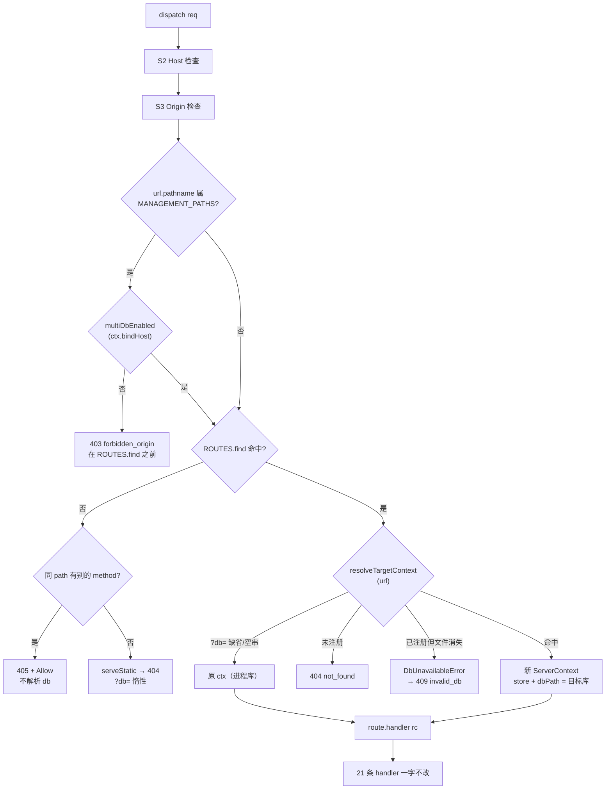

# 13 · 多库服务端 API（D3）

> 本文是 `10-多库共同上下文.md`（冻结，mtime 2026-09-16 03:52）在**服务端 API 层**的落地设计。
> 冲突时以 `10` 为准。本文只拥有：`src/web/routes.ts` 的 `?db=` 解析 + 3 条库管理路由、`/api/databases` 的 DTO、`src/web/server.ts` 的 ctx 传递、`src/web/serialize.ts` 的 DTO 扩展。
> **MUST NOT 碰**：注册表内部（D1）、路径策略内部（D2）、前端（D4）、测试矩阵（D5）。
> 标注纪律：**实测** / `[INFERENCE]` 分开；所有 `file:line` 已在写作时复核（回执见 §1.0）。

---

## 0. 一句话设计

> `dispatch` 在 S2/S3 之后、`ROUTES.find` **之前**插一段「目标库解析」：把 `?db=` 当作**注册表里的查表键**，命中就把 `store`/`dbPath` 换掉，**构造一个新的 `ServerContext`** 交给原 handler。
> 21 条数据路由的 handler **一行不改**；新增 3 条库管理路由；**未注册的 `?db=` 一律 404 且永不打开文件**。

---

## 1. 现状复核（本文用到的每一个事实）

### 1.0 复核回执（写作时逐个跑过）

| 事实 | 复核方式 | 结果 |
|---|---|---|
| `ServerContext` 字段 | `read src/web/server.ts:18-25` | `store`/`dbPath`/`assetsDir`/`tempThreshold`/`tempThresholdSource`/`startedAt`，6 个 ✅ |
| `ctx.store` 引用数 | `grep -c "ctx\.store" src/web/routes.ts` | **16** ✅ |
| `ctx.dbPath` 引用 | `grep -n` | **仅 `routes.ts:177`**（`getMeta`）✅ |
| `ctx.tempThreshold*` | `grep -n` | `routes.ts:195,196,451,452,453` ✅ |
| `ctx.assetsDir` | `grep -n` | `routes.ts:809,812`（`serveStatic`）✅ |
| 路由条数 | `routes.ts:834-855` | **21** 条（11 GET + 10 POST）✅ 与契约 §2.7 修正后一致 |
| 错误码闭集 | `routes.ts:71-79` | 7 个，`as const` ✅ |
| `invalid_db` 的 HTTP | `routes.ts:116-118` + `test/web/api.test.ts:865` | **409**（契约 §4.6 已更正为 409）✅ |
| detector 已 per-store | `runtime.ts:15` | `WeakMap<MemoryStore, ChangeDetector>` ✅ |
| `openDatabase` 无 readOnly | `driver.ts:28-30` | `new DatabaseSync(resolved)` + `PRAGMA journal_mode = WAL` + `busy_timeout = 5000` ✅ |
| `openMemoryStore` 是 async | `index.ts:123` | `export async function openMemoryStore` ✅ → D1 的 `resolve` 必须 `Promise`（D1 已确认） |
| `?db=` 的两处注入点 | `app.js:104` / `app.js:115` | `get(path, query)` 有 query 槽；`post(path, body)` **没有** query 槽 ⚠️ 见 §10.4 |
| launcher 探测 | `web-launcher.ts:63-69`、`test/web-launcher.test.ts:50-60` | 只请求 `/api/meta`（**不带查询串**），比较 `db_path === dbPath` ✅ |
| 既有测试构造 ctx 的地方 | `grep "startServer(" test/web/*.ts` | 5 处（`api:154`、`audit:160`、`dto-contract:74`、`security:35`、`views-parity:714`）✅ |
| 真机库数 | `find /home/yoshix7ti -maxdepth 8 -name memory.db` | **41**（契约写 39）⚠️ 仅供 label 规则设计，测试 MUST NOT 依赖（§7.5） |
| 只读探测成本（实测） | 26 个真实 memory.db 逐个 `new DatabaseSync(p,{readOnly:true})`+查询+`close()` | 合计 **20.9 ms**、**0.8 ms/库**；**主文件 md5 全不变** ✅（与契约 §2.4b 一致） |

### 1.1 `dispatch` 现结构（`routes.ts:878-933`）

```
878-882  method / url / headers
884      try {
888-898  S2 Host 检查                      → 403 forbidden_origin
900-902  S3 Origin 检查（非 GET/HEAD）      → 403 forbidden_origin
904      normalized = HEAD → GET
905-915  ROUTES.find → 命中则 readJsonBody + handler({req,url,ctx,body})；异常 → BadParam / mapStoreError
917-924  未命中但同 path 有别的 method     → 405 + Allow
926-927  serveStatic
929      404
930-932  } catch → mapStoreError
```

**插入点只有一处**：`902` 之后、`905` 之前 —— 与契约 §3.3 的顺序图（S2 → S3 → 解析目标库 → 驱逐 → handler）逐字对应。

---

## 2. 设计总览



---

## 3. `?db=` 解析（契约 §3.3 / §4.1 / §4.2）

### 3.1 规则表

| # | 规则 | 出处 |
|---|---|---|
| R1 | 参数名 **`db`**，值 = 库的**绝对路径**（= 库 id）。除 `URLSearchParams` 自身解的一层百分号编码外不做处理。 | §4.1 |
| R2 | **缺省**（参数不存在，或值为空串）⇒ **进程库**，原样返回传入的 `ctx`。 | §4.1、§4.2#4 |
| R3 | 有值时：`path.resolve(raw)` 归一后与注册表**全等**才接受。 | §4.2#1 |
| R4 | 未命中 ⇒ **404 `not_found`**，MUST NOT 顺手注册、MUST NOT 打开文件。 | §4.2#3 |
| R5 | 命中 ⇒ `store`/`dbPath` 换成目标库，**构造新 `ServerContext`** 传给 handler。 | §3.3、§7.3 |
| R6 | `?db=` 在 21 条数据路由上生效；在 `/`、`/assets/*`、3 条库管理路由上**完全惰性**（§4.6）。 | §4.1、§3.4 |
| R7 | 重复出现（`?db=A&db=B`）⇒ 取**第一个**值（`URLSearchParams.get` 天然如此）。不做额外校验：前端不可能产生（`buildQuery` 用 `set`，`app.js:65-70`）。 | 本文裁定 |

### 3.2 `?db=` 空串 = 进程库（边界用例 #1 的裁定）

**等价于缺省 ⇒ 进程库**，不是 400、不是 404。三条依据：

1. 契约 §4.1「缺省：等价于进程库」的语义单位是**值**，不是「参数存在与否」。
2. 前端 `buildQuery`（`app.js:65-70`）对 `undefined`/`null`/`""` **直接跳过**，本工具自身永远不发 `?db=`；出现它只可能来自 `curl` 或手改 URL。
3. 判为错误会把前端「未选择库」的中间态（localStorage 空）变成故障。

不软化任何安全性质：空串在 `path.resolve` **之前**就返回了（`resolve("")` 会得到 cwd，绝不能让它进查表）。

### 3.3 精确插入位置 + 代码草图

#### 改动 1 — `server.ts` 的 `ServerContext`（`server.ts:18-25`）

```ts
export interface ServerContext {
	store: MemoryStore;
	dbPath: string;
	assetsDir: string;
	tempThreshold: number;
	tempThresholdSource: "cli" | "settings" | "default";
	startedAt: string;
	/** 多库注册表。缺省 = 单库退化（§12.2）。 */
	registry?: StoreRegistry;
	/** CLI `--host` 原值。多库闸门只认它，MUST NOT 用 req.headers.host（§4.5）。 */
	bindHost?: string;
	/** CLI `--roots` / `--allow-any-path`。缺省 `{ roots: [process.cwd()], allowAnyPath: false }`。 */
	pathPolicy?: PathPolicy;
}
```

⭐ **三个字段全部 optional 是刻意的**：既有 5 个测试文件的 `startServer({…})` 调用**一字不改仍编译、仍绿**（D5 的 V9）。
`import type { StoreRegistry } from "./registry.ts";` / `import type { PathPolicy } from "./db-path-policy.ts";` 都是纯类型导入 → **无运行时循环依赖**（`registry.ts` 不 import `server.ts`）。`[INFERENCE]`

#### 改动 2 — `routes.ts` 新增 import（顶部 `routes.ts:12-41` 区块）

`routes.ts` 现有 import 里**没有** `node:os`（§6.1 需要 `homedir`）。新增以下 4 行；`probeMemoryDb` / `checkPathAllowed` / `PathPolicy` 是 `postDatabasesOpen` 与闸门用的：

```ts
import { homedir } from "node:os";                                                       // §6.1 labelOf
import { checkPathAllowed, type PathPolicy, multiDbEnabled } from "./db-path-policy.ts"; // D2
import { discoverMemoryDbs, probeMemoryDb, readMemoryDbStats } from "./discovery.ts";    // D1
import { DbUnavailableError, type RegisteredDb, type StoreEntry, StoreRegistry } from "./registry.ts"; // D1
```

`serialize.ts` 侧新增 4 个类型 import：`type DatabaseDTO`、`type DatabaseOpenedDTO`、`type DatabasesDTO`、`type DiscoveryMetaDTO`（加进 `routes.ts:22-39` 那个已有的 `import { … } from "./serialize.ts"` 块）。

#### 改动 3 — `dispatch` 的替换（`routes.ts:904-929`）

```ts
		const normalized: Method = method === "HEAD" ? "GET" : (method as Method);
		const route = ROUTES.find((r) => r.method === normalized && r.path === url.pathname);
		const samePath = ROUTES.filter((r) => r.path === url.pathname);

		// S4（§5.5）：非回环绑定 ⇒ 3 条库管理路由整体禁用。判定用 CLI 的 --host
		// （ctx.bindHost）；S2 已保证请求头一定是回环，用它会得到永假分支（§4.5）。
		if (MANAGEMENT_PATHS.has(url.pathname) && !multiDbEnabled(ctx.bindHost ?? "127.0.0.1")) {
			return send(res, fail(403, "forbidden_origin", MGMT_DISABLED_MESSAGE), headers);
		}
		// 405 MUST 在目标库解析之前：否则 DELETE /api/node?db=<未注册> 会从 405 变
		// 404 —— 与多库无关的语义漂移必红既有测试（api.test.ts:818-823）。
		if (!route && samePath.length > 0) {
			const allow = [...new Set(samePath.map((r) => r.method))].join(", ");
			return send(res, fail(405, "method_not_allowed", `路径 ${url.pathname} 不支持方法 ${method}`), {
				...headers,
				Allow: allow,
			});
		}

		if (route) {
			// ⭐ entry 的生命周期：resolve 抬引用计数 → 请求期间该 entry 永不被
			// LRU 驱逐 → finally release 放计数（D1 §5.6，逐字照抄）。
			let entry: StoreEntry | null = null;
			try {
				const target = await resolveTargetContext(ctx, url); // ← 唯一插入点
				if (!target.ok) return send(res, target.result, headers);
				entry = target.entry;
				const body = req.method === "POST" ? await readJsonBody(req) : undefined;
				const result = await route.handler({ req, url, ctx: target.ctx, body });
				return send(res, result, headers, method === "HEAD");
			} catch (error) {
				if (error instanceof BadParam) return send(res, badRequest(error.message), headers);
				return send(res, mapStoreError(error, {}), headers);
			} finally {
				// 缺省 ?db= 时 entry === null → 不调用（进程库是 adopt 进来的，不在 LRU 内）。
				if (entry) registryOf(ctx).release(entry);
			}
		}

		const stat = await serveStatic({ req, url, ctx, body: undefined }, url.pathname);
		if (stat) return send(res, stat, headers, method === "HEAD");
		return send(res, notFound(`未找到：${url.pathname}`), headers);
```

⚠️ `route.handler(...)` 的 `body` 读取**顺序不变**（仍在 handler 调用前、仍在同一个 `try` 里）。
⚠️ `MANAGEMENT_PATHS` 判定 MUST 用 `url.pathname`（由 `new URL(rawUrl, "http://localhost")` 得出，已归一化）；MUST NOT 用 `rawUrl` 字符串比较（`/api/databases/`、`/api//databases` 会绕过）。

#### 改动 4 — 新函数（`routes.ts` 的 Dispatch 区块，`dispatch` 之前）

```ts
const MANAGEMENT_PATHS = new Set(["/api/databases", "/api/databases/open", "/api/databases/create"]);
const MGMT_DISABLED_MESSAGE =
	"多库功能只在回环绑定下可用（当前 --host 不是 127.0.0.1 / ::1 / localhost）。";

/**
 * 把 `?db=` 解析成目标库并构造本请求的 `ServerContext`（契约 §3.3）。
 * - 未换库（缺省 / 空串 / 库管理路由）⇒ 返回的 `ctx` 与参数**引用相等**，`entry === null`。
 * - 命中 ⇒ 返回**新对象** + 该 entry（调用方 MUST 在 `finally` 里 `release(entry)`）。
 * - 未命中 ⇒ 返回可直接 `send` 的 `HandlerResult`（404）。已注册但文件不可用时**抛**
 *   `DbUnavailableError`，由 `dispatch` 外层的 `catch` → `mapStoreError` 收敛（§8.3）。
 */
async function resolveTargetContext(
	ctx: ServerContext,
	url: URL,
): Promise<
	| { ok: true; ctx: ServerContext; entry: StoreEntry | null }
	| { ok: false; result: HandlerResult }
> {
	// 库管理路由 MUST 惰性：前端 HTTP 层会给**每个**请求自动附加 ?db=（app.js:104/115），
	// 若此处报错，切库后连"列出库"都会失败（§4.6、边界用例 #11）。
	if (MANAGEMENT_PATHS.has(url.pathname)) return { ok: true, ctx, entry: null };

	const raw = url.searchParams.get("db");
	if (raw === null || raw === "") return { ok: true, ctx, entry: null }; // R2 / §3.2：缺省与空串

	// ⭐ R3：?db= 是**查表键**。先归一，再查注册表；
	//    MUST NOT 把归一后的值交给 openMemoryStore（§3.5）。
	const candidate = path.resolve(raw);

	// ⭐ S5（契约 §5.5）：非回环绑定 ⇒ 多库**整体禁用**，?db= 只接受进程库本身。
	// ⚠️ 这一条 MUST 是**机制**，不能靠"注册表恰好只有进程库"来兜：回环会话里点过
	//    一次「打开」后，那条注册会活到进程结束 ⇒ 非回环下就能读到它。
	// ⚠️ 用 `multiDbEnabled(ctx.bindHost)`（CLI --host），MUST NOT 用 req.headers.host（§4.5）。
	if (!multiDbEnabled(ctx.bindHost ?? "127.0.0.1") && !isProcessDb(ctx, candidate)) {
		return {
			ok: false,
			result: notFound(`未注册的记忆库：${candidate}（非回环绑定下只能访问进程库）`),
		};
	}

	const entry = await registryOf(ctx).resolve(candidate); // D1 内部先 stat，再做懒打开 + 内部驱逐
	if (!entry) {
		// R4：未注册 ⇒ 404，且**从未**碰过这个文件（命中失败在 Map.get 就返回）。
		return { ok: false, result: notFound(`未注册的记忆库：${candidate}（请先在「记忆库」页选择或打开它）`) };
	}
	// R5：只换 store / dbPath。其余字段是进程级的，随库变就是 bug（§10.3）。
	return { ok: true, ctx: { ...ctx, store: entry.store, dbPath: candidate }, entry };
}
```

`resolve` 抛 `DbUnavailableError`（已注册但文件消失/非普通文件）时**不在此 catch**：它发生在外层 `try` 内、`route.handler` 之前，落到 `dispatch` 末尾的 `catch` → `mapStoreError`。为此 `mapStoreError` MUST 加**按 `instanceof` 判**的分支（§8.3）。

### 3.4 为什么必须构造新 `ServerContext`，而不是改 `RouteHandler` 签名

- `RouteHandler`（`routes.ts:62`）被 **21 个 handler** + `test/web/api.test.ts:876,959` 的 `ROUTES.push` 共用。改签名牵动 21 个 handler + 2 处测试构造函数 + 全部推断，**收益为零**。
- `RequestCtx.ctx`（`routes.ts:50`）已经是「本次请求的服务端上下文」的唯一通道：16 处 `ctx.store`、1 处 `ctx.dbPath`、5 处 `ctx.tempThreshold*`、2 处 `ctx.assetsDir` 全经它取值。换掉它 ⇒ 全部 handler 自动作用于目标库，**且没有一个 handler 需要知道多库存在**。
- 被否决的两个替代：① 给 `RequestCtx` 加顶层 `store`/`dbPath` → 改 16 处引用；② 模块级可变 `currentStore` → 并发请求互相踩（单进程并发 HTTP）。

### 3.5 ⭐ 为什么 `?db=` **绝不能**直接当路径去 `openMemoryStore`（安全核心）

四条理由，按严重度降序：

1. **不是「读任意文件」，是「毁任意 SQLite 文件」。** `openMemoryStore`（`index.ts:123-127`）= `openDatabase` + `createSchema` + `new MemoryStore`。`createSchema`（`schema.ts:131`）只在 `memory_kv.schema_version` **存在且不匹配**时才拒绝；普通 SQLite 文件没有 `memory_kv` → `readSchemaVersion` 返回 `null` → **一路建表**。契约 §2.3 实测：一张 `users` 表的库被灌进 22 张 `memory_*` 表。**污染用户的笔记库/别的应用数据文件** —— 这不是保密性问题，是数据破坏。
2. **会凭空造文件。** `driver.ts:28` 的 `new DatabaseSync(resolved)`（非 readOnly）在路径不存在时**静默新建**，随后灌表。`?db=/home/u/notes/important` 会把不存在的路径变成一个 22 表的 SQLite 文件。
3. **CSRF 就够用了。** M5 不引入 token/session/登录，S2/S3 只挡 Host/Origin；而 **`Origin` 对 `GET` 不检查**（`routes.ts:900`：非 GET/HEAD 才查。`test/web/security.test.ts:177` 断言 `GET /api/meta` 带 `Origin: http://evil.com` 仍 200）。所以**用户浏览器里的任意网页**都能发 `GET /api/meta?db=…`。若 `?db=` 是路径 ⇒「任意网页 → 任意 SQLite 文件的读写」成立（契约 §5.1）。
4. **能力与意图不匹配。** `?db=` 表达「在我已经信任的集合里选一个」，不是「我有权动这个路径」。注册表是这个信任集合的物化：只有通过 `checkPathAllowed`（roots 包含性）**且**通过只读探测（§5.2 R1）的路径才进得去，而进门动作必须是**用户显式的一次 UI 动作**（`POST /api/databases/open`）。

**代价（如实记录）**：发现范围外的库必须先点一次「打开」。这正是 M1（自动发现 + 手动输入兜底）的含义；把 fallback 做成"自动打开"会让 M1 与 §5.2 同时失效。

**可机械核验**（§14 / 契约 V1、V2）：对任意普通 SQLite 文件发 `?db=<它>`，断言 ① 404 `not_found` ② 主文件 **md5 不变** ③ 表集合不变。

---

## 4. 3 条库管理路由（契约 §3.4）

### 4.1 路由表 diff（`routes.ts:833-855`）

| 行号 | 变化 | 内容 |
|---|---|---|
| `855` 之后 | **+3 行** | 见下 |
| 其余 21 行 | **不动**（一字不改） | — |

```ts
	{ method: "GET", path: "/api/databases", handler: getDatabases },
	{ method: "POST", path: "/api/databases/open", handler: postDatabasesOpen },
	{ method: "POST", path: "/api/databases/create", handler: postDatabasesCreate },
```

插入位置：**表尾**（`postWorldTime` 之后）。理由：既有 21 行的顺序被 405 断言（`test/web/api.test.ts:818-823`）与 review 文档逐行引用过；追加在尾部让「未改既有行」这件事在 `git diff` 上直接可见（应只有 `+3 -0`）。
**`ROUTES.length`：21 → 24。**

### 4.2 `GET /api/databases`

**闸门**：`MANAGEMENT_PATHS` 成员 ⇒ 非回环 403（§4.5）；**不做** `resolveTargetContext`（`?db=` 惰性，§4.6）。

**步骤**：

1. `const policy = ctx.pathPolicy ?? { roots: [process.cwd()], allowAnyPath: false };`
2. `const registered = registryOf(ctx).list();`（D1：含未打开的，`entry: null`）
3. `const found = await discoverMemoryDbs(policy.roots);`（D1 §5.1：`{ paths, scanned, errors }`）
4. **并集去重**（契约 §4.3）：`Map<path, record>`，先放发现结果（`registered: false`），再放注册表（**覆盖**为 `registered: true`）。注册表**永远赢** —— 它代表「用户已经明确打开过」。
5. **进程库 MUST 在结果里**：`ctx.dbPath` 以 `registered: true` 并入。`cli.ts` 启动时会 `registry.adopt(opts.dbPath, store)`（D1 §5.5），故它本就在 `list()` 中；此处显式并入是**定义**（「进程库一定是已注册库」）而非补丁。
6. 逐库填 `reachable` / `node_count` / `world_time` / `error`（§4.2.1）。
7. 按 §7 排序。
8. 返回 `DatabasesDTO`（§5.1）。

#### 4.2.1 ⭐ `node_count` 的两种数据源（禁止为「列库」而懒打开）

| 库的状态 | `node_count` / `world_time` 来源 | 连接代价 |
|---|---|---|
| 已打开（`registry.entryOf(path)?.store` 非空） | 该 store 的连接：`store.listNodes().length`（`store.ts:1194`）+ `store.getWorldTime()`（`store.ts:1111`） | 0（复用） |
| 未打开（发现结果、尚未 open） | **D1 的 `readMemoryDbStats(path)`**（只读打开一次、内含 `close()`） | ~1 ms/库（实测 0.8 ms） |

⚠️ **MUST NOT** 为 `/api/databases` 调 `registry.resolve()`：那会**懒打开**每个发现的库 → ① 打爆 LRU=8（契约 §3.2#3）② 每次列库都 churn 一遍连接 ③ 违背 §6.2 的意图（列库是只读快照，不是「打开」）。
⚠️ **MUST NOT** 在 `routes.ts` 里裸调 `openDatabaseReadonly`：那会把「调用方 MUST `close()`」（契约 §4.4 末句）在第三处再抄一遍。统一走 D1 的 `readMemoryDbStats`（它保证含异常路径的 `close()`，并自带 5 s TTL 缓存）。
⚠️ 只读打开**会留下 `-wal`/`-shm` 附属文件**（真实 memory 库是 WAL；契约 §2.4b 实测），但**主文件 md5 不变**（本文 §1.0 实测）。这是允许的、与 D1 探测同性质，MUST NOT 为此改设计。MUST NOT 在只读连接上跑 `PRAGMA journal_mode`（会抛 `attempt to write a readonly database`）。

**字段填法**：

- `reachable`：该路径当前可只读读到 `nodes` 表 ⇒ `true`。未打开库由 `readMemoryDbStats` 判（返回 `null` ⇒ `false`）；**进程库与已打开库恒 `true`** —— 连接在我们手里，文件被外部删除这件事由下一个真实请求报 `invalid_db`，列库时**不主动制造失败**（否则用户会因为一次外部删除而看到整页错误，而其他库明明可用）。
- `error`：`reachable === false` 时填 D1 `ProbeOutcome.detail`（已保证人话）；否则 `null`。
- `node_count` / `world_time`：`reachable === false` 时**均为 `null`**（契约 §4.3 冻结：不可达时为 null）。⚠️ MUST NOT 用 `0` 冒充 —— `0` 是「空库」这个**有意义的状态**（39 个库里 35 个是它），混用会让 UI 无法辨认。

### 4.3 `POST /api/databases/open`

**请求**：`{ "path": "<绝对或相对路径>" }`

**流程（顺序 MUST 如下，逐条对应契约 §5.2 R1 的 1→4）**：

| 步 | 动作 | 失败 |
|---|---|---|
| 0 | `asObject(rc.body)`；`strField(obj, "path")`（`routes.ts:563-570`）；缺/空/非字符串 | 400 `bad_request`「缺少必需参数：path」 |
| 1 | `checkPathAllowed(policy, raw)`（D2）—— 内部做 `path.resolve` 归一 + roots 包含性（`path.relative`，非 `startsWith`） | 400 `bad_request`，message = D2 的 `detail` |
| 2 | `probeMemoryDb(allowed.path)`（D1，只读） | 按 §4.3.1 映射 |
| 3 | `registry.register(allowed.path)`（D1；幂等；内部先 `stat` 再懒打开） | 打开失败 → `mapStoreError` |
| 4 | 用 `entry.store` 填 `node_count` / `world_time` | — |

⚠️ 步 2 与步 3 之间**不得**有任何写操作。`probeMemoryDb` 是先验后开的**唯一**闸门（契约 §5.2 R1、Q1）。

#### 4.3.1 `ProbeOutcome` → 响应映射（即 §8 错误矩阵第 5–8 行）

| `ProbeOutcome.reason` | 码 | HTTP | message 要点 |
|---|---|---|---|
| `missing` | `bad_request` | 400 | 「路径不存在：<path>。若要新建空记忆库，请用「新建」（需 `confirm: true`）。」 |
| `not-a-file` | `bad_request` | 400 | 「这不是一个文件（可能是目录）：<path>」 |
| `not-memory-db` | `bad_request` | 400 | 「这不是记忆库（读不到 `memory_kv.schema_version`）：<path>」 |
| `unreadable` | `bad_request` | 400 | 「无法读取该路径（<detail>）：<path>」 |
| `incompatible` | `invalid_db` | **409** | 「记忆库 schema v<实测> 与本版本 v<SCHEMA_VERSION> 不兼容，且无就地迁移。」（`SCHEMA_VERSION` 当前为 `"2"`，`schema.ts:4`；MUST 从常量取，MUST NOT 写死） |
| `ok` | — | 200 | `DatabaseOpenedDTO`（§5.4） |

⚠️ 四条 400 的 message **MUST 由 D1 的 `detail` 提供可读原因**（D1 §5.1 已把 `errors`/`detail` 一律定为人话与 errno 名）；`routes.ts` 只负责**拼接前缀**（场景名）+ 路径。
⚠️ 「是否是记忆库」的**唯一判据**是「能否读到 `memory_kv.schema_version`」（契约 §5.2#4）；MUST NOT 改成"看有没有 `nodes` 表"之类的近似（那会把 `-wal`/`-shm` 的附属判断也拖进来）。

⭐ `incompatible` 用 `invalid_db`(409) 而非 `bad_request`(400)：它**不是表单错误**（路径合法、库合法、就是版本不对），而 `routes.ts:88` 的默认文案「记忆库版本不兼容，无法读取。」**逐字**就是这个语义，`mapStoreError`（`routes.ts:116`）对 `incompatible with this build` 也给 409。两条路径同码 ⇒ 前端只需一条文案（`app.js:278`）。
⚠️ `incompatible` 的 message MUST 由 D1 的 `detail` 提供实测版本号；MUST NOT 在 `routes.ts` 里重新格式化（版本号的唯一真相源在 `schema.ts`/探测里）。

### 4.4 `POST /api/databases/create`

**请求**：`{ "path": "...", "confirm": true }`

**MUST**：`obj.confirm !== true` ⇒ 400 `bad_request`「新建记忆库需要 `confirm: true` 显式确认」。依据契约 §5.3：路径不存在时静默新建会把用户的笔误变成一个莫名其妙的文件。
⚠️ 严格 `=== true`：`"true"`（字符串）/ `1` 都**不**算确认。理由是"显式"的含义 —— 前端的确认框（D4）产生的是布尔 `true`。

#### 4.4.1 ⭐ 存在性守卫（本文对 §5.3 的必要细化，已报 Main）

契约 §5.3 只说「新建库 MUST 走 `openMemoryStore`」。但若目标路径**已存在且不是记忆库**，`openMemoryStore` 就会灌表 —— 正是 §2.3 的破坏。所以 create 的顺序 MUST 是：

| 步 | 动作 | 结果 |
|---|---|---|
| 0 | 校验 `path` 非空 + `confirm === true` | 否则 400 |
| 1 | `checkPathAllowed(policy, raw)` | 否则 400（create 同样受 roots 约束，契约 §5.4） |
| 2 | `fs.stat(path.dirname(resolved))`；父目录不存在 ⇒ 400「父目录不存在：…」 | **MUST NOT** `mkdir -p`：那会把一次笔误变成一棵目录树 |
| 3 | `fs.stat(resolved)`：**已存在**（任意类型）⇒ **409 `conflict`**「该路径已存在，若要使用它请点「打开」」 | **create 永不覆盖任何东西** |
| 4 | `writeFileSync(resolved, "", { flag: "wx" })` 原子占位 | `EEXIST` ⇒ 409 `conflict`（关掉 TOCTOU） |
| 5 | `openMemoryStore(resolved)` → 得到 `created: MemoryStore`（契约 §5.3 明令：**MUST NOT** 用只读探测来建库） | 失败 ⇒ 500 `internal`，走步 6 |
| 6 | 失败时**尽力清理**：`created.db.close()` + 仅当该文件仍是 0 字节时 `unlink`；两者自身失败只记日志 | — |
| 7 | `created.db.close()`（**成功路径也要**，见下 ⚠️） | — |
| 8 | `registry.register(resolved)`（D1；幂等；内部自己 `openMemoryStore`）→ 得到 `entry` | — |
| 9 | 用 **`entry.store`** 填 `node_count` / `world_time`（与 §4.3 步 4 同款） | — |

**响应 200**：`DatabaseOpenedDTO`（§5.4）。`created: true`、`already_registered: false`。

⚠️ ⭐ **步 5 与步 8 会各开一次连接 —— 必须 `close()` 掉步 5 那个**（可行性评审发现，本文初版漏了，总监已实测确认）：
`registry.register(raw)` 只收 `raw: string`，内部走 `resolve → openInto → openMemoryStore` **再开一次**（收 store 的是 `adopt`，那个会 pin，不能用）。两次调用都在**同一个同步 handler** 内 ⇒ D1 的 `inflight` 去重**无效**（第一次的 Promise 已 settle，不是并发窗）；实测两次 `openMemoryStore` 返回**不同对象**。若不关步 5 的连接：
- 同一路径有**两个 `MemoryStore`/两条连接** ⇒ 违反契约 §3.2#2「同一路径进程内 MUST 只有一个 `StoreEntry`」；
- 破坏 §2.2 / §7.4：两个 detector 各读各的 `data_version` ⇒ `/api/events` 的 `changed` 失真（D5 的 V3c 正是断这个）；
- 步 5 那条连接**没人持有** ⇒ fd 泄漏。
**本文选裁定 (a)**：建库后立即 `close()`，由 `register` 重开（干净；代价是 create 多一次 open/close，而 create 是低频人工动作）。
**备选 (b)**（若 D1 后续给 `register` 加"收 store"的重载）：复用步 5 的连接，省掉这一开一关。**MUST NOT 只做一半** —— 两条路各自完整，混用会同时留下"双连接"与"永久 pin"。

⚠️ `node_count` / `world_time` **MUST 取自 `entry.store`（步 8 的）**，MUST NOT 取步 5 那个已 close 的（在已关连接上查询会抛 `database is not open`）。
⭐ 0 字节文件是**合法**空 SQLite 库（契约 §2.4b 实测「open 成功、大小不变」），所以步 4 的占位不需要写任何字节。
⭐ 反复 `create` 一个已存在的路径 = **409**，**不是** 200 幂等：`/open` 才是幂等入口（D1 的 `register` 幂等）。这条差异 MUST 冻结，否则「笔误新建」会被"幂等地"变成"重复确认也照样通过"。
⭐ **步 8 MUST 用 `register` 而非 `adopt`**（评审发现，已改）：`adopt` 无条件 `pinned.add` ⇒ 该连接**永不驱逐也永不关闭**（fd 泄漏），且 D5 的 V6a（活跃连接数 ≤ limit）在做过一次 create 的会话里就不成立。`create` 出来的库与 `/open` 打开的库**语义无差别**：都不是用户 `--db` 显式指定的、都受 roots 约束、都过探测 ⇒ 没有理由 pin。
**只有** `cli.ts` 的进程库用 `adopt`（它是用户显式指定的启动参数，契约 §5.4 也明说它不受 roots 约束）。

### 4.5 非回环闸门：为什么必须在 `dispatch` 里、且只看 `ctx.bindHost`

- **必须在 `dispatch`**：契约 §5.5 要求这 3 条**全部** 403。把判定写在 3 个 handler 里 = 3 个可能被漏掉的地方；集中一处则 D5 的 V5 一次覆盖（`status === 403` + `body.error.code === "forbidden_origin"`）。
- **MUST 在 `ROUTES.find` 之前判**：否则 `POST /api/databases`（表里只有 GET）会先撞 405 —— 既泄漏「这个路径存在」，又让「整体禁用」落空。
- **MUST 用 `ctx.bindHost`，MUST NOT 用 `req.headers.host`**：`checkHost`（`security.ts:33-36`）已保证能走到这一步的请求其 `Host` **必然是** `127.0.0.1`/`localhost`/`[::1]`，所以用请求头判定 `multiDbEnabled` 会得到一个**永假**的分支 —— 测试会绿（真实 host 是回环）、生产永不生效（`--host 0.0.0.0` 时同样永假）。这是一个**会假绿的死代码陷阱**，V5 MUST 用真实 `--host 0.0.0.0` 起服务（或直接构造带 `bindHost` 的 ctx）来钉住。
- 发现扫描随之不执行（契约 §5.5）：天然满足 —— `/api/databases` 是唯一发现入口，它 403 就不扫。**MUST NOT** 在 `startServer` 里预先扫描（非回环启动时会泄漏路径）。

#### 4.5.1 ⭐ 同一判定的第二处：`?db=` 分支（契约 §5.5 第 3 条）

契约 §5.5 不止禁 3 条管理路由，还要求「全部数据路由的 `?db=` **MUST 只接受进程库**；其他值一律 404」。初版本文把这条**当成了自动成立**（注册表里只有 adopt 进来的进程库 ⇒ 别的值自然 404）。评审指出这是错的：

⚠️ **它不是机制，只是巧合。** 注册表的**内容**取决于用户是否点过「打开」，与 `--host` 无关。`--host 0.0.0.0` 只改变**网络可达性**，不改变注册表也不改变谁在访问（同一个进程同时可从 `127.0.0.1` 与局域网地址访问）。所以：用户在本地点过一次「打开」之后，非回环方向来的 `?db=<那个库>` 就会 **200** —— 而契约 §5.5 要求 404。⇒ 必须有**显式判定**，MUST NOT 依赖注册表当时的偶然内容。

**实现**（§3.3 改动 4 的 `resolveTargetContext` 内，紧跟 `candidate` 计算之后）：

```ts
if (!multiDbEnabled(ctx.bindHost ?? "127.0.0.1") && candidate !== path.resolve(ctx.dbPath)) {
	return { ok: false, result: notFound(`未注册的记忆库：${candidate}（非回环绑定下只能访问进程库）`) };
}
```

⚠️ 比较用 `path.resolve(ctx.dbPath)` —— 与 §12.3 的"归一化归 registry"一致（虽然这里只剩即时调用无缓存收益）。
⚠️ 这条 MUST 在 `resolve()` **之前**：`resolve()` 会 `stat` 并可能**懒打开**那个库；先判 404 才能保证"非回环下绝不打开非进程库"。
⚠️ **码是 `not_found` 404**（契约 §5.5 原文），**不是** `forbidden_origin` 403 —— 与 3 条管理路由的 403 刻意不同：数据路由上"这个库在这里不可见"与"这个库不存在"对客户端**不可区分**才是对的（不泄漏"本机上存在哪些库"这一信息）；而管理路由的 403 是要让前端明确知道"多库被禁"（D4 的降级判据，§4.6）。
⚠️ message **MUST NOT** 含"非回环"以外的信息（尤其 MUST NOT 区分"已注册但被禁"与"从未注册"）—— 否则等于把注册表内容泄给网络访问者。

**可机械核验**：§13 #9 / #18。`--host 0.0.0.0` 起服务 → 先在**回环**上 `/open` 一个库 X → 再从非回环 `?db=X` ⇒ **404**（而不是 200）。这条正是评审要求的"机制而非巧合"证明。

### 4.6 `?db=` 在 3 条管理路由上「完全惰性」——对契约 §3.4 的细读（本文裁定，已广播）

契约 §3.4 写「这三条 **MUST NOT 接受** `?db=` 参数」。本实现的口径是：**不解析、不生效、也不因此报错**（而非「带了就 400 / 404」）。

**依据（这不是风格问题）**：D4 的注入点在 `app.js:104` / `app.js:115` —— **全站唯一** HTTP 层的 `get()`/`post()` 里，即前端会给**每一个**请求自动附加 `?db=<当前选中库>`，**包括 `/api/databases`**（切库前必须先列库）。若这 3 条路由对 `?db=` 报错，**切库功能的第一步就失败**。故「不接受」只能解释为「不因它改变行为」。

**可机械核验**（§13 #8）：`GET /api/databases` 与 `GET /api/databases?db=<任意值>`（含 `/etc/passwd`、含已注册库）的**响应体逐字节相同**，且都是 **200**。

---

## 5. DTO（`serialize.ts` 扩展，逐字冻结形状）

位置：`serialize.ts` 的「The rest」区块（`serialize.ts:142-215`）内，紧跟 `EventsDTO`（`:212-215`）。
依据 `serialize.ts:1-16` 的三条冻结规则：DTO 层是 `MemoryStore` 与 JSON 之间**唯一合法通道**；每字段由显式 `to*DTO` 构造；行对象按列名读。

### 5.1 `GET /api/databases` 响应

```ts
/** 一个记忆库在列库结果里的样子（契约 §4.3 冻结形状）。 */
export interface DatabaseDTO {
	/** 绝对路径，同时是库 id（契约 §4.2）。 */
	path: string;
	/** 供 UI 显示的短名（生成规则见 §6）。 */
	label: string;
	/** 是否已在注册表（false = 发现到但未打开）。 */
	registered: boolean;
	/** 文件当前存在且可只读探测为记忆库。 */
	reachable: boolean;
	/** 节点数；`reachable === false` 时为 null（⚠️ 0 是「空库」，有意义，不得混用）。 */
	node_count: number | null;
	/** 世界钟；同上。 */
	world_time: string | null;
	/** 不可达时的人话原因；可达时为 null。 */
	error: string | null;
}

/** 发现扫描的元信息（契约 §4.3）。 */
export interface DiscoveryMetaDTO {
	/** 多库功能是否启用（非回环绑定 ⇒ false）。见 §4.5。 */
	enabled: boolean;
	/** ⚠️ D1 语义：**实际访问过的目录数**，不是库数（D1 §5.1 钉死）。 */
	scanned: number;
	/** 人话错误字符串（含路径 + errno 名）。 */
	errors: string[];
}

export interface DatabasesDTO {
	/** 进程库（启动参数）的绝对路径。不是"当前选择"——选择状态在前端（契约 §6.3）。 */
	current: string;
	/** 注册库 ∪ 发现库，按 path 去重，按 §7 排序。 */
	databases: DatabaseDTO[];
	/** 生效的 roots（D2 的 policy）。`--allow-any-path` 开启时语义是"不限"，返回 `[]`（契约 §5.4）。 */
	roots: string[];
	discovery: DiscoveryMetaDTO;
}
```

⚠️ `current` 是**进程库**，不是「用户当前在看哪个库」。契约 §4.3 原文即如此；选择状态在前端（§6.3）。MUST NOT 把它改名成 `selected` —— 那是另一个语义，会诱导后续实现去服务端存选择状态（契约 §6.3 明令 MUST NOT）。

### 5.2 `POST /api/databases/open` 响应

```ts
/** open / create 成功后返回，形状相同（前端可共用一条渲染路径）。 */
export interface DatabaseOpenedDTO {
	/** 归一化后的绝对路径 = 库 id。 */
	path: string;
	label: string;
	/** 恒 true：这两个端点只在成功时返回 200。 */
	registered: true;
	reachable: true;
	node_count: number;
	world_time: string | null;
	/** `open` → false；`create` → true（供前端区分"打开了一个"与"新建了一个"）。 */
	created: boolean;
	/** 该库此前是否已注册（`open` 的重复调用为 true）。`create` 恒 false。 */
	already_registered: boolean;
}
```

⭐ `registered` / `reachable` 之所以写成字面量类型 `true` 而不是 `boolean`：成功响应里它们**不可能**是别的值，类型系统免费把这个不变式钉住。
⭐ **不返回 `databases[]`**：前端拿到结果后会重新拉 `/api/databases`（契约 §6.4 的切库序列），这里回传全表只会制造第二个真相源并让响应大小随库数增长。

### 5.3 `GET /api/events` 不变

```ts
export interface EventsDTO {
	version: number;
	changed: boolean;
}
```

（`serialize.ts:212-215`，**一字不改**。多库语义见 §9。）

### 5.4 `to*DTO` 转换器（`serialize.ts` 新增）

```ts
/** 发现结果 → DTO 的"未注册且不可达"基线（探测失败路径）。 */
export function toUnreachableDatabaseDTO(path: string, label: string, error: string): DatabaseDTO;

/** 已知 node_count / world_time 的 DTO。⚠️ 不在这里做探测（探测归 D1）。 */
export function toDatabaseDTO(input: {
	path: string;
	label: string;
	registered: boolean;
	nodeCount: number | null;
	worldTime: string | null;
	error: string | null;
}): DatabaseDTO;

/** `current` 字段的唯一构造点：MUST 是调用方传入的进程库路径。 */
export function toDiscoveryMetaDTO(enabled: boolean, scanned: number, errors: string[]): DiscoveryMetaDTO;
```

⚠️ `toDatabaseDTO` **MUST NOT** 接受 `MemoryStore`——那会让 DTO 层产生「这个库已打开」的隐含假设（`serialize.ts:6` 规则 1）。探测与计数留在 `routes.ts` 的 handler 里，与其余 handler 的体力活同处一层。

---

## 6. `label`（短名）生成规则 —— 契约 §11 U1 的裁定

### 6.1 规则（逐字实现，`labelOf(absPath: string): string`）

每步都附实测依据（§6.3 是对 41 个真机库跑出来的结果）。**路径分隔符一律 `path.sep`（不写死 `/`）**。
需要的 import：`import { homedir } from "node:os";`（`routes.ts` 目前未导入 `node:os`，须新增一行）。

```ts
/**
 * 库 id 的显示短名。纯函数：同一 path 永远同一 label（不含全局计数，见 §6.4）。
 * 规则（三步）：
 *   ① 去掉尾级 `memory.db`（库的文件名，恒为最后一段）。
 *   ② ⭐ 丢掉**所有**结构段 `.pi` 与 `characters` —— 它们出现在**任意深度**，
 *      不是"尾级后缀"。见下方 ⚠️（这是本文对初版的修正）。
 *   ③ `worlds/` 之后优先；无 `worlds/` ⇒ `~` 相对 home；home 外 ⇒ 绝对路径原样。
 */
export function labelOf(absPath: string): string {
	const resolved = path.resolve(absPath);
	const parts = resolved.split(path.sep).filter(Boolean);
	// ① 尾级文件名
	if (parts.length > 0 && parts[parts.length - 1] === "memory.db") parts.pop();
	// ② 结构段：`.pi` / `characters` 占据一整段，出现在哪一级都丢掉。
	const kept = parts.filter((segment) => segment !== ".pi" && segment !== "characters");
	// ③
	const worldsAt = kept.lastIndexOf("worlds");
	if (worldsAt >= 0 && worldsAt < kept.length - 1) return kept.slice(worldsAt + 1).join("/");
	const stem = (resolved.startsWith(path.sep) ? path.sep : "") + kept.join(path.sep);
	const home = homedir();
	if (stem === home) return "~";
	if (stem.startsWith(`${home}${path.sep}`)) return `~${stem.slice(home.length)}`;
	return stem;
}
```

⚠️ ⭐ **本文对初版的修正（一致性评审复现，P1）**：初版把 `.pi` / `characters` 当**尾级后缀**逐个 `endsWith` 剥。这对 `…/characters/elias/.pi/memory.db` **不成立** —— 剥掉 `.pi` 后尾部是 `…/characters/elias`，`endsWith("/characters")` 为假 ⇒ `characters` 永远剥不掉，输出 `fpal-9cdfb1dc/characters/elias`，与 §6.3 表里的 `fpal-9cdfb1dc/elias` **不一致**（评审实跑验证）。
根因是**语义搞错了**：`.pi` 与 `characters` 不是"路径末尾的装饰"，而是**布局里的结构段**（`.pi` = memory 目录名；`characters/` = 角色容器的子目录名），可以出现在任意深度。⇒ 正确做法是**按段过滤**（上面的 `filter`），而不是按尾级剥。
**唯一性不受影响**（`characters`/`.pi` 是常量段，去掉后仍然一一对应）：修后实测 41 个真机库仍得 **41 个唯一 label**（§6.3）。

位置：`routes.ts`（值由 `routes.ts` 计算后交给 `serialize.ts` 的 `toDatabaseDTO`）；放 Dispatch 区块附近，不依赖 `ServerContext`，便于 D5 单独断言（§14 A10）。
⚠️ `kept.slice(...).join("/")` 的 `/` 是**显示分隔符**（不是 FS 分隔符），刻意写死 —— windows 上显示 `fpal-9cdfb1dc/elias` 比 `fpal-9cdfb1dc\\elias` 好读，且它是 UI 字符串，不参与路径运算。
⚠️ `kept` 为空（path 恰为 `memory.db` 或全由结构段组成）⇒ `stem` 为空串，落到最后一行返回 `""`。调用方拿到的 `path` 已是 `path.resolve` 过的绝对路径（§4.3 步 1），故 `[INFERENCE]` 实际不可达。
⚠️ 规则**不缩短** `worlds/` 段本身（`worlds/fpal` 的 label 是 `fpal`，不是 `worlds/fpal`）——实测那样更可读（§6.3 表）。
⚠️ 前缀拼接用 **`resolved.startsWith(path.sep)`** 判绝对路径（而不是 `kept` 的首段）：`split` 后首段丢掉了前导分隔符，必须从原串取，否则 `/w/worlds/x` 在无 `worlds` 时会变成 `w/worlds/x`（丢掉根）。

`label` **不是** id（id 是 §4.2 的绝对路径），所以它**允许**重复；但见 §6.3 的实测。

### 6.2 依据（为什么是这套规则，而不是「末两级目录」）
契约 §11 U1 给的建议是「`<world>/<char>` 或末两级目录」。本文选**前者**，并把「末两级」保留为**兜底**。理由三条：

1. **实测记录**（本文 §1.0）：真实库分布是 `<worlds>/<world>/.pi/memory.db` 与 `<worlds>/<world>/characters/<char>/.pi/memory.db`（契约 §2.6）。→ 只有「去掉尾 `memory.db`、丢掉结构段 `.pi`/`characters`，再从 `worlds/` 之后取」才能同时得到 `fpal-9cdfb1dc`（world 级）与 `fpal-9cdfb1dc/elias`（角色级，§6.1 `filter` 修法的实跑输出）。**「末两级目录」做不到**：在角色库上它会得到 `characters/elias`（**所有 world 的角色全部同名**）；在 world 库上它会得到 `world/.pi` —— 两个都是错的。
2. **结构段处理是必需的，不是美化**：本文 §1.0 实测 `~/projects/pi-rp/packages/coding-agent/.pi/memory.db`。若不丢掉 `.pi`，规则会给出 `packages/.pi` 或 `coding-agent/.pi`。D1 独立复现并提醒了这一点（`coding-agent/.pi`）。
3. **`worlds/` 是语义锚点**：它来自实际的项目布局（`~/projects/hackathon/worlds/<world>`），比「第 N 级目录」稳定 —— 用户的 roots 可以是任意祖先目录，用深度索引会在 roots 变化时整体漂移。

### 6.3 实测：41 个真实库 → 41 个唯一 label（0 冲突）
实测（本文 §1.0 同一轮，**按 §6.1 的 `filter` 修法实跑**）：`find /home/yoshix7ti -maxdepth 8 -name memory.db` = 41 个路径 ⇒ **41 个互不相同的 label**（`dups: 0`）。样例（逐字为脚本输出）：

| label | 真实路径（`~` 缩写） |
|---|---|
| `fpal-9cdfb1dc` | `~/projects/hackathon/worlds/fpal-9cdfb1dc/.pi/memory.db` |
| `fpal-9cdfb1dc/elias` | `~/projects/hackathon/worlds/fpal-9cdfb1dc/characters/elias/.pi/memory.db` |
| `fpal-9cdfb1dc/mingyue` | `…/fpal-9cdfb1dc/characters/mingyue/.pi/memory.db` |
| `~/.opensquilla/state/agents/main` | `~/.opensquilla/state/agents/main/memory.db`（**无 `.pi`**） |
| `~/projects/pi-rp/packages/coding-agent` | `~/projects/pi-rp/packages/coding-agent/.pi/memory.db` |
| `~/projects/hackathon-video/templates/fpal/elias` | 另一个仓（**没有 `worlds/`** → 走 `~` 兜底；`characters` 段被丢掉，仍唯一） |

⭐ 第 2、3 行是**修法生效的直接证据**（初版会输出 `…/characters/elias`）。第 5、6 行证明另外两件事：`.pi` 段被丢掉；`worlds/` 缺失时 `~` 兜底仍给出可读且唯一的短名。
⚠️ 测试 MUST NOT 断言这些真实 home 路径（契约 §7.5）；本表只用于论证规则。

### 6.4 仍存在的歧义（如实记录，未伪造成已解）

`[INFERENCE]` 两个**不同 roots 下同名**的 world（例如 `~/projects/hackathon/worlds/fpal` 与 `/data/backup/worlds/fpal`）会得到同一个 label。本文**不**为此加 `#2` 后缀之类的消歧：

- 消歧需要全局计数 → 与「`label` 由 path 纯函数决定」冲突（会引入排序依赖，破坏 §7 的确定性）。
- 单用户本地工具下，**roots 通常只有一个**（契约 §5.4 缺省 `[cwd]`，实际用 `--roots` 指到 worlds 目录）。
- 前端（D4）在 `label` 之外仍可选择显示 `path`（`title` 属性或副行）——那是 UI 的逃生舱，不需要污染 DTO 的语义。

→ **登记为待拍板 U1'**（§15）：若实际使用中出现同名歧义，是否给 `label` 追加 `（<n>）`。本文立场：不加，直到有真实案例。

---

## 7. 排序（契约 §4.3 冻结：确定性）

### 7.1 比较器（逐字）

```ts
/** 契约 §4.3：registered 优先 → node_count 降序 → path 升序。MUST 是纯函数。 */
function compareDatabases(a: DatabaseDTO, b: DatabaseDTO): number {
	if (a.registered !== b.registered) return a.registered ? -1 : 1;
	// null（不可达）排在所有数字之后：它不是"0 条"，而是"不知道"。
	const an = a.node_count ?? -1;
	const bn = b.node_count ?? -1;
	if (an !== bn) return bn - an;
	return a.path < b.path ? -1 : a.path > b.path ? 1 : 0;
}
```

⚠️ `node_count` 为 `null` 时用 `-1`：它必然排在 `0`（空库）**之后**。若不这么做，`?? 0` 会让「不可达」与「空库」在列表里交错，用户无法分辨哪些库其实读不到。
⚠️ 末级 MUST 用**字符串比较**而非 `localeCompare()`：`localeCompare` 受 ICU/locale 影响，在不同环境给出不同顺序 ⇒ 破坏确定性。`path` 是 ASCII 路径（`[INFERENCE]` 非 ASCII 路径下 `<>` 仍是稳定全序，只是不"符合语言习惯" —— 确定性优先）。

### 7.2 稳定性证明（为什么它是确定性的）

三条比较键依次为 `boolean` → `number` → `string`，且**末键 `path` 在集合内唯一**（并集按 `path` 去重，§4.2 步 4）。⇒ 不存在两个元素比较结果为 0，排序结果是**全序**，与输入顺序、引擎实现（`Array#sort` 的稳定性）**均无关**。D5 可以直接断言整个数组的逐项相等。

**可机械核验**：把 `databases` 数组按 `compareDatabases` 再排一次，断言与响应**逐字节相同**（幂等）；且把输入打乱后重排，结果不变。

---

## 8. 错误码映射（契约 §4.6 六场景 + §2.8 Q5 = 七场景，**零新增码**）

### 8.1 完整矩阵（逐条，含契约 §4.6 全部六行 + Q5 一行）

| # | 场景 | 码 | HTTP | 判定位置 | message |
|---|---|---|---|---|---|
| 1 | `?db=` 未注册 | `not_found` | **404** | `resolveTargetContext`（`resolve() === null`） | 「未注册的记忆库：<归一化绝对路径>（请先在「记忆库」页选择或打开它）」 |
| 2 | 已注册但文件消失 / 非普通文件 | `invalid_db` | **409** | `resolveTargetContext` 抛 `DbUnavailableError` → 外层 `mapStoreError` | 「记忆库文件已不存在：<path>」/「该路径已不是一个文件：<path>」 |
| 3 | 已注册但 schema 不兼容（打开时） | `invalid_db` | **409** | `mapStoreError`（`routes.ts:116`，键 `incompatible with this build`） | 默认文案「记忆库版本不兼容，无法读取。」 |
| 4 | 手动路径不在允许 roots 内 | `bad_request` | **400** | `postDatabasesOpen`/`Create` 步 1 | D2 `checkPathAllowed().detail` |
| 5 | 手动路径不是记忆库 | `bad_request` | **400** | `postDatabasesOpen` 步 2（`ProbeOutcome.reason === "not-memory-db"`） | 「这不是记忆库（读不到 `memory_kv.schema_version`）：<path>」 |
| 6 | 非回环绑定下调多库端点 | `forbidden_origin` | **403** | `dispatch` 的 S4 闸门（`MANAGEMENT_PATHS` × `multiDbEnabled(ctx.bindHost)`） | `MGMT_DISABLED_MESSAGE`（§3.3 改动 2） |
| 7 | 新建库缺 `confirm: true` | `bad_request` | **400** | `postDatabasesCreate` 步 0 | 「新建记忆库需要 `confirm: true` 显式确认」 |
| 8 | **（Q5 追加）** 库正被另一进程写入 | `conflict` | **409** | `mapStoreError`（新分支） | 「记忆库正被另一个进程写入，请稍后重试。」 |

⭐ **码集合仍是 `routes.ts:71-79` 的七码闭集**（`bad_request`/`not_found`/`method_not_allowed`/`forbidden_origin`/`invalid_db`/`conflict`/`internal`），**新增 0 个**。`test/web/api.test.ts:19-27` 的 `CONTRACT_CODES` 常量无需改动。

### 8.2 契约 §4.6 的 HTTP 更正（已生效）

契约 §4.6 初版把 `invalid_db` 写成 HTTP 500，与 `routes.ts:116-118`（`fail(409, ...)`）与 `test/web/api.test.ts:865`（断言 409）矛盾，且与 §9 V9（既有测试全绿）互斥。已广播，Main 采纳改为 **409**。本矩阵按 409 落笔。

### 8.3 `mapStoreError` 的两条新分支（`routes.ts:112-141`）

位置：插在 `routes.ts:118`（`unable to open database file`）**之后**、`routes.ts:119`（conflict 区块）**之前**。

```ts
	// ── 多库（D3）──────────────────────────────────────────────────────────
	// ⭐ Q5（契约 §2.8）：busy_timeout 5000 用尽 ⇒ SQLite 抛 "database is locked"。
	// 这是**暂时**冲突（实测：写者 COMMIT 后重试成功），不是环境故障。原先落
	// internal(500) 会让前端显示「服务可能未启动，或已退出」——完全误导。
	if (msg.includes("database is locked") || msg.includes("database table is locked")) {
		return fail(409, "conflict", "记忆库正被另一个进程写入，请稍后重试。");
	}
	// 已注册的库被外部删除 / 变成目录（D1 的 resolve 抛，非字符串可判）。
	// ⚠️ D1 的类有 reason / path 两个字段，**没有 detail** —— 人话原因在 `Error.message`
	//    里（构造时 `super(detail)`，见 D1 的类定义）。此处按实际字段读。
	if (error instanceof DbUnavailableError) {
		return fail(409, "invalid_db", `记忆库不可用（${error.path}）：${error.message}`);
	}

⚠️ `DbUnavailableError` **MUST** 用 `instanceof` 判，**MUST NOT** 匹配 message 字符串（D1 已把 `reason`/`path` 做成 readonly 字段正是为此）。其余分支继续用字符串匹配（它们匹配的是 `node:sqlite` 的原始文本，无法 `instanceof`）。
⚠️ 两条分支的**顺序**：`DbUnavailableError` 的 message 不含 `"database is locked"`，两者不冲突；但 `instanceof` 分支 MUST 在函数末尾的 `return fail(500, "internal")` 之前 —— 否则会静默退化成 500。
⚠️ `database table is locked` 是 SQLite 的**另一条**独立错误（表级锁），一并映射：两者在前端需要的是**同一条**用户动作（稍后重试）。
⚠️ **实测**（本文写作时，Node v26.8.1）：`busy_timeout` 用尽时 `node:sqlite` 抛的 `Error.message` **恰为** `"database is locked"`（`code === "ERR_SQLITE_ERROR"`），写者 `COMMIT` 后重试**成功**。⇒ 字符串匹配键与 §2.8 的记录一致，无需放宽为模糊匹配。

⚠️ ⭐ **字段名以 D1 的类定义为准**（本文初版写了 `error.detail`，**不存在** ⇒ 编译不过）：D1 的 `DbUnavailableError` 是
```ts
class DbUnavailableError extends Error {
	readonly reason: "missing" | "not-a-file" | "path-escalated";
	readonly path: string;
	constructor(reason, path, detail: string) { super(detail); this.name = "DbUnavailableError"; … }
}
```
⇒ **`detail` 只是构造参数，落在 `Error.message`**。本文按 `error.message` 读（`reason` 用于分流文案，见下）。
⚠️ `reason` 三态要**分流**文案（实现时按 `switch (error.reason)`）：
| `reason` | message |
|---|---|
| `missing` | 「记忆库文件已不存在：<path>」 |
| `not-a-file` | 「该路径已不是一个文件：<path>」 |
| `path-escalated` | 「该路径不在允许的 roots 内：<path>」（D2 的 R5/SEC-02；若 D2 已在 `/open` 拦住，这条只在注册后目录被置换时触发） |
⚠️ 「读不到具体原因就直接透传 `error.message`」是**兜底**，不是首选 —— `message` 由 D1 组装，可能是英文 errno 文本。

### 8.4 为什么 Q5 用 `conflict`(409) 而不是 `internal`(500) 或新码

1. **语义**：`conflict` 的既有默认文案是「目标地址已被占用。」（`routes.ts:89`），而 `409` 在整个 API 里已经稳定表示「当前资源状态让你这次操作无法完成，稍后可重试」（`routes.ts:120-125` 的 target occupied / restore clash / UNIQUE 全是这一族）。锁冲突是同一族。
2. **前端动作正确**：`app.js:289-292` 对 `internal` 渲染「服务可能未启动，或已退出」+ **重试按钮**；对 `conflict` 渲染 `m || "目标被占用或已存在。"`。`internal` 的文案是**事实错误**（服务活着），而 `conflict` 的渲染路径会把我们的中文 message 原样展示 → 用户得到「稍后重试」这个正确指令。
3. **不新增码**：契约 §4.6 明令「不得自造第八个码」。
4. **这是上一轮单库就有的缺陷，但多库让它更严重**：单库时只有 pi 会话与 web 抢同一个库；切库后用户**主动**去点那个正被 pi 写着的库（那正是他关心的库）。→ 我的建议：**本次与多库一起修**（改动只有 1 个 `if`），因为它与多库的交互路径是最强的；若 Main 决定单独修，这段代码可独立 cherry-pick。

---

## 9. 写路由的多库语义（10 条 POST）与「每库一份配置」

### 9.1 10 条 POST 在 `?db=` 下如何工作

**结论：一行不改，自动生效。** 依据 §3.4：换掉 `rc.ctx` 即换掉 16 处 `ctx.store` 的取值来源。逐条核对（`routes.ts:577-779`）：

| 路由 | 取库方式 | 多库下的语义 |
|---|---|---|
| `POST /api/node` | `rc.ctx.store.put(...)`（`:586`） | 写入**目标库**；`put` 是 upsert，语义不变 |
| `POST /api/node/revise` | `rc.ctx.store.resolveUri/updateNode`（`:602-636`） | 目标库；乐观锁 `current_version` 是**该库的** |
| `POST /api/node/forget` | `rc.ctx.store.deleteCascade`（`:659`） | 目标库 |
| `POST /api/node/restore` | `rc.ctx.store.restoreDeleted`（`:674`） | 目标库；`version` 编号也是该库的 |
| `POST /api/node/relocate` | `rc.ctx.store.relocateMany`（`:701`） | 目标库 |
| `POST /api/edge` | `rc.ctx.store.addEdge`（`:720`） | 目标库 |
| `POST /api/glossary` | `rc.ctx.store.addGlossaryEntry`（`:733`） | 目标库 |
| `POST /api/glossary/remove` | `rc.ctx.store.removeGlossaryEntry`（`:742`） | 目标库 |
| `POST /api/awaken` | `rc.ctx.store`（`:753-764`，`tools.ts` 的 kv） | 目标库自己的 `memory_kv`（唤醒名单是**每库一份**） |
| `POST /api/world-time` | `rc.ctx.store.setWorldTime`（`:775`） | 目标库的世界钟 |

⚠️ **无跨库操作**（契约 §1.3）：`relocateMany` 的源与目标都在**同一个库**里（`uri` 是库内地址）。`?db=` 只决定"在哪个库里"，不引入任何跨库语义；MUST NOT 出现「把 A 库节点移到 B 库」这种请求形状。
⚠️ `POST /api/awaken` 的 `uris` 元素仍**不**校验可解析性（`routes.ts:761`，与引擎一致）—— 多库不改这条。
⚠️ 每条 POST 都走 `MemoryStore` 方法（`routes.ts:8-10` 的纪律）；多库**不新增任何直接 SQL 写**（契约 §5.6）。

### 9.2 ⭐ `tempThreshold` 这类「每库一份配置」的字段：**它们是进程级，不随库变**

**事实链（本文 §1.0 复核）**：

- `tempThreshold` / `tempThresholdSource` 来自 **CLI / settings**：`cli.ts:53-76` `readThresholdFromSettings` 读 `settings.memory.temp.threshold`，CLI `--temp-threshold` 覆盖它 → 落进 `ctx.tempThreshold`（`cli.ts:176-177`）。
- 契约 §2.2 已把它排除在「per-connection 状态」之外（那张表只有 `ChangeDetector` / `PRAGMA data_version` / `visibility`）。
- CLI 帮助（`cli.ts:19-29`）与 `cli.ts:199-201` 的启动输出都把它描述为**进程级参数**。

**裁定**：`tempThreshold` / `tempThresholdSource` 在多库下**保持进程级**，切库**不改变**它们。即 `getTemp`（`routes.ts:451-453`）与 `getMeta`（`:195-196`）在任意库上都返回同一个阈值。

**依据（不是将就）**：

1. **它根本不是库的属性**。库里存的是节点（`memory_kv` 里没有阈值键）；阈值来自作家/角色的 settings 文件，是**宿主配置**。
2. **若"每库一份"，真相源会分裂成两处**（进程级 CLI + 每库某处），而契约 §1.3 明确不做 schema 变更 —— 没有地方存它。
3. **行为一致性**：用户切库是为了看/改节点；TEMP 阈值的含义（"多少条临时记忆该提醒"）与库无关，随库跳变反而诡异。

⚠️ **MUST NOT** 在 `resolveTargetContext` 里复制 `tempThreshold` 时"顺手"从目标库读一个值 —— 那会引入一个**库内没有**的真相源。
⚠️ 前端（D4）MUST NOT 因为切库而重读阈值、也不得显示"本库阈值"（会暗示它是每库属性）。

**登记**：若将来出现「不同 world 需要不同阈值」的真实需求，那是一次**独立**的设计（需要 schema 变更或 settings 的 roots 映射），MUST NOT 在本次偷偷实现。→ §15 U3'。

### 9.3 `visibility` 与 `domainBlocklist`

- `visibilityFor(rc.ctx)`（`runtime.ts:33`）每请求由 `ctx.store` 现算 → 目标库的 `raw_log.active`（§2.2）。**0 改动**。
- ⚠️ **已知边界（本文登记）**：`MemoryStore.setDomainBlocklist`（`store.ts:172`）是**进程内调用**，web 从不调它（`grep` 无命中）→ 每个 store 的 `blocklist` 都是默认 `[]`，多库下**无差异**。`[INFERENCE]` 若将来 web 引入 blocklist 设置，它必须变成 per-store 且随 `?db=` 走 —— 届时是一条独立设计。

---

## 10. ⚠️ 兼容性：不带 `?db=` 的 `/api/meta` 语义逐字不变

### 10.1 调用方（已读源码确认）

`packages/coding-agent/src/extensions/memories/web-launcher.ts:61-75` 的 `probePort`：

```ts
const res = await fetch(`http://127.0.0.1:${port}/api/meta`, { signal: AbortSignal.timeout(timeoutMs) });
if (!res.ok) return { kind: "occupied" };
const reported = (body as { db_path?: unknown }).db_path;
return reported === dbPath ? { kind: "match" } : { kind: "occupied" };
```

`ensureWebServer`（`:124-157`）用它做三态判定：`match` → 复用已有实例；`occupied` → 让路换端口（**绝不误连别人的库**）；`free` → spawn。
测试 `packages/coding-agent/test/web-launcher.test.ts:50-60` 钉住 `match` / `occupied` 两个方向，`:42-48` 钉住 `free`。

### 10.2 为什么本改动不影响它们（逐条论证）

| 观察 | 本次改动为何不触碰 |
|---|---|
| 请求 **只发 `/api/meta`，不带查询串** | `resolveTargetContext` 里 `url.searchParams.get("db") === null` ⇒ 走 R2 分支，**原样返回传入的 `ctx`**（引用相等，零分配）。 |
| 比较的是 `db_path === dbPath`（绝对路径） | `getMeta`（`routes.ts:177`）读 `rc.ctx.dbPath`。缺省 `?db=` 时 `rc.ctx` **就是** `cli.ts:172-179` 造的那个对象，`dbPath === opts.dbPath`。⇒ 逐字不变。 |
| `web-launcher.ts:125` 用 `path.resolve(opts.dbPath)` 归一 | `cli.ts` 的 `opts.dbPath` 来自 `resolveMemoryDbPath`（`cli.ts:13`），已是绝对路径。⇒ 两侧仍是同一个字符串，`===` 成立（这是 `match` 的必要条件）。**多库不参与**：launcher 探测的是**进程库**，与 `?db=` 无关。 |
| `resolveWebCliPath` → `dist/web/cli.js`（`:84-92`） | CLI 入口路径不变（§12 只加 flag，不改入口）。 |
| `spawnWebServer(cliPath, dbPath, port)`（`:103-114`） | 只传 `--db <path> --port <n>`；本次不**要求**新 flag（`--roots` 有缺省，§12）。⇒ 不加 flag 也能起来，`free → spawn → match` 全链不断。 |
| 既有 344 条测试（契约 V9） | `registry`/`bindHost`/`pathPolicy` 全 optional（§3.3 改动 1）⇒ 既有 `startServer({…})` 调用一字不改；`?db=` 缺省路径与今天**逐字节同构**。 |

### 10.3 一个必须显式说明的推论

带 `?db=<进程库绝对路径>` 的 `/api/meta` 也必须返回**同一个** `db_path`。这**不**由本 §10 保证，而由 §12.3 的 `adopt` 保证：进程库必须在注册表里，否则 `?db=<进程库>` 会 404。
⚠️ 这条**不是**可选的一致性美化：若进程库不在注册表里，前端（D4）在「选中 = 进程库」时发出的**每一个**请求都会 404 —— 即"默认打开就白屏"。D1 已同意在 `cli.ts` 里 `adopt`（本文 §12.3 落笔）。

### 10.4 ⚠️ 一处留给 D4 的接缝（本文不做，只登记）

`app.js:113-124` 的 `post(path, body)` **签名里没有 query 槽**（对比 `get(path, query)`，`app.js:101-112`）。契约 §2.5 / §7.7 说 `app.js:104`、`app.js:115` 是注入点 —— 因此 D4 需要给 `post` 增加 query 支持（例如 `post(path, body, query)`）。**这属于 D4 的文件**，本文只登记边界与**服务端的容忍范围**：

⚠️ ⭐ **拼接顺序 MUST 是「先拼完整 URL，再注入 `db`」**（契约 §7.7 新规则，D4 实测发现）：

```
✅ 正确： get(path + buildQuery(query))  →  withDbParam(<完整 URL>)   ⇒ /api/tree?domain=core&db=%2Fabs%2Fmemory.db
❌ 错误： withDbParam(path)  →  再拼 query                            ⇒ /api/tree?db=%2Fabs%2Fmemory.db?domain=core
```

反例里 `?db` 的值变成 `"/abs/memory.db?domain=core"` —— 归一后与任何注册路径**都不全等** ⇒ 我的实现返回 **404 `not_found`**（不会打到错库：§4.2#1 的"全等"判据把它挡在门外）。**这正是不做模糊匹配的价值**：拼接 bug 的后果是响亮的 404，而不是静默读错库。
⚠️ ⭐ **注入 MUST 用 `URLSearchParams` 的 `set()`**（契约 §7.7 更正后的口径，Main 实测确认）：
```
path="/a+b/x.db"                     服务端读回
  new URLSearchParams({db:p})          → "/a+b/x.db" ✅
  usp.set('db', p)                     → "/a+b/x.db" ✅
  encodeURIComponent(p)                → "/a+b/x.db" ✅
  new URLSearchParams("db=/a+b/x.db")  ← 当 query **串解析**（唯一会坏）→ "/a b/x.db" ❌
```
⇒ 真正该禁的是**字符串解析形态**（`new URLSearchParams(string)`），不是 `URLSearchParams` 本身。MUST NOT 手写 `"?db=" + p` 字符串拼接（`+`/`&` 会被服务端按 URL 语法误切）。
⭐⭐ 且 `.set()` 有一个手拼做不到的优势：基底已是 `/api/meta?db=<旧库>` 时，`.set('db', 新库)` **替换**（读回新库），手拼则是**追加** ⇒ 产出重复的 `db=`，按 R7「取第一个」会读到**旧库**。

本文对服务端的自检（已在 §13 #16 落成用例）：
- 服务端**不**依赖 POST 上 `?db=` 的**具体**拼法：`URLSearchParams.get("db")` 对 `?db=x`、`?db=x&y=1`、`&db=x` 一视同仁（R7 取第一个）。
- 服务端**不**做模糊匹配、不做前缀/后缀匹配 —— 所以拼接顺序错误必然变成 404/400，不会变成"读到别的库"。
- 若 D4 用全局状态（如 `location.search`）注入，会**同时**污染 `GET /assets/*`（`?db=` 在静态资源上惰性，§4.6）—— 无害但脏；契约 §7.7 已明令 MUST NOT。

---

## 11. `/api/events` 的 `changed`（每库一份 detector）

### 11.1 机制（契约 §7.4，零改动）

`runtime.ts:15` 的 `const detectors = new WeakMap<MemoryStore, ChangeDetector>()` 已天然 per-store：`borrowDetector(ctx)`（`:17-24`）以 `ctx.store` 为键。`getEvents`（`routes.ts:553-555`）读 `borrowDetector(rc.ctx).read()`。

**为什么必须每库一份**：`ChangeDetector`（`change-detect.ts:28-44`）把 `PRAGMA data_version` 的上一次读数存在**实例**里（`this.last`，`:29`）。`data_version` 是**per-connection** 计数器（`change-detect.ts:4-10` 实测记录）。若两个库共用一份 detector：

- 基线会**跨库串台** → 切库后第一次读必然 `changed: true`（假阳性，用户会看到"别处变了"）；
- 更糟的是 `stmt`（`:33`）绑在**某一个** store 的连接上 ⇒ 另一个库的写入永远看不见（假阴性）。

本设计下：每库一个 store（契约 §3.2#2 同库同连接）⇒ 每库一个 detector ⇒ `changed` 只反映**该库**的外部写入。**0 行改动**。

### 11.2 `?db=` 切换时前端如何拿到正确库的 `changed`

契约 §2.5：`app.js` 的 HTTP 层自动附加 `?db=<选中路径>` ⇒ `/api/events` 请求也带它 ⇒ `resolveTargetContext` 换 `ctx.store` ⇒ `borrowDetector` 取到**目标库**的 detector。

**序列（前端轮询视角）**：

| 时刻 | 前端动作 | 服务端 | 结果 |
|---|---|---|---|
| T0 | 选中库 A，轮询 `GET /api/events?db=A` | 取 A 的 detector，首读 ⇒ `last === null` | `{version: v0, changed: false}`（首读不报假变更，`change-detect.ts:17-18`） |
| T1 | A 被 pi 写入（另一连接） | A 的 `data_version` 递增 | `{version: v1, changed: true}` |
| T2 | 用户切到库 B | `?db=B` ⇒ B 的 detector（`last` 可能为 `null`） | 首读 B ⇒ `changed: false` ✅ **不串台** |
| T3 | 切回 A | A 的 detector **仍在**（`WeakMap` 以 store 为键，A 的 store 未被驱逐） | `{version: v1, changed: false}`（`last` 已是 v1）✅ 不重报 |

⚠️ **T3 有一个前提**：A 的 store 当时**未被 LRU 驱逐**（上限 8，契约 §3.2#3）。若 A 已被驱逐：`WeakMap` 条目随 store 一起被 GC（D1 在驱逐时 `detectors.delete(store)`，契约 §3.2#3），下次 `?db=A` 会**懒打开一个新 store + 新 detector** ⇒ 该次读 `changed: false`（新基线）。**这不是 bug**：库确实可能在我们不在场时变了，而我们**无法**在重新打开时知道 —— 报 `changed: true` 才是撒谎（会让前端每次切回都刷新一遍）。契约 §7.4 的"`changed` 失真"指的正是**共用 detector** 的那种失真，不是这里的"基线重置"。
⭐ 该行为**必须**在 D5 的测试里显式钉住（§13 边界用例 #13）：否则将来有人把 LRU 调小，会以为 `changed` 坏了。

### 11.3 `version` 字段的跨库语义

`version` 是 `PRAGMA data_version` 的**原始值**（`change-detect.ts:43`），per-connection、与库内容**无全局对应关系**。⇒ 多库下：

- 前端 **MUST NOT** 比较跨库的 `version`（A 的 `version=3` 与 B 的 `version=3` 毫无关系）。
- 前端 **MUST NOT** 持久化 `version`（换库/刷新后无意义）。
- 前端**只**用 `changed` 这个布尔（契约 §6.4 的重载触发）。

**登记**：这条**已经在单库下成立**（连接重启即变），多库只是让它更容易踩。→ 写进 D4 的消费契约（§15 U5'）。

---

## 12. `server.ts` 的 ctx 传递（本文件归属内的改动）

### 12.1 逐处清单

| 位置 | 改动 | 说明 |
|---|---|---|
| `server.ts:18-25` `ServerContext` | **+3 optional 字段** | §3.3 改动 1 |
| `server.ts:18` 顶部 import | **+2 行 type-only** | `import type { StoreRegistry } from "./registry.ts";` / `import type { PathPolicy } from "./db-path-policy.ts";` |
| `server.ts:70-80` `createServer((req,res) => … dispatch(req,res,ctx) …)` | **不改** | 传的是**进程级** `ctx`（含 registry）；per-request 的复制发生在 `dispatch` 内部，**不**在这里 |
| `server.ts:126-133` `close()` | **+1 行** | 见 §12.4 |
| `server.ts:62-65` `startServer` 签名 | **不改** | 新增字段走 `ctx`，不开第二个参数（避免"两个真相源"） |

⭐ **为什么 per-request 复制不放在 `createServer` 回调里**：那里是唯一知道"当前请求"的地方，但 `?db=` 的语义（未注册 404 / 非回环 403 / 405 优先）只能与 `ROUTES`/`MANAGEMENT_PATHS` 一起判。放在 `createServer` 里会把这些知识复制一份到 `server.ts`，并让 `dispatch` 变成"已经拿到 store 的执行器" —— 而 `dispatch` 的现有测试边界（`test/web/api.test.ts`）正是围绕它构造的。→ **单一入口**：`dispatch`。

### 12.2 ⭐ 单库退化路径（为什么既有测试一字不改还能跑多库）

`registry` 是 optional，但 `routes.ts` 的所有多库逻辑需要它。为此加一个**惰性兜底**（放 `routes.ts` 的 Dispatch 区块）：

```ts
/**
 * 惰性 registry：`ServerContext` 没带 `registry`（既有测试 / 单库用法）时，
 * 建一个只 `adopt` 了进程库的注册表，并**缓存**在该 ctx 上。
 * - `WeakMap` 的键是 `ctx` 对象：`startServer` 的 `ctx` 在整个服务器生命周期内是
 *   同一个引用（`server.ts:75`），所以一个 server 恰好建一个 registry。
 * - 不 `adopt` 进程库的话，`?db=<进程库路径>` 会 404（§10.3）。
 * - `adopt` 在这里是**对的**：adopt 的是**进程库**（`--db` 显式指定、可信、不受
 *   roots 约束，契约 §5.4）。这与 §4.4 步 8 的 `create` 不同 —— 后者 MUST 用
 *   `register`：那个库没有任何理由 pin 住，否则 fd 泄漏且 V6a 失效。
 * - ⚠️ `ctx.dbPath` 可能是 `":memory:"`（既有测试传的就是它，见下）或 `""`。
 *   D1 的 `key()` 对 `":memory:"` **显式抛错** ⇒ 必须跳过 adopt，否则每条请求都 500。
 */
const fallbackRegistries = new WeakMap<ServerContext, StoreRegistry>();

/** 内存库 / 空路径的哨兵：它们不是可注册的"库路径"。 */
function isRegistrable(pathValue: string): boolean {
	return pathValue !== "" && pathValue !== ":memory:";
}

function registryOf(ctx: ServerContext): StoreRegistry {
	if (ctx.registry) return ctx.registry;
	let registry = fallbackRegistries.get(ctx);
	if (!registry) {
		// D1 的 StoreRegistryOptions 里 `policy` 是**必填**（R5/SEC-02）——裸测试没有
		// policy 可言，用 D2 的同一缺省（契约 §5.4）：cwd 为唯一 root、不许越界。
		registry = new StoreRegistry({ policy: ctx.pathPolicy ?? { roots: [process.cwd()], allowAnyPath: false } });
		if (isRegistrable(ctx.dbPath)) registry.adopt(ctx.dbPath, ctx.store);
		fallbackRegistries.set(ctx, registry);
	}
	return registry;
}

/** `?db=` 是否指向进程库本身（用于 §4.5.1 的闸门与 §12.2 的裸测试守卫）。 */
function isProcessDb(ctx: ServerContext, candidate: string): boolean {
	if (!isRegistrable(ctx.dbPath)) return false;
	return candidate === path.resolve(ctx.dbPath);
}
```

⚠️ ⭐ **`isRegistrable` 是必需的**（评审发现，P2 —— 本文初版假定既有测试的 `dbPath` 全是 `""`，**错了**）：

| 测试 | 传入的 `dbPath` | 后果（不加守卫） |
|---|---|---|
| `test/web/security.test.ts:38` | **`":memory:"`** | D1 的 `key()` 对 `":memory:"` 抛 ⇒ **每条请求 500**（`registryOf` 在 `dispatch` 里被调用） |
| `test/web/dto-contract.test.ts:75` 等 | `""` | `key()` 对 `""` 归一为 cwd 再判非绝对 → 抛 ⇒ 同上 |
| `test/web/api.test.ts:157` | `databasePath \|\| ":memory:"` | `:memory:` 分支同上 |

⇒ MUST 跳过 adopt。代价：裸测试里 `?db=`:memory:` 一律 404 —— **语义正确**（`:memory:` 不是可注册的库路径，进程库本身的值在裸测试里也无意义）。
⚠️ §4.5.1 的 `candidate !== path.resolve(ctx.dbPath)` 也 MUST 换成 `!isProcessDb(ctx, candidate)`：否则 `path.resolve(":memory:")` = `<cwd>/:memory:`，一个**永远不会等于**任何 `?db=` 值的字符串 —— 虽然结果（404）巧合正确，但那是"常量不相等"而非"判定生效"，属于 §4.5.1 批评过的那类巧合。
}
```

⚠️ 空串 `""` 也 MUST 跳过 adopt（`path.resolve("")` = cwd，D1 的 `key()` 判非绝对路径时也可能抛）—— 由 `isRegistrable` 一并覆盖。
⚠️ `registryOf` MUST 在每个用到 registry 的地方**统一调用**（`resolveTargetContext`、`getDatabases`、`postDatabasesOpen`、`postDatabasesCreate`、`dispatch` 的 `release`）。MUST NOT 直接读 `ctx.registry` —— 否则裸测试下会 `undefined.resolve()` 崩。
⚠️ `release(entry)` 里的 `registryOf(ctx)` 用的是**原始 `ctx`**（不是复制后的）——这是对的：registry 是进程级的，复制后的 ctx 也共享同一个引用，用哪个都行，但用原始 ctx 让 `WeakMap` 键稳定。

⭐ **`cli.ts` 生产路径显式传 registry**（§12.3），所以 `WeakMap` 在生产里**不参与**（少一层间接）。它只为"既有测试一字不改"而存在 —— 这个取舍 MUST 在代码注释里写清，否则后人会以为它是主路径。

### 12.3 `cli.ts` 的必改（仅 2 行，归 D1 的 §8 边界之外，但本文**必须**声明）

本文只**消费** `registry`，但下列接线不落地则整个多库不工作：

```ts
// cli.ts:172 之前
const registry = new StoreRegistry({ limit: 8 });
registry.adopt(opts.dbPath, store);

const ctx: ServerContext = {
	store,
	dbPath: opts.dbPath,
	assetsDir: resolveAssetsDir(),
	tempThreshold: opts.tempThreshold,
	tempThresholdSource: opts.tempThresholdSource,
	startedAt: new Date().toISOString(),
	registry,                                   // ← 本文 §12.2 的兜底因此不参与
	bindHost: opts.host,                        // ← §4.5 闸门的唯一依据
	pathPolicy: { roots: opts.roots, allowAnyPath: opts.allowAnyPath },  // ← D1 加的两个 flag
};
```

⚠️ ⭐ **归一化归 registry（已与 D1 定案）**：注册表的 key MUST 是 `path.resolve` 归一后的值，且归一 MUST 发生在 **registry 的四个入口**（`adopt`/`register`/`resolve`/`entryOf`），**MUST NOT** 交给调用方（`cli.ts` / `/open` handler / 未来的第三处）各自记得。
本条来自 D3 发现的一个**隐性缺陷**：若 `adopt(opts.dbPath, store)` 用未归一的 `opts.dbPath`，而 `resolve` 侧已归一，则 `?db=<进程库路径>` 会 **404** —— 而**不带** `?db=` 的 `/api/meta` 照常返回 ⇒ 契约 V4 绿、§13 #12 红，缺陷只在"显式指定进程库"时暴露。`web-launcher.ts:125` 自己写了 `path.resolve(opts.dbPath)`（实测），说明上游确实可能传未归一值 ⇒ 真实风险。
D1 已冻结：`private static key(raw)` 做 `path.resolve`（幂等，故已归一值零成本）并对 `:memory:` / 非绝对路径抛错；`list()` 返回的 `RegisteredDb.path` 也是归一后的值 ⇒ `/api/databases` 的 `databases[].path` 一定是绝对路径（契约 §4.2「库 id = 绝对路径」由此成立）。
⚠️ `key()` **不做 `realpath`**（契约 §5.2#1 冻结，且 `web-launcher.ts:67-69` 比的就是未 realpath 的 `dbPath`）⇒ 同一文件的符号链接与真身是**两个 key**。`[INFERENCE]` 后果：用两条路径打开同一库会得到**两个连接**，违反契约 §3.2#2 的"同库同连接"精神（`PRAGMA data_version` 因此可能失真）。D1 已登记（F9/T2），本文接受。

⚠️ `opts.roots` / `opts.allowAnyPath` 由 **D1** 加进 `CliOptions`（`cli.ts:31-39`）与 `parseCliArgs`（`cli.ts:78-127`）。缺省 `roots = [process.cwd()]`、`allowAnyPath = false`（契约 §5.4）。这两行的**归属**是 D1，本文只要求它存在且在 `startServer` **之前**。
⚠️ **`--allow-any-path` 开启时的 stderr 警告**归 D1/D2（契约 §5.4），本文不实现。

### 12.4 `close()` 的 registry 清理（`server.ts:126-133`）

现状：`ctx.store.db.close()`（`server.ts:130`）。
多库下必须再多一步：**关闭所有已打开的库**，否则进程退出前会留下 N 个未关连接（WAL 库会留 `-wal`/`-shm`；测试里表现为临时目录删不干净）。

```ts
			server.close(() => {
				// registry 持有所有已打开库（含进程库，cli.ts 会 adopt 它）。
				// closeAll() 已关掉的连接，这里再关会抛 "database is not open"（实测），
				// 故吞掉该异常；「关不上」在关机路径上不构成需要上报的故障。
				ctx.registry?.closeAll();
				try {
					ctx.store.db.close();
				} catch {
					/* 已由 closeAll() 关闭 */
				}
				log("已关闭。");
				resolve();
			});
```
⚠️ `server.ts:130` 的注释（"store 只能在连接停止、在途请求排空之后关"）**仍然成立且更重要**：registry 可能持有**别的**库的在途引用。⇒ `closeAll()` 也必须在 `server.close()` 的回调里（此处已经是）。

⚠️ `ctx.registry?.closeAll()` 用 **optional chaining**：既有测试不传 `registry`（§12.2 的 `fallbackRegistries` 是惰性建的，`close()` 时可能从未建过）⇒ 必须有 `?.`，否则关机路径会 `TypeError`。
⚠️ **MUST NOT** 在 `close()` 里改成 `registryOf(ctx).closeAll()`：那会在一个从未用过多库的进程里**无端建出一个 registry**（虽然无害，但它让"关机"产生了副作用，且掩盖了 §12.2 的"生产路径显式传 registry"这一事实）。

---

## 13. 边界用例（编号 #1–#18，共 26 行；子编号 `b`/`c` = 同一场景的对照分支，每条都给出可机械核验的断言）

| # | 用例 | 输入 | 期望 | 核验方式 |
|---|---|---|---|---|
| **#1** | `?db=` **空串** | `GET /api/meta?db=` | **200**，`db_path` = **进程库**（等价缺省，§3.2） | 断言 `status 200` + `body.db_path === processDbPath`；且与**不带** `?db=` 的响应 `deepEqual` |
| **#2** | `?db=` **相对路径** | `GET /api/meta?db=./sub/memory.db`，cwd 下有 `sub/memory.db` 且**已注册** | **200**（`path.resolve` 归一后与注册路径全等） | 断言 200 + `db_path` 是**绝对**路径 |
| **#2b** | 相对路径**未注册** | `GET /api/meta?db=./sub/memory.db`（存在但未注册） | **404** + `not_found`，且该文件**未被打开** | 404 + 文件 **md5 不变** + `sqlite_master` 表集合不变（V1/V2） |
| **#3** | `?db=` 带 **`..`** 逃逸 | `GET /api/meta?db=<roots>/../outside/memory.db`（`outside` 存在且是合法记忆库、**未注册**） | **404**（未注册）；**不**因为"归一后是个真库"就打开它 | 404 + `outside/memory.db` md5/表集合不变 |
| **#3b** | `..` 指向**已注册**库 | 同上但 `outside/memory.db` **已注册** | **200**（归一后全等 ⇒ 合法。`..` 本身不是攻击特征，**注册表成员资格**才是） | 200 + `db_path` 为**归一化后的绝对路径** |
| **#4** | **已删除的已注册库** | ① 注册库 X（`/open`）② 删 X 的文件 ③ `GET /api/tree?db=X` | **409 `invalid_db`**（不是 404，不是 500） | `status 409` + `code === "invalid_db"`；message 含 X 的路径；**不**出现 `ECONNREFUSED`/`服务未启动` 字样 |
| **#4b** | 已注册库被换成**目录** | 删文件后 `mkdir X` | **409 `invalid_db`**（`DbUnavailableError.reason === "not-a-file"`） | 同上；且该目录内容不变 |
| **#5** | **并发切库** | 并发 12 个请求：6 个 `?db=A`、6 个 `?db=B`（A、B 各 1 个连接） | 全部 200；**每库恰好 1 个 store 引用**（V3）；`registry.openCount <= 8`（V6） | 断言 12 个响应的 `db_path` 与请求一致；断言 `registry.entryOf(A).store === registry.entryOf(A).store`（两次请求后引用相同） |
| **#5b** | 并发下**驱逐不误伤在途请求** | 顺序请求 12 个库（> limit 8），同时对第 1 个库持有一个慢请求 | 第 1 个请求**不**因驱逐而 `database is not open` | 断言无 500；断言 `openCount <= 8`（D1 的引用计数保证；本文 §3.3 的 `finally release` 是另一半） |
| **#6** | **未注册的普通 SQLite 文件** | `?db=/tmp/victim.db`（一张 `users` 表） | **404**；`victim.db` 的**表集合与主文件 md5 不变** | V1 + V2；`sqlite_master` 差集为空 |
| **#7** | `?db=` 指向**非库的普通文件** | `?db=/etc/hostname`（未注册） | **404**（未注册路径 ⇒ 在 `stat` 前就返回） | 404；文件内容不变 |
| **#8** | 3 条管理路由带 `?db=` | `GET /api/databases?db=/etc/passwd` | **200** + 与不带 `?db=` **逐字节相同** | §4.6 的可机械核验 |
| **#9** | 非回环绑定 | `--host 0.0.0.0` 起服务 | 3 条管理路由**全 403**；`?db=<非进程库>` **404**；`?db=` 缺省 / `?db=<进程库>` 仍 **200** | V5；断言 403 的 `body.error.code === "forbidden_origin"`；断言 404 的 code 是 `not_found` |
| **#9b** | ⚠️ `--host 0.0.0.0` 下**别用请求头 Host 判** | 同上 | 若实现误用 `req.headers.host`，本用例会**假绿** | 断言必须基于**真实** `--host 0.0.0.0` 启动的 server（不能 mock），否则测不出§4.5 的死代码陷阱 |
| **#9c** | ⭐⭐ **非回环下 `?db=` 必须是机制而非巧合**（§4.5.1） | **同一次启动**：`--host 0.0.0.0` → 先在**回环**访问 `/open` 注册库 X（注册表现在非空）→ 再从非回环（`Host: 127.0.0.1:<port>` 但走非回环绑定的 socket 等价手段，或直接构造 `bindHost:"0.0.0.0"` 的 ctx）请求 `?db=X` | **404 `not_found`**（而不是 200）。⚠️ 本用例 MUST **先**注册 X，否则它会因为"注册表恰好为空"而**假绿** | 断言 404；**且断言 X 的 `entryOf` 仍非 null**（证明它确实注册过、是被闸门挡的，不是没注册） |
| **#10** | **并发写锁冲突**（Q5 / §2.8） | 连接 a `BEGIN IMMEDIATE` 并写库 X；然后 `POST /api/node?db=X` | **409 `conflict`** + message 含「正被另一个进程写入」 | 断言 `status 409` + `code === "conflict"`；**且 message 不含「服务可能未启动」**（旧行为是 `internal` 500 → 前端会这么显示） |
| **#11** | **切库序列**（端到端，与 D4 联测） | 切到 B → 前端自动带 `?db=B` 拉 `/api/databases` | 列表**成功**（`?db=` 惰性） | 断言 `GET /api/databases?db=B` 200（§4.6） |
| **#12** | 进程库路径作为 `?db=` | `GET /api/meta?db=<进程库绝对路径>` | **200**，`db_path` **等于**不带参数时的值（§10.3） | V4 的加强版：`deepEqual(带参, 不带参)` |
| **#13** | **LRU 驱逐后的 `changed` 基线重置** | 打开 9 个库（> limit 8）→ 回到第 1 个 → `GET /api/events?db=<第1个>` | **200**，`changed: false`（新 detector 新基线），**不是** `true` | §11.2 的 T3 分支；断言 `changed === false` 且 `version` 为数字 |
| **#14** | `?db=` **重复出现** | `GET /api/meta?db=A&db=B` | 取**第一个** A（R7） | 断言 `db_path` 是 A 的绝对路径 |
| **#15** | 405 优先于 `?db=` | `DELETE /api/node?db=<未注册>` | **405** + `Allow`（不是 404） | 复用 `api.test.ts:818-823` 的形状 + 未注册的 `?db=` |
| **#16** | ⭐ **URL 拼接顺序错误**（契约 §7.7） | `GET /api/tree?db=<已注册绝对路径>?domain=core`（第二个 `?`：模拟"先注入后拼 query"的坏产物） | **404 `not_found`**（`db` 的值是 `<path>?domain=core`，归一后与注册路径不全等）；**MUST NOT** 打到任何库、**MUST NOT** 静默忽略 `domain` | 断言 404 + `code === "not_found"` + message 含那个被污染的值；断言**无** 200 |
| **#16b** | 合法顺序的对照 | `GET /api/tree?domain=core&db=<已注册绝对路径>` | **200**，且 `parent_uri`/`items` 来自**该库 + `domain=core`** | 断言 200 + 与不带 `?db=` 时同库同 domain 的响应 `deepEqual` |
| **#17** | 库路径含 URL 元字符（`&`、`+`、空格、非 ASCII） | 在 `mkdtemp` 下建目录 `dir&x+ y/世界/memory.db` 并注册，然后 `GET /api/meta?db=<该路径经 URLSearchParams 编码>` | **200** | 断言 200 + `db_path` 与注册路径逐字相等（证明 `URLSearchParams` 编解码 roundtrip 无损；服务端只做 `path.resolve`，不做任何解码/去空格） |
| **#17b** | 未编码的 `&` | 手动拼 `?db=/a/b&c`（路径里真有 `&`，**未**编码） | `db` 的值被截为 `/a/b` ⇒ 若它未注册则 **404**；若恰好 `/a/b` 已注册则 200（**这不是服务端 bug**：URL 语法如此） | 断言行为与 `URLSearchParams` 语义一致；登记为 D4 MUST 用 `URLSearchParams` 的理由 |
| **#18** | 非回环下 `?db=` 的三种取值 | `--host 0.0.0.0` + ① `?db=`（缺省）② `?db=<进程库>` ③ `?db=<别的已注册库>` | ① **200** ② **200**（契约 §5.5：进程库仍可读写） ③ **404** | 断言 ①② 的 `db_path` 都等于进程库；③ 的 code 是 `not_found`；**③ 的 message MUST NOT 区分"已注册但被禁"与"从未注册"**（不泄漏注册表内容） |

⚠️ 所有用例 MUST 用 `mkdtemp` 自建库（契约 §7.5），**MUST NOT** 断言 `/home/yoshix7ti/...`。
⚠️ V2 的断言 MUST 用**主文件 md5 + 表集合**，**MUST NOT** 用 `readdir` 比文件列表（契约 §2.4b 更正：只读探测会留 `-wal`/`-shm`，对真实 WAL 库必然误报失败）。

---

## 14. 可机械核验的验收清单

| # | 断言 | 命令 / 方式 | 期望 |
|---|---|---|---|
| A1 | 路由表恰增 3 条，既有 21 条**未改** | `git diff src/web/routes.ts` 的 `ROUTES` 区块 | 仅 `+3 -0` |
| A2 | `?db=` 解析点在 `ROUTES.find` **之前** | `grep -n "resolveTargetContext\|ROUTES.find" src/web/routes.ts` | `resolveTargetContext` 的**调用行号 > `ROUTES.find` 的行号**，且两者都在 `dispatch` 内 |
| A3 | 未注册 `?db=` **不打开文件** | 契约 V1/V2 的用例（§13 #3、#6） | 404 + 主文件 md5 不变 + 表集合不变 |
| A4 | 未注册 `?db=` ⇒ **404 not_found** | §13 #2b/#3/#6 | `status 404` && `code === "not_found"` |
| A5 | 3 条管理路由**不接受** `?db=`（惰性） | §13 #8 | 带/不带 `?db=` 的响应 `deepEqual`，均 200 |
| A6 | 无新错误码 | `grep -c "ERROR_CODES" src/web/routes.ts`、`read src/web/routes.ts:71-79` | 仍 7 个；`test/web/api.test.ts:19-27` 的 `CONTRACT_CODES` 未改 |
| A7 | 每条 `?db=` 请求只抬/放一次引用 | `grep -n "release(entry)" src/web/routes.ts` | 恰 1 处，且在 `finally` 里 |
| A8 | 不带 `?db=` 的 `/api/meta` 语义不变 | `cd packages/coding-agent && npx vitest --run test/web-launcher.test.ts` | 全绿（V4） |
| A9 | 既有 344 条测试仍绿 | 主 agent 统一跑 `vitest --run` | 全绿（V9） |
| A10 | `label` 规则对 41 个真机库无冲突 | §6.3 的脚本（`find` + `labelOf`） | `labels.size === paths.length` |
| A11 | 排序确定性 | §7.2 | 排序幂等（重排 = 原序） |
| A12 | 非回环 403 不依赖请求头 | §13 #9b | 用**真实** `--host 0.0.0.0` |
| A13 | Q5 映射存在 | `grep -n "database is locked" src/web/routes.ts` | 恰 1 处，映射 `conflict` 409 |
| A14 | `DbUnavailableError` 用 `instanceof` 判 | `grep -n "instanceof DbUnavailableError" src/web/routes.ts` | 恰 1 处；**无** message 字符串匹配该错误 |
| A15 | `ServerContext` 新增字段全 optional | `grep -n "registry?\|bindHost?\|pathPolicy?" src/web/server.ts` | 3 处带 `?` |
| A16 | 归一化在 registry 入口（不是调用方） | §13 #2b/#3b + `resolve(p)` vs `resolve(path.resolve(p))` 命中同一 entry | 同一逻辑路径 ⇒ 同一 entry；`?db=<进程库路径>` 必须 200（§13 #12） |
| A17 | ⭐ 非回环下 `?db=` 只接受进程库（**机制**，非巧合） | §13 #9c（**必须先注册一个库**再断言 404） | `grep -n "multiDbEnabled(ctx.bindHost" src/web/routes.ts` ⇒ **2 处**（闸门 + `?db=` 分支）；404 的 code 是 `not_found` |
| A18 | ⭐ `create` 用 `register` 而非 `adopt`（否则该连接永不驱逐 = fd 泄漏 + V6a 失效） | `grep -n "registry.adopt" src/web/routes.ts` | **恰 1 处**，且它必须在 `registryOf(ctx)` 的兜底里（§12.2，adopt 的也是**进程库**）；`postDatabasesCreate` 里 MUST 是 `registry.register(resolved)` |

| A19 | ⭐ `create` 不产生第二条连接（§4.4.1 Q8） | `GET /api/events` 前后各一次 `PRAGMA data_version`，或在 create 后断言 `registry.entryOf(X).store` 是**唯一**持有该路径的连接：`registry.openCount` 只 +1 | create 一个**新**库后 `openCount <= limit`；且对同一路径连续两次 `?db=X` 拿到的 store **引用相同** |
| A20 | `":memory:"` / `""` 的 `dbPath` 不使 registry 崩（§12.2 Q9） | `cd packages/memory && npx vitest --run test/web/security.test.ts test/web/dto-contract.test.ts` | 全绿（不出现 500）；`grep -n "isRegistrable" src/web/routes.ts` 命中 |
| A21 | `labelOf` 对结构段生效 | §6.3 的三行断言：`…/worlds/W/.pi/memory.db` → `W`；`…/worlds/W/characters/C/.pi/memory.db` → `W/C`；`/home/u/proj/.pi/memory.db` → `~/proj` | 逐字相等（初版会输出 `W/characters/C`） |

**MUST NOT 由 D3 执行**：全量 `npm run check` / 全量 vitest / 全量 lint（契约 §12.2）——由主 agent 在验收阶段统一跑。

---

## 15. 待拍板 + 已知缺口（MUST NOT 伪装成已定）

承接契约 §11 的 U1（本文已裁定，见 §6）与 U3、U4。

| # | 问题 | 本文立场 | 需要谁 |
|---|---|---|---|
| **U1**（契约） | `label` 短名规则 | **已裁定**：§6.1 的四步规则；依据 §6.2；实测 41/41 唯一 | 无需再拍板 |
| **U1'** | `label` 冲突时是否加 `（2）` 后缀 | **不加**（§6.4）。理由：消歧需全局计数 → 破坏 `label` 的纯函数性与排序确定性；单用户工具下 roots 通常唯一 | 若出现真实案例再议 |
| **U3**（契约：roots 是否配在 settings） | 本期只 CLI | **同意**（D1/D2 归口）。本文的 `pathPolicy` 只从 CLI 传入 | — |
| **U3'** | `tempThreshold` 是否需要「每 world 一份」 | **本期不做**（§9.2）。它是**进程级**配置，库里没有存放它的位置，且 `01`/`00` 都把它当启动参数 | 需要时为独立设计（含 schema 变更） |
| **U4**（契约：空库是否默认可选） | 本文**不**过滤空库 | `/api/databases` 返回全部（含 `node_count: 0`）；`reachable: false` 的库**也**返回（带 `error`）。"可选/禁选"是 D4 的 UI 决定（契约 §6.1 建议"可选但标注"） | D4 |
| **U5'** | 前端 MUST NOT 比较/持久化 `version` | **登记**（§11.3）；服务端无法强制，只能写进 D4 消费契约 | D4 |
| **U6'** | `POST /api/databases/create` 的原子占位（`wx` + 0 字节） | 本文**已定**（§4.4.1）；若 D1 的 `register` 内部已做存在性检查，两处**不冲突**（本文早于它，且 `wx` 提供真正的 TOCTOU 保护） | D1 复核 |
| **Q5**（契约：`database is locked` 未映射） | **本文已认领并修复**（§8.3）：`conflict` 409 + 中文文案。**这是上一轮单库就有的缺陷**，多库使其更易触发；建议与多库一起合入 | Main 决定是否单独 cherry-pick |
| **G1** | `?db=` 的**多次**出现取第一个 | 本文裁定（R7）。前端不可能产生（`buildQuery` 用 `set`） | — |
| **G2** | `/api/databases` 未做**服务端缓存** | node_count 的来源分两种（§4.2.1）；未打开库走 D1 的 `readMemoryDbStats`（D1 自带上限 5 s TTL 缓存）。服务端不再叠加一层 | D1 |
| **G3** | `discovery.enabled` 在非回环下**恒 false**，但该端点整体 403 ⇒ 前端拿不到 | **不修**：前端应从"403"推断（契约 §5.5），而不是靠一个永远读不到的字段。若 D4 认为需要区分，可把 `GET /api/meta` 加一个 `multi_db: boolean` 字段 —— **但那会改 `/api/meta` 的响应体**，与 §4.5「逐字不变」冲突 ⚠️ | D4 + Main |
| **G4** | 本设计**未**处理「同一路径的库被外部**替换**成另一个记忆库」 | `stat` 只看存在性/类型（D1），不比对 inode/mtime ⇒ 我们可能继续服务旧 inode 的快照。**如实登记**：这需要 `stat` 比对 inode，且用户"替换库文件"是很小众的动作 | 不修，除非有真实案例 |
| **Q5b**（评审发现） | 非回环下 `?db=` 只接受进程库 —— 初版**依赖注册表内容**（巧合），非机制 | **已修**（§4.5.1）：`?db=` 分支加显式 `multiDbEnabled(ctx.bindHost)` 判定；A17 + §13 #9c 钉住。⚠️ 本条的教训：**"在某个具体进程状态下恰好成立"不是不变量** —— 测试必须先制造那个危险状态（先注册再断言 404），否则用例会假绿 |
| **Q7**（评审发现） | `create` 步 7 用 `adopt` ⇒ 该连接永不驱逐、fd 泄漏，且 D5 的 V6a 在做过 create 的会话里失效 | **已修**（§4.4 步 8）：改为 `registry.register(resolved)`（与 `/open` 步 3 一致）。`adopt` 只留给 `cli.ts` 的进程库（`--db` 显式指定、受信、不受 roots 约束 ⇒ 有理由 pin） |
| **Q8**（可行性评审发现） | ⭐ **改 `register` 引入了新洞**：`register` 内部**再开一次** `openMemoryStore`，步 5 那条连接失去归宿 ⇒ 同路径**双 MemoryStore/双连接**（`inflight` 去重对同 handler 内的两次顺序调用**无效**，实测两对象不同）⇒ 违反 §3.2#2、`changed` 失真（V3c）、fd 泄漏 | **已修**（§4.4 步 5/7/8/9）：步 5 建库后**立即 `close()`**，由步 8 的 `register` 重开；`node_count`/`world_time` 取自 `entry.store`。备选 (b) 是给 `register` 加收 store 的重载 —— **MUST NOT 只做一半** |
| **Q9**（评审发现） | 初版假定裸测试的 `ctx.dbPath` 全是 `""`，**错**：`security.test.ts:38` 传 `":memory:"` ⇒ D1 的 `key()` 抛 ⇒ `registryOf` 让**每条请求 500** | **已修**（§12.2）：加 `isRegistrable()` 跳过 `""`/`":memory:"` 的 adopt；`isProcessDb()` 同理 |
| **U7'** | 契约 §7.7 的"`db` 值 MUST 用 `encodeURIComponent`，MUST NOT 用 `URLSearchParams`" | **口径已更正**（Main 实测）：真正该禁的是 `new URLSearchParams("<query 串>")` 这种**解析**形态；构造对象与 `.set()` 都无损。本文 §10.4 已按新口径写，并补了 `.set()` 的"替换 vs 追加"优势（手拼会产生重复 `db=` ⇒ 按 R7 读到旧库） |
| **U8'** | `ServerContext` 的 roots 表示：D1 的 `11:1160-1162` 写两个顶层字段 `roots`/`allowAnyPath`，本文写 `pathPolicy?: PathPolicy` | **以本文为准**（Main 已裁定，并要求 D1 改）。依据：契约 §8.1 冻结的是 `PathPolicy` **接口**；两个散字段会让"策略"这一概念在类型里消失，无法整体传递/替换 |

---

## 16. 边界声明（防越界）

本文**只**改动：`src/web/routes.ts`、`src/web/server.ts`（`ServerContext` + `close`）、`src/web/serialize.ts`（DTO）。
本文**只**消费（不改）：`src/web/registry.ts`（D1）、`src/web/discovery.ts`（D1）、`src/web/db-path-policy.ts`（D2）、`src/driver.ts` 的 `openDatabaseReadonly`（D1）。
本文**声明但不实现**：`cli.ts:172-179` 的 3 行接线（§12.3）+ `CliOptions` 的两个新 flag —— 归 D1。
本文**不碰**：`src/web/assets/**`（D4）、`test/**`（D5）。

---

## 17. 对冻结契约的回执（契约 §12.1 要求）+ 实现顺序

### 17.1 契约版本回执

本文写作时读的是 `plan/memory-web/10-多库共同上下文.md` **mtime 2026-09-16 03:52:58**（含 §2.8 / §2.4b / §4.6 三处更正），并按 **约 04:05** 追加的 §7.6 / §7.7 复核过边界。

| 契约更正 | 本文落笔位置 | 是否照新口径 |
|---|---|---|
| §8.1 `ProbeOutcome` + `probeMemoryDb` 归 D1（`discovery.ts`），D2 不留 re-export 垫片 | §4.3 消费 `probeMemoryDb`；§4.2.1 消费 `readMemoryDbStats` | ✅ |
| §2.4b「零副作用」有边界（主文件 md5 不变 = 唯一判据；`-wal`/`-shm` 会留） | §1.0 实测表、§4.2.1、§13 末尾 | ✅ |
| §5.5 第 3 条（非回环下 `?db=` 只接受进程库） | §4.5.1（显式机制）、§3.3 改动 4、§13 #9/#9c/#18、A17 | ✅（评审指出初版是巧合 → 已改） |
| §7.7 的 `encodeURIComponent` 口径更正 | §10.4（禁解析形态、保留 `.set()`） | ✅ |
| §4.6 `invalid_db` = **409**（非 500） | §8.1 第 2/3 行、§8.2 | ✅ |
| §2.8 / Q5 `database is locked` 未映射 | §8.1 第 8 行、§8.3、§8.4、§13 #10 | ✅（已认领并给出映射） |
| §2.7 路由 21 条 | §1.0、§4.1 | ✅ |
| §7.6 缓存库身份（`treeCache` 归 D2 强修；D4 的 clear 是第二道） | 本文**不拥有任何前端缓存**（§16 声明不碰 `assets/**`）；服务端**有意**不提供"上次是哪个库"的记忆（契约 §6.3）⇒ 前端每个缓存键必须自带库维度 | ✅（无代码影响，仅确认边界） |
| §7.7 `?db=` 惰性 + URL 拼接顺序（先拼完整 URL 再注入）+ `post()` 缺 query 槽 | §4.6（惰性）、§10.4（拼接顺序与 `URLSearchParams` 要求）、§13 #16–#17b | ✅ |

### 17.2 与 D1 的接口回执（逐字照抄 D1 的最终签名）

```ts
// D1 src/web/registry.ts —— 本文 §3.3 / §12 消费
class StoreRegistry {
	constructor(opts: StoreRegistryOptions);   // { limit?: number; policy: PathPolicy; onLog?: (line) => void }
	register(absPath: string): Promise<StoreEntry>;
	adopt(absPath: string, store: MemoryStore): StoreEntry;
	resolve(absPath: string): Promise<StoreEntry | null>;   // 命中即已 inFlight++；抛 DbUnavailableError
	entryOf(absPath: string): StoreEntry | null;            // 纯查表（§4.2.1 用它判"是否已打开"）
	has(absPath: string): boolean;
	list(): RegisteredDb[];
	release(entry: StoreEntry): void;                       // ⭐ 参数是 entry，不是 path
	evictBeyondLimit(keepPath: string): void;               // dispatch MUST NOT 调
	closeAll(): void;                                       // server close（§12.4）
	readonly openCount: number;                             // V6
	readonly limit: number;
}

// D1 src/web/discovery.ts
export interface DiscoveryResult { paths: string[]; scanned: number; errors: string[]; }
export interface DiscoveryOptions { maxDepth?: number; extraSkipDirs?: readonly string[]; ttlMs?: number; now?: () => number; }
export function discoverMemoryDbs(roots: string[], opts?: DiscoveryOptions): Promise<DiscoveryResult>;
export interface MemoryDbStats { schemaVersion: string; nodeCount: number; worldTime: string | null; }
export function readMemoryDbStats(candidate: string): Promise<MemoryDbStats | null>;
export type ProbeOutcome =
	| { ok: true; schemaVersion: string }
	| { ok: false; reason: "missing" | "not-a-file" | "not-memory-db" | "incompatible" | "unreadable"; detail: string };
export function probeMemoryDb(candidate: string): Promise<ProbeOutcome>;

// D2 src/web/db-path-policy.ts
export interface PathPolicy { roots: string[]; allowAnyPath: boolean; }
export function checkPathAllowed(policy: PathPolicy, candidate: string): { ok: true; path: string } | { ok: false; detail: string };
export function multiDbEnabled(host: string): boolean;
```

⚠️ 本文 §3.3 改动 4 里 `resolve` 用了 `entry.store`。`DbUnavailableError` 的字段名见 §8.3（**`reason` / `path`，detail 落在 `Error.message`**）—— D1 的 `StoreRegistryOptions` 现另需 **`policy: PathPolicy` 为必填**（D1 的 R5/SEC-02），本文 §12.2 的兜底构造因此也要传一个 policy（`{ roots: [process.cwd()], allowAnyPath: false }` 即可）。

### 17.3 实现顺序（依赖 → 可独立验证的切片）

| 步 | 内容 | 依赖 | 独立验证 |
|---|---|---|---|
| 1 | `serialize.ts` 加 4 个 DTO + 3 个转换器 | 无 | 类型编译；D5 可先写形状断言 |
| 2 | `server.ts`：`ServerContext` +3 optional 字段；`close()` 调 `closeAll()` | D1 的 `StoreRegistry` 类型存在 | 既有 344 条测试仍绿（新字段 optional） |
| 3 | `routes.ts`：`labelOf` + `compareDatabases` + `registryOf` | 无 | §14 A10 / A11（纯函数） |
| 4 | `routes.ts`：`resolveTargetContext` + `dispatch` 接线 | 步 2、3 + D1 的 `resolve/release` | §13 #1–#7、#12、#14–#18 |
| 5 | `routes.ts`：`mapStoreError` 两条新分支 | 步 4 | §13 #4、#10 |
| 6 | `routes.ts`：3 条管理路由 + 路由表 +3 | 步 1–5 | §13 #8、#9、#11 |
| 7 | （D1）`cli.ts` 3 行接线 + `--roots` / `--allow-any-path` | 步 2 | 端到端：`/memories web` 起服务 → launcher `match`（§10） |

⭐ 步 1–3 **不依赖任何多库运行时**，可以并行；步 4 是唯一的"接线时刻"。
⭐ **V9（既有测试全绿）在步 2、4 之后各跑一次最省事** —— 步 2 保证结构改动无害，步 4 保证缺省路径未漂移。
