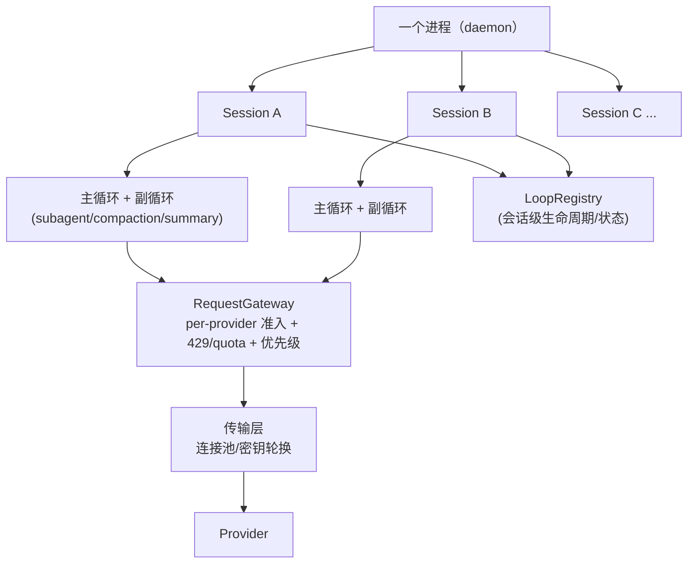

# pi-rp Multi-Agent 基础设施改造路线图（合并版）

> 本文档合并了两个方向相同、依赖互补的计划：
> 1. [high-concurrency-optimization.md](./high-concurrency-optimization.md)（横向：进程 / 会话 / 传输层并发）
> 2. 后台请求统一治理架构（纵向：会话内主循环 + 副循环的请求、生命周期、记账治理）
>
> 两者本质是同一个改造：把 pi-rp 从"agent 的基础设施"改造成"multi-agent 的基础设施"。

## 1. 目标

一个进程托管多个会话；每个会话是一个主循环 + 若干副循环（subagent / compaction / branch summary，未来还有常驻 reviewer）；所有 LLM 请求汇入一个统一网关；所有循环有身份、生命周期、记账。



目标指标（沿用原 high-concurrency 计划）：
- 会话创建 < 10ms（当前 ~300ms）
- 50+ 并发会话下内存下降 ~60%
- IPC 吞吐经 UDS / 进程内分发提升 5x

## 2. 现状盘点

pi-rp 的独立请求点（比 omp 少且已部分收敛）：

| 请求点 | 实现 | 现状 |
|---|---|---|
| subagent | `packages/coding-agent/src/core/subagent/run.ts` — 每次委托 `createAgentSession` 一个完整 in-memory session（`SessionManager.create(cwd, "/tmp/pi-subagent-ephemeral")`），`prompt(task)` + `waitForIdle()` 同步等待 | 无并行；无并发治理；usage 落在临时 session 文件，父会话不可见；无 extensions、read-only tools |
| compaction | `core/compaction/compaction.ts` — `completeSummarization` 共享 choke point（`streamFn \|\| completeSimple` + `retryAssistantCall`） | 手动/auto 触发；usage 已进 `CompactionEntry.usage` |
| branch summary | `core/compaction/branch-summarization.ts` — 同一个 `completeSummarization` | tree 导航触发 |

已有种子（不必重建）：
- `retryAssistantCall`（`@earendil-works/pi-ai`）+ `settings.retry` 策略 — 共享重试层已存在
- `core/usage-totals.ts` 聚合入口 + entry 自带 `usage` 字段 — 记账地基已存在
- `abortCompaction()` + `isCompacting`（覆盖 compaction 与 branch summary）— abort 生命周期已初步收敛

差距：
- **RequestGateway 完全缺失**：无 per-provider 并发信号量、无 429/quota 治理；subagent 走自己的 streamFn，不在任何 choke point 内
- **LoopSpec 未成型**：`completeSummarization` 十几个散参数（model/apiKey/headers/env/signal/streamFn/retry/callbacks…），无请求身份
- **LoopRegistry 未成型**：3 个 `AbortController` 字段（`_compactionAbortController`/`_autoCompactionAbortController`/`_branchSummaryAbortController`）散在 `core/agent-session.ts`
- **subagent usage 不可见**：ephemeral session 路径在 `/tmp`，父会话统计不到

## 3. 依赖关系

| 组件 | 来源 | 依赖 |
|---|---|---|
| RequestGateway（StreamFn 缝：per-provider 并发信号量 + 429/quota 退避） | 本计划 Phase 0 + high-concurrency Phase 4 | **共同地基**，双方前置 |
| 连接池（keep-alive，`@earendil-works/pi-ai` 传输层） | high-concurrency Phase 4 | 与网关正交但互补：池化是传输，信号量是准入 |
| LoopSpec（side request 身份 / 记账） | 本计划 | 独立；daemon 记账需要它 |
| LoopRegistry（会话级 loop 生命周期） | 本计划 | **依赖多会话**；session 生命周期与 loop 生命周期是同一个生命周期，必须一起设计 |
| 多会话协议（sessionId、create/destroy/list） | high-concurrency Phase 1 | 独立可先行 |
| Daemon / UDS | high-concurrency Phase 2 | 依赖 Phase 1 |
| Worker 线程池 | high-concurrency Phase 3 | **完全正交**，任意时刻可做 |
| BackgroundLoopRuntime（队列/drain/coalesce/epoch） | 本计划 Step 5 | 未来触发式；daemon 化不改变这一点 |

关键判断：
- **网关是唯一"纯重构、单会话行为零变化"的组件**，可在现有单会话测试上先验证。
- **Phase 1 只做"会话"不做 loop 生命周期 = 把 LoopRegistry 的债留到 Phase 2**，届时每个会话的 compaction abort 逻辑要重写一遍。session + loops + usage 必须一起落地，少一个都是半成品。
- **pi-rp 目前没有常驻后台循环**（无 omp advisor 那类），所以 omp 的 BackgroundLoopRuntime（~1200 行 drain/coalesce/epoch 骨架）现在是纯 YAGNI——没有真实消费者能验证它。等第一个常驻 reviewer / 反思循环需求出现再抽。

## 4. 用例：worldlines 世界引擎（第一个消费者）

worldlines-mvp 是目前最强的消费场景：它已经在用"多进程模拟多会话"（每回合 4 次 pi-rp 进程生命周期），改造成"一个世界一个进程"是把它从模拟变成原生。

### 现状（worldlines-mvp/app/engine/）

- 每回合编排（`drive_sim.py`）：① world pose（per-call spawn，preset=world-pose）→ ② `ThreadPoolExecutor` 并行 player/elena choose（常驻 `PersistentRpcPool`）→ ③ world advance（per-call spawn，preset=world-advance）→ 场景收口时 novelize（再 spawn）。world 因 pose/advance 两套 preset 每回合重新起进程，靠 `--session-id` 续接上下文。
- 状态靠文件桥：`extensions/lw-state-sync.ts` 在 session_start 从 `run_state.json` seed 进 pi-rp state，`onStateChange` 实时写回。
- 结果靠文本解析：`CHOSEN:` / `ELENA_CHOSE:` / `BEAT:` 正则从输出抠行动与 beat。
- `vendor/pi-rp` 是 pi-rp 源码 submodule（与 projects/pi-rp 同一 commit），改造的是自己 vendored 的代码。

### 目标形态

一个世界一个 pi-rp daemon：

```
pi-rp daemon（一个世界一个进程）
├── Session: world（或 pose/advance 双会话）
├── Session: player（常驻，替代 PersistentRpcPool 进程）
├── Session: elena（常驻）
├── Session: novelize（一次性 side request，场景收口触发）
├── RequestGateway（全部角色会话共享准入）
└── RPC 入口（Python 引擎作为客户端）
```

边界：编排（时序、场景流转、lint 门禁、快照）留在 Python 引擎（`tick_lw.py` / `drive_sim.py`）；pi-rp 只提供多会话、网关、状态、side request 通道。**不要把引擎搬进 pi-rp**——引擎管时序，agent 管智能。

### 差距与映射

| 能力 | 现状 | 缺口 |
|---|---|---|
| RPC 协议（prompt/abort/settled/init_commands） | 有 | 无 |
| 会话持久化续接（`--session-id`） | 有 | 无 |
| 扩展系统（状态同步、记忆） | 有（lw-state-sync / nocturne-memory） | 无 |
| 同进程多会话 | 有（subagent 先例：`runSubAgent` 在主进程内 `createAgentSession`） | **协议加 `sessionId` 字段（Phase 1）** |
| 并行角色行动的 provider 治理 | 无（每进程独立，无共享准入） | **RequestGateway（Phase 0）** |
| 会话间通信/状态共享 | 文件桥 | 保守方案：保留文件桥（快照/回滚/审计本来就要落盘） |
| novelize 这类一次性旁路请求 | per-call spawn + 自写重试 | **side request 通道（LoopSpec 雏形）** |
| 世界生命周期 = daemon 生命周期 | 无 | Phase 2 daemon |

### 落地顺序（叠加到执行阶段）

- **Phase 0 网关先行**：per-call spawn 模式下网关是 per-进程的，准入只在进程内有效；全局语义在"一个世界一个进程"之后才真正发挥（所有角色共享一个网关实例）。先建好，daemon 化自动全局生效。
- **Phase 1 协议加 sessionId**（向后兼容：不带 sessionId 即默认单会话）→ `PersistentRpcPool` 类整体删除（职责被 SessionManager + sessionId 取代），Python 侧几乎不改。
- **世界进程落地**：`tick_lw.py` 改为"起 daemon + 发回合指令"；novelize 作为第一个 side request 迁移。
- **常驻副循环**：等世界级自动反思 / 异步记忆整理需求出现，再抽 BackgroundLoopRuntime。

### 风险（worldlines 侧）

- **故障域从角色级变成世界级**：现在 4 进程，elena 挂不影响 world；一个世界一个进程后单点。缓解：会话落盘已有（session-backends），需要 daemon 崩溃恢复 + 监督重启。
- **内存预算**：N 个会话 context 常驻；50 会话目标下要重新核算（-60% 内存指标正是靠去掉每会话一个进程拿到的）。
- **会话隔离**：同进程内会话 A 崩溃不能污染会话 B；subagent 先例证明机制可行（内存会话 + 独立 transcript），协议级化需要补隔离测试。

## 5. 执行阶段

### Phase 0 — RequestGateway（先行，独立验证）

在 StreamFn 缝做统一 wrap（参照 omp `task/provider-concurrency.ts` 的思路，但位置放对——不是 task 专用，而是所有 loop 共用的构造点）：
- per-provider 并发信号量（`providers.<name>.maxConcurrency` 可配置）
- 429 / quota / rate-limit 识别 + 退避
- （可选，后加）优先级与预算：主 turn > blocker > concern > nit > 维护任务

主 agent 与 subagent 会话的 streamFn 都从 gateway 构造（`createAgentSession` 注入）。

**验收**：单会话行为零变化（现有测试全绿）；并发限制生效且可观测（日志/计数器）。

### Phase 1 — 多会话 + LoopRegistry + 记账统一（一起设计一起做）

- RPC JSONL 协议加 `sessionId`，会话生命周期命令：`create_session` / `destroy_session` / `list_sessions`
- `SessionManager` 注册表（rpc-mode 内）
- `BackgroundLoops` 容器：把 agent-session 里 3 个 AbortController + subagent 运行合并为 `start/abort/isActive/status`；`isCompacting` → `loops.isActive()`；`destroy_session` 必须 abort 该会话全部副循环
- LoopSpec 雏形：把 `completeSummarization` 的散参数收敛为 `SideRequestSpec`（model 解析、streamFn、retry、usage 回调、身份 label）；compaction / branch summary 迁移
- 记账统一：subagent usage 显式回传父会话（**不动** `/tmp` 的 ephemeral 语义，路径变更是破坏性变更且"不落盘"是特性）；compaction / branch summary usage 走同一个 `LoopUsage` 通道，`usage-totals.ts` 聚合

**验收**：单进程可跑多个并发会话，互不阻塞；`list_sessions` 能带出每会话后台 loop 状态；每会话 usage 可独立统计；worldlines 验证场景——一个 daemon 进程托管 world+player+elena 三会话跑完一回合编排（从 4 进程降为 1 进程），`PersistentRpcPool` 类整体删除。

### Phase 2 — Daemon / UDS

- 持久化 RPC daemon：Unix Domain Socket + WebSocket
- 核心基础设施（Model Registry / Extension Engine / Settings）常驻内存
- 外部引擎请求直接路由到进程内 session

**依赖**：Phase 1。

### Phase 3 — Worker 线程池

- `worker_threads` 迁移重计算（extension 执行、文件树索引等）
- 只读静态状态（Model Catalog、system prompts）经 `SharedArrayBuffer` / 不可变结构共享

**依赖**：无，正交，随时插入。

### Step 5 — BackgroundLoopRuntime（未来，触发式）

当第一个"常驻后台循环"需求出现（搬 omp advisor、自动反思、autolearn 类）时：
- 按 omp `AdvisorRuntime` 的抽法落通用骨架：pending 队列、busy 防重入、coalesce 轮数、epoch 失效、backlog / catchup waiter
- 届时 LoopSpec / 网关 / 注册表已就位，只是新增一个消费者类型

**触发条件**：出现常驻循环的明确需求；在此之前禁止提前实现（无验证载体）。

## 6. 风险与边界

- **不要一上来搬 omp 全套**：pi-rp 没有 advisor 那种消费者，运行时骨架没有验证载体，还会挤占 high-concurrency 投入。
- **不要让协议/传输工作拖延网关**：Phase 0 是 1-2 天的纯重构，Phase 1/2 的协议设计可能反复；网关先行，多会话落地时自动受治理。
- **网关的全局暂停要有恢复语义**（omp 教训：quota 暂停要能 resume，否则一次 429 静默停掉所有后台）。
- subagent usage 回传不要动 session 路径（见 Phase 1 记账统一）。
- 主循环不参与副循环的调度抽象：它只共享网关，作为最高优先级消费者。
- **一个世界一个进程 = 世界级故障域**（见第 4 节）：daemon 需崩溃恢复 + 监督重启，隔离与内存预算要纳入 Phase 1 设计。

## 7. 参考

- omp（上游 pi-mono 进化版）的对应实现：
  - `task/provider-concurrency.ts`（per-provider 信号量，StreamFn wrap）
  - `advisor/runtime.ts`（AdvisorRuntime：drain / coalesce / epoch / backlog，~1200 行）
  - `session/session-advisors.ts`（advisors 构建与生命周期）
  - `retry-fallback-chains.ts`（角色级 fallback 链）
- 相关代码：`packages/coding-agent/src/core/{subagent,compaction,agent-session.ts,model-runtime.ts,sdk.ts}`
